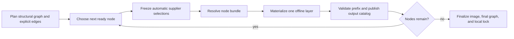

# APT Provider Detailed Design

## Purpose and Authority

This document maps the accepted contracts in
[`APT_PROVIDER.md`](APT_PROVIDER.md) and
[`BLUEPRINT_ENVIRONMENT_MODEL.md`](BLUEPRINT_ENVIRONMENT_MODEL.md) onto concrete
Go types, package boundaries, state files, Docker operations, and implementation
gates. Those documents remain authoritative for product semantics. If this
document disagrees with either one, implementation stops and the conceptual
contract is reconciled first.

This design covers the initial local Docker implementation:

- one selected Linux OCI platform per build;
- an immutable APT/dpkg-compatible base image;
- at most one shared APT authority node;
- zero or more independently materialized Python environment nodes;
- closed provider bundles in a local content-addressed store;
- one offline filesystem layer per provider node;
- local build locks and immutable Docker image references; and
- provider outputs consumed by later nodes or exposed through commands.

Portable export/import, blueprint-defined repositories and credentials,
application-configuration transport, RPM/APK providers, and application-output
version matching remain outside this design.

## Required Behavioral Changes

The current implementation is a useful prototype but is not the target
architecture. The detailed design deliberately replaces these assumptions:

| Current prototype | Required design |
| --- | --- |
| `ComponentTypePython` only | discriminated Python and APT component schemas |
| optional components represented as separate components | options nested under their owning component |
| one aggregated Python provider request | one node per Python component |
| provider interface resolves one ecosystem as a unit | provider-owned node planning plus per-node resolution |
| Python selected through base-image `PATH` | typed logical executable requirement and absolute validated path |
| public executable profiles drive Python output discovery | exact wheel metadata drives the provider output catalog |
| directory-local `.reploy/bundle` is the artifact store | shared immutable content-addressed artifact store |
| one `Materialization` per generated image | ordered provider-node transactions, one layer each |
| image identity uses directory tags and labels | shared content identity plus directory-owned generation references |
| host `runtime.GOARCH` chooses the target | blueprint-level OCI compatibility set plus explicit backend selection |
| `up` may build a missing image | only `reploy build` resolves and materializes |
| mutable state embeds prototype bundle structures | versioned request overlay, local build lock, and generation pointer |

Existing types may be adapted during migration, but they must not be extended in
ways that preserve these obsolete assumptions as permanent contracts.

## Package Ownership

The implementation is divided as follows:

| Package | Responsibility |
| --- | --- |
| `internal/blueprint` | Decode and normalize blueprint compatibility, the required base root, provider components, options, exports, and interpreter requirements. |
| `internal/canonical` | Canonical JSON encoding and domain-separated SHA-256 identities. |
| `internal/artifactstore` | Immutable raw artifact and manifest publication by digest. No mutable global index. |
| `internal/providers` | Provider registry, node planning contracts, graph model, common bundle/output/transaction types. |
| `internal/providers/apt` | APT request parsing, resolver profile, package closure, provenance, and offline materialization recipe. |
| `internal/providers/python` | Per-component wheel closure, interpreter consumption, venv materialization, and console-script catalog. |
| `internal/dockerdeploy` | OCI platform selection, Docker inspection/probing, exact-prefix validation, BuildKit rendering, image references, and cutover. |
| `internal/deploy` | Versioned directory state, request overlay, local build lock, atomic state publication, and operation locking. |
| `internal/cli` | `build`, bundle option/addition commands, platform/cache flags, and user-facing diagnostics. |

`internal/blueprint` must not import provider implementations. The public schema
is an explicit discriminated union owned by the blueprint package. Provider
implementations consume its resolved typed values through `internal/providers`.

## Public Schema Representation

### Platform

Add `Compatibility Compatibility` to `blueprint.Metadata`. Its `platforms`
syntax remains a list of strings under `blueprint.compatibility`. Resolution
parses each value once into:

```go
type Compatibility struct {
    Platforms []Platform
}

type Platform struct {
    OS           string
    Architecture string
    Variant      string
    Canonical    string
}
```

The list must be nonempty, duplicate-free after canonicalization, and sorted by
canonical byte order in identity records. Platform selection occurs in the
Docker backend, not while decoding the blueprint.

### Provider identifiers

Add a dedicated `validateProviderIdentifier` instead of reusing the existing
portable-filename validator. It accepts exactly `[a-z][a-z0-9_-]*`.

It is used for component, option, and executable-output names. `base` is the
required reserved root component and cannot be used for another component.
Package/distribution names remain provider-native and do not use this grammar.

### Components

Extend the resolved model with an explicit union:

```go
type Component struct {
    Type        ComponentType
    Base        *BaseComponent
    Python      *PythonComponent
    APT         *APTComponent
    Options     map[string]ComponentOption
}

type BaseComponent struct {
    Image   string
    Exports map[string]BaseExecutableExport
}

type BaseExecutableExport struct {
    Executable             string
    LogicalVersionOverride string
}

type PythonComponent struct {
    Interpreter CommandRequirement
    Requirements []string
}

type APTComponent struct {
    Packages []APTPackageRequest
}

type ComponentOption struct {
    Description        string
    PythonRequirements []string
    APTPackages        []APTPackageRequest
}
```

The syntax struct may expose the union's known fields so YAML unknown-field
rejection remains available. Semantic resolution then rejects a field that does
not belong to the selected type. In particular:

- exactly one component named `base` is required; it omits `type`, requires a
  nonempty OCI image reference, accepts only `image` and `exports`, and
  normalizes to the internal root-component kind;
- every base export requires one normalized absolute `executable` path and may
  carry a logical-version override; base discovery is not supported;
- Python accepts `interpreter`, `requirements`, and Python option
  `requirements`;
- APT accepts `packages` and APT option `packages`;
- neither option accepts `type`, `interpreter`, or nested `options`; and
- the initial Python and APT providers reject an active component whose
  effective request is empty. A component containing only disabled options
  produces no active provider node.

An omitted Python interpreter normalizes immediately to:

```go
CommandRequirement{Command: "python"}
```

No later phase distinguishes omission from that explicit value.

### APT package requests and exports

A package list item decodes from either a scalar or a structured mapping into
one resolved form:

```go
type APTPackageRequest struct {
    Name    string
    Version string
    Exports map[string]ExecutableExport
}

type ExecutableExport struct {
    Mode                   ExportMode // discover or explicit
    Executable             string
    LogicalVersionOverride string
}
```

The parser owns the strict `name` or `name=exact-version` grammar and stores the
two fields separately. It never retains a raw APT expression for execution.
`Executable` must be an absolute normalized container path. Exactly one of
`discover` and `executable` is required.

### Command requirements

```go
type CommandRequirement struct {
    Command    string
    Version    string
    Supplier   string
    Capability []string
}
```

`Command` uses the provider identifier grammar. `Supplier`, when present, is an
active component name or `base`. The Python provider owns interpretation of its
version constraint and capability list.

## Deployment Request Overlay

Directory state stores user intent separately from resolved build facts:

```go
type RequestOverlayV1 struct {
    Schema           string
    SelectedOptions  []QualifiedOption
    DirectPackages   []DirectPackageRequest
    DirectSources    []DirectSourceRequest
}

type QualifiedOption struct {
    Component string
    Option    string
}

type DirectPackageRequest struct {
    Component   string
    Provider    string
    Requirement string
}

type DirectSourceRequest struct {
    Component string
    Provider  string
    SourceID  string
}
```

Physical source paths are stored in a separate
`map[component/source-id]locator` field in directory state. They are not part of
canonical overlay intent. During `reploy build`, local-source inspection
produces a `ResolvedSourceInput` containing the source-manifest digest,
builder/toolchain profile, settings, ecosystem metadata, and built-artifact
digest. The resolved overlay and its digest live in the build lock.

This produces two intentionally different values:

- overlay intent changes when the user changes an option, direct package, or
  logical source selection; and
- resolved request identity also changes when selected local source content or
  its builder inputs change.

Overlay updates hold the directory operation lock, validate the complete new
overlay, write it atomically, and mark the recorded build stale. A failed
multi-add or multi-remove writes nothing.

The public commands are:

```text
reploy bundle add COMPONENT/OPTION[,OPTION...]
reploy bundle remove COMPONENT/OPTION[,OPTION...]
reploy bundle add-package COMPONENT REQUIREMENT...
reploy bundle remove-package COMPONENT REQUIREMENT...
reploy bundle add-source COMPONENT PATH...
reploy bundle remove-source COMPONENT SOURCE-ID...
```

`add-source` validates provider metadata and reports the stable source ID used
by `list` and `remove-source`.

## Canonical Identity Service

Introduce one service used by blueprints, overlays, bundles, transactions,
locks, validation profiles, and image assembly:

```go
type Digest string

func Marshal(value any) ([]byte, error)
func Sum(kind string, schema string, value any) (Digest, error)
```

`Sum` implements:

```text
SHA-256("reploy:" + kind + ":" + schema + NUL + canonical-json-v1(value))
```

Schema-normalized identity structures use only objects, arrays, strings,
booleans, and null. Integers are decimal strings and floats are forbidden. Map
keys are fixed ASCII schema keys or provider identifiers; all semantically
unordered collections are sorted before encoding. The encoder rejects invalid
UTF-8, duplicate keys, unsupported numeric values, and non-I-JSON input.

Golden tests must include RFC 8785 vectors, domain-separation vectors, Unicode
string escaping, reordered maps, reordered semantic sets, and values that must
be rejected.

## Provider Registry and Node Planning

The current provider interface is split into planning, resolution, and
materialization:

```go
type Provider interface {
    Type() blueprint.ComponentType
    Plan(PlanInput) ([]NodeSpec, error)
    Resolve(context.Context, ResolveInput, ArtifactSink) (ResolvedBundle, error)
    Materialize(MaterializeInput) (MaterializationTransaction, error)
}

type NodeSpec struct {
    ID                  NodeID
    Provider            blueprint.ComponentType
    Components          []string
    Request             CanonicalProviderRequest
    OutputDeclarations  []OutputDeclaration
    CommandRequirements []ExecutableRequirement
    ResolverProfile     RequirementProfile
}
```

`Plan` constructs a structural graph. It creates nodes, output declarations,
requirements, and edges implied by explicit `supplier` fields; it does not
choose suppliers for unqualified requirements.

Planning rules for the initial registry are exact:

- blueprint resolution synthesizes the required `base` root node from
  `components.base`; it is not returned by a provider, has no bundle or
  materialization transaction, and exposes only outputs validated against its
  immutable selected image;
- all active APT components form one `apt` node and one dpkg authority;
- each active Python component forms `python/<component>`;
- an explicit supplier creates a structural edge from the named component, or
  the `base` root, to the consumer;
- cycles among the known structural edges fail before any resolver starts;
- initialization order is base first, then the shared system-package node,
  component-scoped Python nodes in stable component-name order, and then
  higher provider layers, subject to explicit structural edges; and
- independent nodes use stable node-ID byte order as the final tie-breaker.

Immediately before resolving a consumer, Reploy freezes every unqualified
requirement against catalogs published by the resolved base and already
initialized nodes. It examines compatible candidates in lower-layer-first
order, selects exactly one, adds only that supplier-to-consumer edge to the
final graph, and records the selection in the bundle and local build lock.
Automatic edges therefore always point backward to an initialized supplier and
cannot introduce a cycle. A later node never becomes a retroactive candidate.

Provisional typed facts or a declared logical-version override are sufficient
for this initial selection. The selected candidate is probed against the
realized prefix before the consumer bundle is finalized. A differing observed
value is accepted with a warning only when the consumer's compatibility rule
still passes; otherwise the build fails without falling back to a later
supplier. A provider that declares no matching output does not become a
dependency merely because it is present.

The executor processes the graph as an interleaved pipeline:



After their supplier selections are frozen, bundle resolution for independent
ready nodes may run concurrently when they consume the same immutable prefix.
Image materialization is sequential in final stable topological order because
OCI filesystem layers form one chain.

## Resolver Dependency Profiles

Every node declares the complete upstream evidence that can affect its
resolution:

```go
type RequirementProfile struct {
    Schema       string
    Executables  []ExecutableRequirement
    Files        []FileRequirement
    Platform     blueprint.Platform
    ProviderData CanonicalProviderData
}

type ValidationEvidence struct {
    SubjectRootFS Digest
    ProfileDigest Digest
    Executables   []ExecutableEvidence
    Files         []FileEvidence
    Facts         CanonicalProviderData
}
```

The resolver cache key is the digest of:

- the validated dependency-evidence fingerprint;
- canonical provider request;
- provider resolver recipe/profile version; and
- selected platform.

The Python profile includes the selected interpreter evidence, platform/ABI,
declared build prerequisites, builder profile, requirements, translations, and
resolved local-source inputs. The APT profile binds the exact base image,
APT/dpkg capability evidence, mapped native architecture, repository/trust
state transitively supplied by that base, and normalized root request.

A provider that cannot enumerate a safe narrower profile sets
`WholeUpstreamImage: true`; its fingerprint then includes the immutable upstream
image digest.

## Artifact Store

The shared store is immutable and contains no last-used database or mutable
global reference index. Its default root is the existing Reploy user cache:

```text
<reploy-cache>/provider-store/
  blobs/sha256/<first-two>/<digest>
  manifests/sha256/<first-two>/<digest>.json
  tmp/<random>
```

An artifact publisher:

1. creates a private temporary object on the same filesystem;
2. streams bytes while enforcing count, size, and path limits;
3. validates provider metadata and computes SHA-256;
4. fsyncs and closes the object;
5. publishes it with an atomic no-replace operation; and
6. treats an existing matching digest as success.

Resolver output is ingested only after its container has stopped. The output
mount must be initially empty and its only writable host-backed mount. Ingestion
uses `Lstat`, never follows links, and accepts only accounted regular files.

Bundle manifests refer to blobs by digest and logical name. Physical cache
paths are late-bound and never enter an identity. Explicit cache cleanup may
remove any store object; an existing built environment continues using its
Docker image, while a later rebuild refetches or rebuilds a missing artifact.

## Common Bundle Model

```go
type ResolvedBundle struct {
    Schema          string
    NodeID          NodeID
    Provider        blueprint.ComponentType
    RecipeVersion   string
    Platform        blueprint.Platform
    Upstream        ImageDescriptor
    Artifacts       []ArtifactDescriptor
    Outputs         []ResolvedOutput
    ProviderPayload json.RawMessage
    Identity        canonical.Digest
}

type ArtifactDescriptor struct {
    LogicalPath string
    Kind        string
    Size        string
    SHA256      canonical.Digest
}
```

Provider payloads have provider-specific versioned schemas and are validated
again before materialization. Unknown schemas or recipe versions fail closed.

## APT Resolver

### Compatibility profile

APT support is enabled through an explicit provider compatibility registry,
not a generic `ID_LIKE` guess:

```go
type DistributionProfile struct {
    ID                  string
    VersionRule         string
    ResolverRecipe      string
    MaterializerRecipe  string
    ArchitectureMapping map[string]string
}
```

The first implementation gate must contain and test at least one Debian
profile. Ubuntu or another dpkg-based distribution is added only with its own
accepted profile and real-container evidence. An unknown `ID`, version, or OCI
platform fails before resolution.

Initial architecture mappings are `linux/amd64 -> amd64`,
`linux/arm64 -> arm64`, and `linux/arm/v7 -> armhf`. Supported CPU variants
retain the same Debian architecture.

### Resolver container

The Docker backend creates a disposable container from the exact upstream image
with the selected platform, explicit root user, explicit working directory,
stdin closed, no TTY, and a provider-owned entrypoint. It mounts:

- the trusted generated resolver script read-only;
- an initially empty private lists directory;
- an initially empty scratch/archive directory; and
- an initially empty artifact-output directory as the only writable
  host-backed mount.

The resolver has network access. Provider subprocesses run under the exact
`apt-resolve-v1` child environment; caller proxy and package-manager variables
are absent. Base APT configuration, sources, keys, and authentication remain
available inside the trusted immutable base.

The fixed resolver sequence is:

1. probe `/etc/os-release`, `apt-get`, `dpkg`, `dpkg-deb`, `getconf`, the
   checksum tool, and required command capabilities by absolute path;
2. require mapped native `dpkg --print-architecture` and no foreign
   architectures;
3. snapshot the complete installed package/status set;
4. run `apt-get update --error-on=any` against the private empty lists tree;
5. require exact cache matches for every typed root;
6. run one `apt-get --download-only install` transaction with the required
   safety arguments;
7. inspect every downloaded `.deb` and construct the mixed base/bundle closure;
8. bind each bundle artifact through its exact `Packages` stanza and signed
   index checksum to authenticated release metadata; and
9. write only raw `.deb` files and a declarative resolver result to output.

For step 8, the resolver uses APT's selected-version metadata to identify the
exact file in the private lists tree that supplied the package record. It reads
that record directly and requires its `Package`, `Version`, `Architecture`,
`Filename`, `Size`, and `SHA256` fields to match the selected tuple and
downloaded artifact. It then requires the digest of that lists file to match
the corresponding checksum entry in the authenticated `InRelease` or
`Release` metadata. An absent field, ambiguous record, or mismatch fails the
node; Reploy never reconstructs provenance from a repository URL or package
filename alone.

APT output and source configuration are secret-tainted. Raw output is not
stored. Diagnostics pass through the APT redactor before display; when safe
rendering is impossible, Reploy reports the node, phase, structured error code,
and opaque source identifier.

### APT bundle payload

```go
type BundleV1 struct {
    NativeArchitecture string
    BasePackages       []BasePackage
    BundlePackages     []BundlePackage
    Repositories       []RepositoryProvenance
    ProtectedClaims    []FileClaim
}

type PackageTuple struct {
    Name         string
    Version      string
    Architecture string
    Status       string
}

type BasePackage struct {
    Tuple PackageTuple
}

type BundlePackage struct {
    Tuple           PackageTuple
    Artifact        ArtifactDescriptor
    BasePredecessor *PackageTuple
    Relationships   PackageRelationships
    Provenance      PackageProvenance
}
```

Package records are sorted by `(name, architecture, version)`. Only native and
`all` architectures are legal. A base record has no artifact hash; the exact
base image binds it. A bundle record always has logical path, size, digest, and
authenticated provenance.

### Protected path inspection

Before materialization, the APT provider streams each archive listing and
rejects claims beneath Reploy-reserved build roots or exclusive provider roots.
It treats symlinks as leaf files and never follows them. Ordinary overlap and
replacement within the shared dpkg authority is delegated to APT/dpkg.

After materialization, the Docker backend streams the new layer's change set
and repeats the protected-boundary check so maintainer-script changes are also
covered. The initial backend may obtain this stream through a temporary image
save; the Phase 3 prototype must measure that approach and replace it with a
more direct BuildKit/OCI result only if the latter preserves Docker and Docker
Desktop support. No layer is accepted before this check passes.

## Materialization Transaction

Providers return one private transaction per node:

```go
type MaterializationTransaction struct {
    Schema              string
    NodeID              NodeID
    RecipeVersion       string
    Runner              ValidatedExecutableInput
    Script              ArtifactDescriptor
    Argv                []TypedArgument
    ChildEnvironment    ChildEnvironmentProfile
    WorkingDirectory    string
    BuildUser           string
    Network             NetworkPolicy
    Mounts              []BuildMount
    GeneratedExecutables []GeneratedExecutableDeclaration
    FinalImageConfig    ImageConfigPolicy
}
```

The backend renders every field or rejects the transaction. It never accepts
provider-supplied Dockerfile text. Dynamic values are positional arguments,
typed executable operands, environment values, or mounted files; they are not
shell source.

Each node is built from its exact immutable upstream image with one Dockerfile
`RUN --mount` instruction, `--network=none`, an explicit `/bin/sh` carrier, and
the pinned Dockerfile frontend digest. The script and artifact mounts live
beneath reserved `/.reploy-build`, which must be absent in the upstream prefix
and absent again in the result. The complete transaction produces exactly one
accepted filesystem layer.

The initial APT materializer:

1. verifies the base-origin package tuples and clean `dpkg --audit` result;
2. snapshots complete installed state;
3. selects an initially empty private APT archive cache;
4. verifies every mounted `.deb` path, size, and SHA-256 inside the transaction;
5. invokes one offline `apt-get install` over all exact paths with the accepted
   noninteractive and safety arguments;
6. runs `dpkg --audit` and `apt-get check`; and
7. compares the full resulting package state with the locked mixed-origin
   closure.

Any unplanned addition, removal, upgrade, status change, or base-origin change
fails the node. Transaction failure publishes no prefix or build lock.

## Executable Outputs

Output identity is always `(supplier component, output name)`. The provider node
is recorded separately because one shared APT node may contain several supplier
components.

```go
type ResolvedOutput struct {
    SupplierComponent string
    SupplierNode      NodeID
    Name              string
    Candidates        []ExecutableCandidate
    VersionOverride   string
}

type ExecutableCandidate struct {
    InvocationPath string
    LinkChain      []LinkEvidence
    TerminalPath   string
    File           FileEvidence
    Facts          CanonicalProviderData
}
```

APT `discover` derives bounded candidates from the exact package closure;
explicit exports contain one candidate. After the APT layer exists, the backend
validates link/alternatives chains and file evidence in that exact prefix.

Each Python node independently applies its typed adapter to the eligible
`python` candidate sets. The adapter executes only plausible absolute paths,
uses `-I -S -c` with fixed provider-owned code, validates implementation,
version, ABI, platform, and `venv`, and records the selected candidate. Multiple
compatible terminal groups from one supplier remain ambiguous unless the
supplier export was refined explicitly.

Python then resolves/builds wheels in a disposable resolver container based on
that exact upstream prefix and creates its venv at:

```text
/opt/reploy/providers/python/<component>
```

Console-script outputs come from exact wheel entry-point metadata. After
materialization, every selected wrapper must exist beneath that component root
and its immediate shebang must name the component's own interpreter.

## Exact-Prefix Validation Records

The Docker backend computes the subject as the domain-separated digest of the
ordered OCI `rootfs.diff_ids` list. Validation records are keyed by subject plus
requirement-profile digest.

The finalized image config uses reserved content-only labels:

```text
io.reploy.validation.schema=prefix-validation-v1
io.reploy.validation.subject=<rootfs-subject>
io.reploy.validation.records=<canonical compact JSON>
```

The record set contains only profiles required by downstream consumers or final
command exposure. It does not contain deployment directories, staging/installed
phase, or mutable timestamps. The image digest covers the labels; adding a new
filesystem layer changes the rootfs subject and invalidates inherited records.

The prototype must establish a conservative label-size limit. If selected
records exceed it, the build fails with a diagnostic; this design does not add
a separate mutable validation database.

## Docker Platform and Base Inspection

Add a backend operation:

```go
ResolveBase(ctx, authorRef, selectedPlatform) (ImageDescriptor, BaseConfig, error)
```

It pulls or selects the author reference for the explicit platform, captures an
immutable repo digest or local image ID, and inspects OS, architecture, variant,
rootfs layers, environment, user, workdir, entrypoint, command, healthcheck,
stop signal, `OnBuild`, and declared volumes.

The backend rejects platform mismatches, nonempty `OnBuild`, and declared
volumes. Generated transactions explicitly set user and workdir and ignore
inherited shell, entrypoint, command, and healthcheck behavior. Base environment
remains runtime defaults, with Reploy-owned runtime values taking precedence;
provider subprocesses use closed child environments.

Every Docker build, probe, resolver, and runtime request receives the selected
platform explicitly. `runtime.GOARCH`, `DOCKER_DEFAULT_PLATFORM`, and backend
defaults are not selection inputs.

## Runtime Mount and Access Preflight

The resolved Docker plan compiles a runtime policy after interpolation,
`extends`, backend-generated mounts, phase selection, and effective user
selection. `/mnt` is the built-in allowed root. A blueprint may add explicit
absolute normalized roots through `docker.additional_mount_roots`; `/`,
duplicate or overlapping roots, and intersections with protected
Reploy/provider roots are invalid.

The exact selected base must contain either no `/mnt` entry or an empty real
directory there. `/mnt` is a Reploy-reserved build boundary: provider archive
inspection and every resulting-layer change check reject persistent descendants
so the final image retains the same condition.

Immediately before every workload or transient container, including commands,
lifecycle actions, probes, and `reploy shell`, the backend validates the final
Reploy-owned mount plan in this order:

1. Every destination is a strict descendant of `/mnt`, or equal to or beneath
   one additional allowed root. Destinations are unique and non-overlapping.
2. Against the exact immutable image, the destination is absent or an empty
   real directory. The backend walks existing ancestors with no-follow
   `lstat`; an existing file, symlink, non-directory, mountpoint, or non-empty
   directory fails. Directory emptiness uses one bounded entry read and never
   scans the subtree.
3. The destination subtree does not contain a Reploy-internal path, exclusive
   provider root or leaf, or any invocation/link/terminal path referenced by
   the runtime plan, and the destination is not inside a protected root.
4. Every mount source satisfies its declared read/write policy for the selected
   runtime identity. Every referenced executable remains traversable, readable,
   and executable under the exact effective mounts, numeric UID, primary GID,
   and supplementary groups without launching package code.

Docker-intrinsic kernel and resolver mounts are not authored by the blueprint
or Reploy mount plan and are outside the allowed-root check. All
Reploy-generated mounts are checked. Additional roots are blueprint-bound
runtime inputs recorded with the resolved plan; runtime validation results live
only in deployment state. Neither affects provider bundles, materialization
transactions, assembly keys, or realized-image identity, and runtime validation
results do not enter the build lock.

## Build Orchestration

`reploy build` is the only public operation that resolves bundles or constructs
an environment image. `stage` and overlay commands may make the recorded build
stale but do not perform hidden provider work. `up`, restart, shell, command,
test, and install require a matching recorded build and otherwise instruct the
user to run `reploy build`.

The build state machine is:

```text
lock directory
  -> load blueprint + overlay
  -> select platform + resolve components.base.image
  -> validate the immutable base root and its declared outputs
  -> compute resolved request
  -> plan structural graph and validate explicit edges
  -> for each ready node: freeze suppliers, resolve/materialize/validate,
     publish outputs, and add the selected edges to the final graph
  -> validate final exposed outputs
  -> write canonical local build lock
  -> publish unique environment generation
  -> atomically replace directory state
  -> update shared cache references best-effort
  -> clean superseded directory references
  -> unlock
```

`--no-cache` bypasses resolver-cache and realized-image lookup, reruns every
resolver and materializer, and reprobes all outputs. It may reuse verified raw
content-addressed blobs and does not delete any cache.

## Local Files and State

Each deployment directory contains:

```text
.reploy/state.json
.reploy/locks/sha256-<digest>.json
.reploy/operation.lock
.reploy/pending-build.json        # only while recovery is needed
```

`state.json` is mutable operational state. Its environment-image section is:

```go
type EnvironmentGenerationState struct {
    Reference       string
    ImageDigest     string
    BuildLockDigest string
    Platform        string
}
```

Each directory owns one current generation and optionally one prior generation
for local rollback/cleanup. Staging and installed directories own independent
references even when both point to the same immutable image digest.

Each file beneath `locks/` is immutable canonical `lock-v1` metadata for one
exact local build. Its filename is its validated content digest. It contains
the blueprint fingerprint, resolved overlay, selected platform/base, provider
graph, bundle identities, transaction digests, validation evidence, resolved
outputs, realized prefix digests, and final image digest. It contains no
physical cache paths or credentials.

All state writes use temporary files on the same filesystem, fsync, atomic
rename, and directory sync where supported. A platform-specific advisory lock
implementation serializes state-changing operations for one deployment
directory.

## Image References and Publication

Shared image contents contain no directory identity. Reploy uses three kinds of
references:

```text
temporary:   reploy/env/<slug>-<dirhash>:tmp-<random>
generation:  reploy/env/<slug>-<dirhash>:g-<random>
cache hint:  reploy/cache:sha256-<assembly-hex>
```

The publication protocol is:

1. build under a unique temporary reference and inspect the immutable digest;
2. validate the exact result and write a durable pending record naming old and
   candidate state;
3. create the unique generation reference from the candidate digest;
4. publish the immutable content-addressed build lock, then atomically replace
   directory state so it references that lock; state replacement is the commit
   point;
5. update the canonical cache hint best-effort; and
6. remove the old generation and temporary reference, then the pending record.

Recovery holds the same directory lock and preserves the generation named by
committed state. It never retargets or removes another directory's references.
Cache readers resolve a cache hint once to an immutable digest before use.

Environment cleanup removes only that directory's references. Explicit cache
cleanup may remove cache hints and artifact-store content, but never invokes a
global Docker prune or force-removes images. Docker owns physical layer
reference tracking and reclamation.

## Failure and Diagnostic Model

Every error identifies:

- selected platform and immutable base when known;
- provider node and phase (`plan`, `resolve`, `materialize`, `probe`, or
  `publish`);
- stable structured error code;
- safe request/package/output identity; and
- the corrective command when one exists.

Provider errors wrap typed causes rather than parsing human tool output. Raw APT
output is displayed only after redaction. Failed operations retain the prior
committed state and image generation. Temporary containers, mounts, files, and
references are cleanup inventory in the pending record when immediate cleanup
cannot complete.

Resource deadlines, process-tree cancellation, output caps, artifact limits,
and disk/layer growth limits are a versioned backend execution policy rather
than blueprint fields. Concrete defaults must be chosen and tested before the
APT schema is enabled, but changing an admissible host limit does not alter
semantic bundle identity.

## Implementation Sequence

### Slice 1: Canonical foundations and schema

- Add canonical identity vectors.
- Add blueprint compatibility and provider identifier parsing.
- Add the required base root, the Python/APT component union, nested options,
  interpreter defaults, package requests, and exports.
- Add versioned overlay intent and CLI parsing without enabling APT builds.

Gate: parser, normalization, identifier, overlay atomicity, and canonical
identity tests pass.

### Slice 2: Provider graph with existing Python behavior

- Replace the ecosystem-wide provider interface with node planning.
- Adapt the existing prepared wheelhouse resolver behind one temporary Python
  node.
- Add structural graph ordering, explicit-edge cycle detection, incremental
  frozen supplier selection, node-local invalidation, and typed executable
  requirements.

Gate: existing Python-only behavior passes through the graph executor; no APT
schema is accepted yet. Tests prove base-first selection, incompatible-base
selection of an APT output, explicit supplier override, no retroactive selection
of a later node, deterministic final graphs, and observed incompatibility
failure without fallback.

### Slice 3: Artifact store and Docker transaction backend

- Add immutable artifact/manifest publication.
- Add explicit platform/base inspection.
- Add versioned transaction rendering, pinned frontend, exact child
  environments, reserved build mounts, and argument budgets.
- Add prefix validation records and unique generation publication/recovery.

Gate: fake-Docker command tests plus real Docker and Docker Desktop BuildKit
probes pass for a synthetic provider layer.

### Slice 4: APT resolver and offline layer

- Add the first explicit distribution profile.
- Resolve exact mixed-origin closures and provenance.
- Ingest raw `.deb` artifacts safely.
- Materialize offline, validate full package state, and inspect protected paths.

Gate: real-container tests cover base-only dependencies, downloads, upgrades,
native/`all` architecture, repository failure, provenance mismatch,
noninteractive behavior, and transaction rollback.

### Slice 5: Cross-provider Python

- Materialize APT before dependent Python nodes.
- Select and validate actual APT/base interpreter outputs.
- Resolve each Python component against its selected interpreter.
- Create independent venv roots and console-script catalogs.

Gate: one environment where APT supplies Python, two independently selected
Python interpreter/venv pairs, and one Python-base environment where APT adds
only native libraries.

### Slice 6: Public build cutover

- Make top-level `reploy build` canonical.
- Make runtime operations reject missing/stale builds.
- Remove startup-time Python runtime preparation and the directory-local bundle
  as the authoritative artifact store.
- Migrate retained option/addition state into overlay-v1.
- Enforce the `/mnt` runtime namespace, explicit additional roots, no-shadow
  image inspection, protected-path checks, and exact effective-user access
  preflight for every persistent and transient container.

Gate: full tests, CLI Docker smoke, install/staging reuse, failure recovery,
cache cleanup, mount-policy and runtime-access matrices, and legacy-removal
assertions pass.

## Required Prototype Decisions

The following are detailed-design gates, not invitations to reopen the
conceptual model:

1. Select the first exact Debian distribution profile and versions tested in
   CI; do not accept generic `ID_LIKE=debian` without a profile.
2. Pin the Dockerfile frontend digest and minimum Docker/BuildKit capability
   profile from measured Linux Engine and Docker Desktop results.
3. Choose and benchmark the Docker mechanism used to stream the newly produced
   layer change set without filesystem extraction.
4. Set conservative limits for validation-label size and the U17 execution
   resource policy.
5. Decide whether the initial directory advisory lock needs an external Go
   dependency or small OS-specific implementations.

None of these decisions changes public blueprint semantics. Each must be
recorded with tests before the corresponding implementation gate is marked
complete.

## Completion Criteria

This detailed design is implementation-ready when:

- every proposed type has one owning Go package and versioned serialization
  where it crosses a process or persistence boundary;
- the five prototype decisions above have recorded evidence and exact values;
- current `providers.Bundle`, `Materialization`, directory image tags, and
  `PreparedFingerprint` have explicit migration/removal tasks;
- top-level `reploy build` and stale-build behavior are reflected consistently
  in user documentation and CLI tests; and
- the implementation plan links each Phase 2/3 task to one slice and gate in
  this document.
