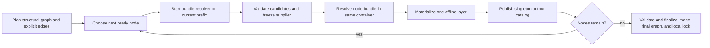

# APT Provider Detailed Design

## Purpose and Authority

This document maps the accepted contracts in
[`APT_PROVIDER.md`](APT_PROVIDER.md) and
[`BLUEPRINT_ENVIRONMENT_MODEL.md`](BLUEPRINT_ENVIRONMENT_MODEL.md) onto concrete
Go types, package boundaries, state files, Docker operations, and implementation
gates. Those documents remain authoritative for product semantics. If this
document disagrees with either one, implementation stops and the conceptual
contract is reconciled first.

This design covers the initial local Docker implementation:

- one selected Linux OCI platform per build;
- an immutable APT/dpkg-compatible base image;
- at most one shared APT authority node;
- zero or more independently materialized Python environment nodes;
- closed provider bundles in a local content-addressed store;
- one offline filesystem layer per provider node;
- local build locks and immutable Docker image references; and
- provider outputs consumed by later nodes or exposed through commands.

Portable export/import is unsupported in v1; any future transfer feature
requires a separate design. Blueprint-defined repositories and credentials,
application-configuration transport, RPM/APK providers, and application-output
version matching also remain outside this design.

## Required Behavioral Changes

The current implementation is a useful prototype but is not the target
architecture. The detailed design deliberately replaces these assumptions:

| Current prototype | Required design |
| --- | --- |
| `ComponentTypePython` only | discriminated Python and APT component schemas |
| optional components represented as separate components | options nested under their owning component |
| one aggregated Python provider request | one node per Python component |
| provider interface resolves one ecosystem as a unit | provider-owned node planning plus per-node resolution |
| Python selected through base-image `PATH` | typed logical executable requirement and absolute validated path |
| public executable profiles drive Python output discovery | exact wheel metadata drives the provider output catalog |
| unversioned `.reploy/bundle` is the artifact store | deployment-owned immutable content-addressed provider store |
| one `Materialization` per generated image | ordered provider-node transactions, one layer each |
| image identity uses directory tags and labels | content-derived image identity plus directory-owned generation references |
| host `runtime.GOARCH` chooses the target | blueprint-level OCI compatibility set plus explicit backend selection |
| runtime startup may build a missing image | `reploy build` and the explicit build phase of `reploy install` may resolve and materialize; runtime operations never do |
| mutable state embeds prototype bundle structures | versioned request overlay, local build lock, and generation pointer |

Existing types may be adapted during migration, but they must not be extended in
ways that preserve these obsolete assumptions as permanent contracts.

## Package Ownership

The implementation is divided as follows:

| Package | Responsibility |
| --- | --- |
| `internal/blueprint` | Decode and normalize blueprint compatibility, the required base root, provider components, options, exports, and interpreter requirements. |
| `internal/canonical` | Canonical JSON encoding and domain-separated SHA-256 identities. |
| `internal/providerstore` | Deployment-owned immutable raw artifact and content-record publication by digest. No mutable global index. |
| `internal/providers` | Provider registry, node planning contracts, graph model, common bundle/output/transaction types. |
| `internal/providers/apt` | APT request parsing, resolver profile, package closure, artifact inspection, and offline materialization recipe. |
| `internal/providers/python` | Per-component wheel closure, interpreter consumption, venv materialization, and console-script catalog. |
| `internal/dockerdeploy` | OCI platform selection, Docker inspection/probing, exact-prefix validation, BuildKit rendering, image references, and cutover. |
| `internal/deploy` | Backend-neutral OCI/runtime records, versioned directory state, request overlay, local build lock, atomic state publication, and operation locking. |
| `internal/cli` | `build`, bundle option/addition commands, platform/cache flags, and user-facing diagnostics. |

`internal/blueprint` must not import provider implementations. The public schema
is an explicit discriminated union owned by the blueprint package. Provider
implementations consume its resolved typed values through `internal/providers`.

## Public Schema Representation

### Platform

Add `Compatibility Compatibility` to `blueprint.Metadata`. Its `platforms`
syntax remains a list of strings under `blueprint.compatibility`. Resolution
parses each value once into:

```go
type Compatibility struct {
    Platforms []Platform
}

type Platform struct {
    OS           string
    Architecture string
    Variant      string
    Canonical    string
}
```

The list must be nonempty, duplicate-free after canonicalization, and sorted by
canonical byte order in identity records. Platform selection occurs in the
Docker backend, not while decoding the blueprint.

`platform-v1` parses lowercase OCI `os/architecture[/variant]` strings into
nonempty slash-free fields and rejects extra segments. `Canonical` is
recomputed from the other fields and may not disagree. Backend support is
checked during platform selection; the APT provider then applies its narrower
Linux/amd64, Linux/arm64, and Linux/arm/v7 mapping. The resolved blueprint never
stores an unparsed platform string or hard-codes distribution release versions.

### Provider identifiers

Add a dedicated `validateProviderIdentifier` instead of reusing the existing
artifact-filename validator. It accepts exactly `[a-z][a-z0-9_-]*`.

It is used for component, option, and executable-output names. `base` is the
required reserved root component and cannot be used for another component.
Package/distribution names remain provider-native and do not use this grammar.

### Components

Extend the resolved model with an explicit union:

```go
type Component struct {
    Type        ComponentType
    Base        *BaseComponent
    Python      *PythonComponent
    APT         *APTComponent
    Options     map[string]ComponentOption
}

type BaseComponent struct {
    Image   string
    Exports map[string]BaseExecutableExport
}

type BaseExecutableExport struct {
    Executable string
}

type PythonComponent struct {
    Interpreter CommandRequirement
    Requirements []string
}

type APTComponent struct {
    Packages []APTPackageRequest
}

type ComponentOption struct {
    Description        string
    PythonRequirements []string
    APTPackages        []APTPackageRequest
}
```

The syntax struct may expose the union's known fields so YAML unknown-field
rejection remains available. Semantic resolution then rejects a field that does
not belong to the selected type. In particular:

- exactly one component named `base` is required; it omits `type`, requires a
  nonempty OCI image reference, accepts only `image` and `exports`, and
  normalizes to the internal root-component kind;
- every base export requires one normalized absolute `executable` path; base
  discovery is not supported;
- Python accepts `interpreter`, `requirements`, and Python option
  `requirements`;
- APT accepts `packages` and APT option `packages`;
- neither option accepts `type`, `interpreter`, or nested `options`; and
- the initial Python and APT providers reject an active component whose
  effective request is empty. A component containing only disabled options
  produces no active provider node.

`ComponentType` has exactly the internal values `base`, `python`, and `apt`.
The public `base` entry has no `type` field; resolution assigns `base`. Every
other component requires exactly one supported `type`. A resolved `Component`
must have exactly the matching pointer set and all other union pointers nil.
This invariant is checked when YAML is resolved, before overlay entries or
provider planning are considered.

Effective requests are computed after validating the complete overlay. Direct
component requirements, selected option requirements, and targeted direct
package additions are normalized into provider-owned records, deduplicated by
their canonical encoding, and sorted by canonical byte order. Component and
option maps are likewise emitted as sorted name/value entries in identity
records. Disabled options contribute nothing. A non-base component with no
effective request is inactive and creates no node. Naming an inactive or
missing component as an explicit supplier fails semantic resolution before
`Plan`; a provider also rejects an empty active request defensively. There is
no later phase that silently activates a component or changes this result.

An omitted Python interpreter normalizes immediately to:

```go
var defaultPythonInterpreter = CommandRequirement{Command: "python"}
```

No later phase distinguishes omission from that explicit value.

### APT package requests and exports

A package list item decodes from either a scalar or a structured mapping into
one resolved form:

```go
type APTPackageRequest struct {
    Name    string
    Version string
    Exports map[string]ExecutableExport
}

type ExecutableExport struct {
    Executable string
}
```

The parser owns the strict `name` or `name=exact-version` grammar and stores the
two fields separately. It never retains a raw APT expression for execution.
Every declared export requires an absolute normalized `Executable`; `discover`
is rejected as an unknown field.

`apt-package-request-v1` encodes `Name`, optional `Version`, and exports sorted
by output name. Identical requests contributed by the component, selected
options, or direct additions deduplicate. Two effective roots with the same
package name but different versions or different export declarations are an
order-dependent conflict and fail resolved-request construction before APT is
started. Package order never decides which declaration wins.

Independently of declared exports, `well-known-apt-tools-v1` recognizes an exact
`python3` root request and publishes output `python` with candidate path
`/usr/bin/python3` and consumer kind `python`. A declared `python` export on the
same structured request replaces that candidate path. The profile identifier,
package request, output name, candidate path, and replacement choice participate
in bundle identity. No other package has a built-in mapping in v1.

### Command requirements

```go
type CommandRequirement struct {
    Command  string
    Version  string
    Supplier string
}
```

`Command` uses the provider identifier grammar. `Supplier`, when present, is an
active component name or `base`. The Python provider owns interpretation of its
version constraint. Command requirements have no generic capability-name list;
each consuming provider validates the fixed prerequisites of its own recipe.

## Deployment Request Overlay

Directory state stores user intent separately from resolved build facts:

```go
type RequestOverlayV1 struct {
    Schema           string
    SelectedOptions  []QualifiedOption
    DirectPackages   []DirectPackageRequest
}

type QualifiedOption struct {
    Component string
    Option    string
}

type DirectPackageRequest struct {
    Component string
    Package   CanonicalPackageRequest
}

```

`Schema` is exactly `overlay-v1`. Selected options are unique and sorted by
`(component, option)`. Direct packages are unique by their complete canonical
package request and sorted by `(component, package schema, canonical package
bytes)`. Empty arrays are encoded as arrays, not null; an absent overlay file
normalizes to the canonical empty `overlay-v1` value. Its digest is
`canonical.Sum("request-overlay", "overlay-v1", overlay)`.

The provider for a direct package request is derived from the target
component's resolved type and is not stored separately. `CanonicalPackageRequest`
is the provider-owned structured form also produced when resolving a package
declared in the blueprint. The overlay decoder uses the component type to
select that provider's package schema.

`add-package` parses and validates every CLI requirement before beginning the
overlay write. For APT, it stores the parsed `APTPackageRequest` name and exact
version fields with no exports rather than retaining `name=version`. Python
uses the same canonical resolved requirement record as a blueprint Python
requirement. A missing component, unsupported direct-package capability,
syntax error, or payload that does not match the component type rejects the
whole command and leaves the overlay unchanged.

Blueprint translations are not overlay entries. During `reploy build`, a used
translation's local-source inspection produces a `ResolvedSourceInput`
containing the source-manifest digest, builder/toolchain profile, settings,
ecosystem metadata, and built-artifact digest. The resolved request and its
digest live in the build lock; the physical source path does not.

```go
type ResolvedSourceInput struct {
    Schema               string
    Component            string
    LogicalPackage       string
    SourceManifestDigest canonical.Digest
    BuilderProfile       string
    BuildSettings        CanonicalProviderData
    EcosystemMetadata    CanonicalProviderData
    ArtifactDigest       canonical.Digest
}
```

`Schema` is `resolved-source-input-v1`. Records are unique and sorted by
`(component, logical package)`. Both provider-owned values must have recognized
schemas. Source roots and host paths are used only while producing these
content-bound values and are absent from the record.

This produces two intentionally different values:

- overlay intent changes when the user changes an option or direct package; and
- resolved request identity also changes when selected local source content or
  its builder inputs change.

Overlay updates hold the directory operation lock, validate the complete new
overlay, write it atomically, and mark the recorded build stale. A failed
multi-add or multi-remove writes nothing.

The lock file is `.reploy/operation.lock`, but file existence never determines
ownership. `internal/deploy` holds an OS advisory lock for the complete state
transaction: nonblocking `golang.org/x/sys/unix.Flock` with context polling on
supported Unix hosts and `golang.org/x/sys/windows.LockFileEx` on Windows. The
descriptor or handle remains open until unlock. Process death releases the
kernel lock, so Reploy has no stale-PID or stale-file ownership protocol.

Install is the only operation that locks two deployment directories. It first
locks its source workspace and holds that lock while it ensures the source build
and later reads the selected lock and provider-store closure. A staged source
is a staged deployment; direct install uses the same code path and locks its
private temporary staging-like workspace. After the source build is current,
install acquires the installed destination's lock, copies and verifies the
selected closure, commits installed state, and releases destination then source.
The fixed order is source before destination. An installed deployment is never
an install source, and no operation may acquire a source lock while already
holding an installed-destination lock; these role rules prevent a lock cycle.
Install invokes a lock-aware internal ensure-build routine under the held source
lock; it never recursively invokes the public `reploy build` lock acquisition.

The public commands are:

```text
reploy bundle options
reploy bundle list
reploy bundle add COMPONENT/OPTION[,OPTION...]
reploy bundle remove COMPONENT/OPTION[,OPTION...]
reploy bundle add-package COMPONENT REQUIREMENT...
reploy bundle remove-package COMPONENT REQUIREMENT...
reploy bundle clean
```

`options` and `list` report blueprint options and the current canonical overlay;
they do not inspect a prepared wheelhouse. `clean` removes the deployment-owned
provider store without invalidating an already built image. `reploy build`
replaces the prototype `bundle prepare` and `bundle check` operations. The
prototype `bundle upgrade` command has no direct replacement: authors change a
blueprint constraint or an exact component-qualified overlay request and then
build. `bundle list-options`, `bundle prepare`, `bundle check`, and `bundle
upgrade` are removed at cutover rather than retained as aliases.

## Canonical Identity Service

Introduce `internal/canonical`, the one service used by blueprints, overlays,
bundles, transactions, locks, validation profiles, and image assembly:

```go
type Digest string

type Envelope struct {
    Schema string
    Value  Object
}

func Marshal(value any) ([]byte, error)
func Sum(kind string, schema string, value any) (Digest, error)
```

`Sum` implements:

```text
SHA-256("reploy:" + kind + ":" + schema + NUL + canonical-json-v1(value))
```

Schema-normalized identity structures use only objects, arrays, strings,
booleans, and null. Integers are decimal strings and floats are forbidden. Map
keys are fixed ASCII schema keys or provider identifiers; all semantically
unordered collections are sorted before encoding. The encoder rejects invalid
UTF-8, duplicate keys, unsupported numeric values, and non-I-JSON input.

Golden tests must include RFC 8785 vectors, domain-separation vectors, Unicode
string escaping, reordered maps, reordered semantic sets, and values that must
be rejected.

### Ownership and serialization matrix

The following table is exhaustive for records that cross a Go package, process,
cache, or persistence boundary in this design. “Canonical JSON” means
`canonical-json-v1`; in-memory helper structs that never cross one of those
boundaries do not acquire independent schemas.

| Record/schema | Owning package | Boundary and encoding | Identity role |
| --- | --- | --- | --- |
| Resolved blueprint / `blueprint-resolved-v1` | `internal/blueprint` | YAML input to strict resolved Go value; canonical JSON only for its fingerprint | Blueprint digest |
| Platform / `platform-v1` | `internal/blueprint` | Embedded canonical JSON | Every platform-dependent identity |
| Request overlay / `overlay-v1` | `internal/deploy` | Canonical JSON inside `state-v1` | Resolved-request input |
| Provider request / provider-specific schema such as `apt-provider-request-v1` | Provider package, envelope owned by `internal/providers` | Embedded canonical JSON | Node and resolver-cache identities |
| Node plan / `provider-plan-v1` | `internal/providers` | In-memory package boundary; canonical digest in the build lock | Final graph identity |
| Requirement profile / `requirement-profile-v1` | `internal/providers` | Host-to-resolver/materializer canonical JSON | Resolver evidence and cache key |
| Executable/file evidence / `executable-evidence-v1`, `file-evidence-v1` | `internal/providers` | Resolver/materializer result and embedded canonical JSON | Validation and dependent-node identities |
| Resolved bundle / `resolved-bundle-v1` | `internal/providers` | Immutable canonical JSON manifest | Bundle identity |
| APT payload / `apt-bundle-v1` | new `internal/providers/apt` | Validated canonical JSON inside resolved bundle | APT bundle identity |
| Python payload / `python-bundle-v1` | `internal/providers/python` | Validated canonical JSON inside resolved bundle | Python bundle identity |
| Materialization transaction / `materialization-transaction-v1` | `internal/providers` | Host-to-Docker-renderer canonical JSON | Transaction and assembly identities |
| Image/base inspection / `image-descriptor-v1`, `base-config-v1` | `internal/deploy`, populated by `internal/dockerdeploy` | Backend inspection result and embedded canonical JSON | Base, prefix, and assembly identities |
| Prefix validation / `prefix-validation-v1` | `internal/dockerdeploy` | Fixed labels plus immutable canonical JSON record | Validated prefix and final-image identity |
| Compiled runtime policy / `runtime-policy-v1` | `internal/deploy`, compiled/validated by `internal/dockerdeploy` | Canonical JSON inside build lock | Staleness and final validation |
| Build lock / `lock-v1` | `internal/deploy` | Immutable digest-named canonical JSON | Current local build root |
| Deployment state / `state-v1` | `internal/deploy` | Mutable atomically replaced canonical JSON | Selects current lock/generation |
| Pending publication / `pending-build-v1` | `internal/deploy` | Mutable recovery-only canonical JSON | Crash recovery, never content identity |
| Structured error / `build-error-v1` | `internal/providers` with backend/provider detail owners | In-memory typed value and safe renderer input; never persisted or hashed | None |

Nested Go type ownership is also fixed; moving a type across these package
boundaries requires a schema/identity review:

| Owning package | Types |
| --- | --- |
| `internal/blueprint` | `Compatibility`, `Platform`, `Component`, `BaseComponent`, `BaseExecutableExport`, `PythonComponent`, `APTComponent`, `ComponentOption`, `APTPackageRequest`, `ExecutableExport`, `CommandRequirement` |
| `internal/canonical` | `Digest`, `Envelope`, and the validated canonical value/object implementation |
| `internal/deploy` | `RequestOverlayV1`, `QualifiedOption`, `DirectPackageRequest`, `ImageDescriptor`, `BaseConfig`, `ConfigEnvironmentVariable`, `RuntimePolicyV1`, `ProtectedPathV1`, `RuntimePlanV1`, `RuntimeMountV1`, `StateV1`, `EnvironmentGenerationState`, `BuildLockV1`, `ProviderGraphLockV1`, `NodeLockV1`, `PendingBuildV1`, `PendingCandidateV1`, `CleanupItemV1` |
| `internal/providerstore` | `ArtifactDescriptor`, `StoreObjectRef`, immutable publication and reachability |
| `internal/providers` | `CanonicalProviderData`, `CanonicalProviderRequest`, `CanonicalPackageRequest`, `ResolvedSourceInput`, `Provider`, `ProviderPlanV1`, `PlanInput`, `ResolveInput`, `RequirementCandidatesV1`, `ResolveResult`, `MaterializeInput`, `ArtifactSink`, `NodeSpec`, `RequirementDeclaration`, `NodeID`, `ProviderEdgeV1`, `OutputDeclaration`, `ExecutableRequirement`, `FileRequirement`, `RequirementProfile`, `ValidationEvidence`, `ResolvedBundle`, `ResolvedBundleIdentityV1`, `ResolvedRequestV1`, `ResolvedComponentRequestV1`, `ResolverCacheKeyV1`, `AssemblyKeyV1`, `MaterializationTransaction`, `ValidatedExecutableInput`, `TypedArgument`, `ChildEnvironmentProfile`, `EnvironmentVariable`, `ContainerIdentity`, `NetworkPolicy`, `BuildMount`, `GeneratedExecutableDeclaration`, `ImageConfigPolicy`, `ImageLabel`, `ResolvedOutput`, `ExecutableCandidate`, `RealizedOutput`, `ExecutableEvidence`, `QualifiedOutput`, `LinkEvidence`, `OwnerEvidence`, `FileEvidence`, `PortableAccessEvidence`, `AccessPathEvidence`, `RealizedImageV1`, `BuildErrorV1`, `SafeErrorSubjectV1`, `CorrectionV1` |
| `internal/providers/apt` | `DistributionProfile`, `APTProviderRequestV1`, `APTComponentRequestV1`, `BundleV1`, `PackageTuple`, `BasePackage`, `BundlePackage`, `ArchiveMemberV1`, `AlternativeEvidence`, `DpkgOwnerEvidence`, and APT-specific provenance payloads |
| `internal/providers/python` | `PythonProviderRequestV1`, `PythonBundleV1`, `PythonWheelV1`, `PythonConsoleScriptV1`, and Python-specific facts/provenance payloads |
| `internal/dockerdeploy` | `PrefixValidationV1`, label rendering, runtime-policy validation, and Docker inspection/rendering |

The common provider and provider-store packages own lower-level semantic
records, while `internal/deploy` owns backend-neutral image, runtime, and
publication records. None owns Docker commands or physical store paths.
`internal/dockerdeploy` consumes those records and owns backend execution.
These directions avoid a provider importing deployment state, deployment state
importing the Docker backend, or a blueprint parser importing a provider
implementation.

Allowed design-layer imports are acyclic:

```text
canonical
blueprint           -> canonical
providerstore       -> canonical
providers           -> blueprint, canonical, providerstore
providers/apt       -> blueprint, canonical, providers, providerstore
providers/python    -> blueprint, canonical, providers, providerstore
deploy              -> blueprint, canonical, providers, providerstore
dockerdeploy        -> deploy plus every backend-neutral package above
```

In particular, `providerstore` uses `canonical.Envelope`, not a provider-owned
metadata type; common owner/alternatives extension points use validated
canonical envelopes, not imports of `providers/apt`; and deployment records use
backend-neutral values owned by `deploy` rather than importing `dockerdeploy`.
The current imports from `internal/providers/python` to `internal/deploy` are
prototype debt, not an exception to this graph. Slice 2 moves deployment pack
and request adaptation above the provider boundary before accepting the new
provider contracts.

Every schema field named `Schema` must contain the table's exact schema value.
Decoders reject unknown schema values, unknown object keys, missing required
fields, noncanonical ordering, duplicate set members, and a union with zero or
multiple active variants. Provider-owned canonical payloads use this envelope:

```go
type CanonicalProviderData = canonical.Envelope

type CanonicalProviderRequest struct {
    Schema   string
    Provider blueprint.ComponentType
    Value    canonical.Object
}

type CanonicalPackageRequest struct {
    Schema string
    Value  canonical.Object
}
```

`canonical.Object` is a validated tree of only the canonical identity service's
allowed JSON values, not `json.RawMessage`. The owning provider must recognize
and validate `Schema` before the common package hashes, stores, or forwards the
value. The initial APT package value is exactly the normalized
`APTPackageRequest`; its schema is `apt-package-request-v1`. The initial Python
package value is the provider's normalized requirement record under
`python-package-request-v1`.

`blueprint-resolved-v1` is the canonical projection of the complete resolved
`blueprint.Blueprint` after defaults, `extends`, interpolation, union
validation, and provider normalization. It includes runtime and Docker policy,
not only provider components, because those fields participate in build
staleness. It excludes YAML spelling/order, comments, source locations, and
physical translation roots. Its digest is
`canonical.Sum("resolved-blueprint", "blueprint-resolved-v1", projection)`.

## Provider Registry and Node Planning

The current provider interface is split into planning, resolution, and
materialization:

```go
type Provider interface {
    Type() blueprint.ComponentType
    Plan(PlanInput) ([]NodeSpec, error)
    Resolve(context.Context, ResolveInput, ArtifactSink) (ResolveResult, error)
    Materialize(MaterializeInput) (MaterializationTransaction, error)
}

type ProviderPlanV1 struct {
    Schema string
    Nodes  []NodeSpec
    Edges  []ProviderEdgeV1
}

type PlanInput struct {
    BlueprintDigest canonical.Digest
    Components      []ResolvedComponentRequestV1
    Platform        blueprint.Platform
}

type ResolveInput struct {
    Node              NodeSpec
    Candidates        []RequirementCandidatesV1
    Upstream          RealizedImageV1
    ReusableArtifacts []StoreObjectRef
}

type RequirementCandidatesV1 struct {
    RequirementID string
    Outputs       []RealizedOutput
}

type ResolveResult struct {
    Bundle   ResolvedBundle
    Profile  RequirementProfile
    Evidence ValidationEvidence
}

type MaterializeInput struct {
    Bundle        ResolvedBundle
    Profile       RequirementProfile
    AssemblyParent RealizedImageV1
}

type ArtifactSink interface {
    Publish(context.Context, string, string, io.Reader) (ArtifactDescriptor, error)
}

type NodeSpec struct {
    ID                  NodeID
    Provider            blueprint.ComponentType
    Components          []string
    Request             CanonicalProviderRequest
    OutputDeclarations  []OutputDeclaration
    Requirements        RequirementDeclaration
}

type RequirementDeclaration struct {
    Executables  []ExecutableRequirement
    Files        []FileRequirement
    ProviderData CanonicalProviderData
}

type NodeID string

type OutputDeclaration struct {
    SupplierComponent string
    Name              string
    Kind              string
    CandidatePath     string
    Provenance        CanonicalProviderData
}

type ExecutableRequirement struct {
    ID                string
    Command           string
    VersionConstraint string
    Supplier          string
    ValidationPolicy  string
}

type FileRequirement struct {
    ID               string
    Path             string
    Kind             string
    ExpectedSHA256   canonical.Digest
    ValidationPolicy string
}
```

These input/result/sink records are owned by `internal/providers` and are
in-memory package boundaries, not separately persisted schemas. Every field
they carry into a cache, subprocess, transaction, or lock is represented by
the versioned record named in the ownership matrix. `ArtifactSink.Publish`
takes logical path, artifact kind, and a stream; it publishes one raw blob only
after the resolver has exited and host-side provider inspection has accepted
that output. It returns the verified descriptor and never exposes or accepts a
physical store path. The executor publishes the returned `ResolvedBundle` as
the sole manifest after validating its complete descriptor set.

Candidate groups are sorted by requirement ID and their outputs in established
lower-layer-first order. Planning filters an explicit supplier group to that
one supplier but does not assert compatibility. The resolver validation prelude
observes candidates, returns the selected evidence in `ResolveResult`, and only
then constructs the complete immutable profile. Thus no input type pretends
that selection occurred before the consuming resolver ran.

`ProviderPlanV1.Schema` is `provider-plan-v1`. `NodeID` is `base` for the root, `apt` for the combined dpkg authority, and
`python/<component>` for a component-scoped Python node. Because `/` is not a
provider identifier character, these forms cannot collide. The plan contains
the sorted `NodeSpec` records plus explicit structural edges; node
lists use `NodeID` byte order and edge lists use `(supplier, consumer,
requirement ID)` byte order.

Requirement and output IDs use the provider identifier grammar and are unique
within their node. `OutputDeclaration.Kind` is `executable` in v1.
`CandidatePath` is a normalized absolute path for base/APT singleton outputs;
Python plans no individual console-script declarations because those names do
not exist until the exact wheel bundle is resolved; it publishes them as
`ResolvedOutput` records after materialization. `CandidatePath` is therefore
never empty in a stored `OutputDeclaration`. `ValidationPolicy` is exactly
`compatible` or `unchanged`. Empty expected file digests mean that the operation
must observe and record the file; a nonempty digest must match. There is no
generic command capability field.

`Plan` constructs a structural graph. It creates nodes, output declarations,
requirement declarations, and edges implied by explicit `supplier` fields; it
does not choose suppliers for unqualified requirements or create a resolver
profile.

Planning rules for the initial registry are exact:

- blueprint resolution synthesizes the required `base` root node from
  `components.base`; it is not returned by a provider, has no bundle or
  materialization transaction, and exposes only outputs validated against its
  immutable selected image;
- all active APT components form one `apt` node and one dpkg authority;
- each active Python component forms `python/<component>`;
- an explicit supplier creates a structural edge from the named component, or
  the `base` root, to the consumer;
- cycles among the known structural edges fail before any resolver starts;
- initialization order is base first, then the shared system-package node,
  component-scoped Python nodes in stable component-name order, and then
  higher provider layers, subject to explicit structural edges; and
- independent nodes use stable node-ID byte order as the final tie-breaker.

The consuming provider's bundle resolver begins with a selection prelude before
performing network or source work. For an unqualified requirement, it examines
singleton candidates published by the resolved base and already initialized
nodes in lower-layer-first order. The consumer validates each candidate's
actual executable and version against the current immutable prefix and freezes
the first compatible candidate. For an explicit `supplier`, it validates only
that supplier's candidate and fails if it is incompatible. Reploy then adds the
selected supplier-to-consumer edge to the final graph and records the selection
in the bundle and local build lock. Automatic edges therefore always point
backward to an initialized supplier and cannot introduce a cycle. A later node
never becomes a retroactive candidate.

After the selection prelude, `internal/providers` combines the node's
declaration, the selected executable and observed file evidence, the selected
platform, and provider-specific data into the immutable `RequirementProfile`
used for the remainder of resolution. The prelude and bundle resolution run in
the same existing resolver container; selection does not add a probe container.
The provider supplies its declaration during `Plan`; it does not choose or
rewrite the selected supplier evidence. The complete profile is never mutated
after it participates in a cache key.

Supplier catalogs carry paths and provenance, not provisional logical
versions. Package versions and author assertions never stand in for the
runtime version. Once a candidate is selected, a later validation mismatch or
drift fails under the normal validation policy rather than silently selecting a
different supplier. A provider that declares no matching output does not become
a dependency merely because it is present.

The executor processes the graph as an interleaved pipeline:



After their supplier selections are frozen, bundle resolution for independent
ready nodes may run concurrently when they consume the same immutable prefix.
Image materialization is sequential in final stable topological order because
OCI filesystem layers form one chain.

The materializer validates a resolved bundle's complete `RequirementProfile`
against the then-current image prefix as its first transaction step. If the
profile matches, materialization continues. If it does not match because an
earlier independent layer changed relevant facts, the transaction exits before
changing the filesystem and commits no layer. The executor discards that
bundle, resolves it again against the fixed current prefix, and materializes the
replacement. A mismatch after the fresh resolution fails rather than looping.

`ResolvedBundle.Upstream` therefore identifies only the image prefix used to
resolve that bundle. The sequential assembly parent is executor state used by
the materialization transaction, assembly identity, and build lock; it is not a
second semantic upstream field in the bundle.

## Resolver Dependency Profiles

Every node declares the complete upstream evidence that can affect its
resolution:

```go
type RequirementProfile struct {
    Schema              string
    Declaration         RequirementDeclaration
    SelectedExecutables []ExecutableEvidence
    SelectedFiles       []FileEvidence
    Platform            blueprint.Platform
    Facts               CanonicalProviderData
}

type ValidationEvidence struct {
    Schema        string
    SubjectRootFS canonical.Digest
    ProfileDigest canonical.Digest
}
```

`RequirementProfile.Schema` is `requirement-profile-v1` and
`ValidationEvidence.Schema` is `validation-evidence-v1`. Declarations are
sorted by provider-local requirement ID; selected evidence uses the same IDs
and each declared required input appears exactly once. Extra evidence is an
error. The platform is the selected canonical `platform-v1` value. `Facts`
contains any provider-specific observed inputs needed for resolution; the
profile therefore contains the complete subject-independent evidence to
reproduce, without copying it into `ValidationEvidence`.

`ProfileDigest` is the canonical digest of the complete requirement profile.
`SubjectRootFS` is the rootfs-subject digest defined below. Validation succeeds
only when a fresh observation on that subject reproduces the complete profile
digest under every declared policy. `ValidationEvidence` is the compact
association proving that check ran on one subject; it does not duplicate the
profile's executable, file, platform, or provider facts. Neither runtime paths
to local store objects nor timestamps participate.

The resolver cache key is the digest of:

- the reproduced requirement-profile digest;
- canonical provider request;
- provider resolver recipe/profile version; and
- selected platform.

The Python profile includes the selected interpreter evidence, platform/ABI,
declared build prerequisites, builder profile, requirements, translations, and
resolved local-source inputs. The APT profile binds the exact base image,
APT/dpkg fixed-interface evidence, mapped native architecture, repository/trust
state transitively supplied by that base, and normalized root request.

A provider must enumerate the complete executable, file, platform, and
provider-specific evidence that can affect its resolver. If it cannot do so,
the provider profile is unsupported and resolution fails before cache lookup.
There is no whole-image fingerprint fallback.

## Artifact Store

Raw artifacts use this immutable descriptor:

```go
type ArtifactDescriptor struct {
    LogicalPath string
    Kind        string
    Size        string
    SHA256      canonical.Digest
}
```

`Kind` is a fixed provider-recognized raw artifact kind such as `deb` or
`wheel`. `LogicalPath` is a normalized slash-separated relative name with no
empty, `.`, or `..` component and is unique within its resolved bundle. `Size`
is the nonnegative base-10 logical byte length without a sign or leading zero
except for `0`; digests use `sha256:<64 lowercase hex>`. Blob filenames use the
digest of the raw bytes, not the logical path. No host or deployment path
appears in the descriptor or store identity.

Each deployment owns an immutable content-addressed provider store beneath its
`.reploy/` directory:

```text
<deployment>/.reploy/provider-store/
  blobs/sha256/<first-two>/<digest>
  manifests/sha256/<first-two>/<resolved-bundle-digest>.json
  validation/sha256/<first-two>/<validation-record-digest>.json
  tmp/<random>
```

There is no machine-wide provider store, mutable global reference index, or
independent provider-artifact garbage collector. Publication and recovery use
the state-selected build lock as the reachability root and remove every local
store object not transitively referenced by it. Removing the deployment
directory removes all of its provider artifacts. `reploy bundle clean` removes
this store for the selected deployment while holding that deployment's
operation lock. Deleting the store does not affect an already built Docker
image; a later `reploy build` or install build phase treats missing artifacts as
a cache miss and resolves them again.

Install first uses the shared build pipeline to ensure its source workspace has
a current build. A staged install may reuse a matching current build; direct
install builds in its temporary staging-like workspace. Install then copies only
the provider-store objects transitively referenced by the selected current
build lock into the installed deployment's own store. This includes referenced
bundle manifests, raw artifacts, and validation records; it excludes every
unreferenced or superseded object in the source store. The destination retains
no path or reference back to either source.

The source operation lock remains held from before the build-validity check
through the final source-object read, so a concurrent build or `bundle clean`
cannot replace the selected lock or delete its closure. The destination lock is
acquired after the source build completes and is held through object publication
and installed-state commit. Direct install locks its private source workspace as
well, keeping staged and direct transfer behavior identical.

Each destination object is streamed into private temporary storage, verified
against its locked digest, and atomically published before installed state is
committed. An existing valid destination object is reused. A missing source
object or failed verification or copy aborts installation without changing the
previous installed state.

An artifact publisher:

1. creates a private temporary object on the same filesystem;
2. streams bytes with bounded memory while rejecting malformed paths and
   integer overflow and obeying actual format, filesystem, and backend limits;
3. validates provider metadata and computes SHA-256;
4. fsyncs and closes the blob;
5. publishes the blob with an atomic no-replace operation; and
6. treats an existing matching digest as success.

Resolver output is ingested only after its container has stopped. The output
mount must be initially empty and its only writable host-backed mount. Ingestion
uses `Lstat`, never follows links, and accepts only accounted regular files.

The resolved-bundle manifest refers to blobs by digest and logical name and is
the store's only artifact manifest; there is no parallel generic artifact
manifest containing the same descriptor list. Physical store paths are
late-bound and never enter an identity. Reploy adds no artifact-count,
artifact-size, path-length/depth, or scratch-size quota. Resource exhaustion
fails cleanly and removes unpublished output.

The current committed build lock is the only resolver-cache lookup for a
deployment. Each provider-node entry records its complete resolver cache key,
bundle manifest, and artifact digests. An entry is reusable only when its key
matches and every artifact is present and valid in that deployment's store. A
complete hit skips the resolver. A changed request, missing or invalid artifact,
`--no-cache`, or no current matching lock runs the affected resolver. Reploy
does not scan old locks or another deployment's state for a match.

The current lock's deployment-owned content-addressed closure, not APT's archive
layout or pip's cache, is the persistent artifact cache. A resolver rerun may
expose compatible verified objects from that closure as read-only inputs, but it
never receives writable access to the authoritative blobs.

## Common Bundle Model

```go
type ResolvedBundle struct {
    Identity canonical.Digest
    Payload  ResolvedBundleIdentityV1
}

type ResolvedBundleIdentityV1 struct {
    Schema          string
    NodeID          NodeID
    Provider        blueprint.ComponentType
    Request         CanonicalProviderRequest
    RequirementProfileDigest canonical.Digest
    RecipeVersion   string
    Platform        blueprint.Platform
    Upstream        RealizedImageV1
    Artifacts       []ArtifactDescriptor
    Outputs         []ResolvedOutput
    ProviderPayload CanonicalProviderData
}

```

`Schema` is `resolved-bundle-v1`. `RequirementProfileDigest` binds the exact
selected upstream evidence used by this resolution without copying the full
profile into the bundle. Artifacts are sorted by logical path and outputs by
`(supplier component, output name)`. Provider payloads have provider-specific
versioned schemas and are validated again before materialization. Unknown
schemas or recipe versions fail closed; unvalidated raw JSON is never part of
this record.

The semantic bundle identity is
`canonical.Sum("bundle", Payload.Schema, Payload)`. Only the payload participates
in the hash; the stored `Identity` field does not. Before hashing, the
provider-specific payload is schema-validated and canonicalized like every
other identity value.

The manifest file is the canonical encoding of `ResolvedBundle`. Every manifest
load recomputes the identity from `Payload` and requires it to equal both the
stored `Identity` and the digest encoded in the manifest path. Publication uses
an atomic no-replace write. If the target manifest already exists, Reploy reads
and validates its schema, canonical encoding, and recomputed identity before
treating it as the same manifest. Any mismatch is store corruption and fails the
operation; Reploy neither accepts nor overwrites the existing file.

The initial Python provider payload is also concrete because Slice 2 and the
cross-provider slice use the common bundle boundary:

```go
type PythonProviderRequestV1 struct {
    Component    string
    Interpreter  CommandRequirement
    Requirements []CanonicalPackageRequest
}

type PythonBundleV1 struct {
    Interpreter ExecutableEvidence
    Wheels      []PythonWheelV1
    Outputs     []PythonConsoleScriptV1
    Sources     []ResolvedSourceInput
}

type PythonWheelV1 struct {
    Distribution string
    Version      string
    Tags         []string
    Artifact     ArtifactDescriptor
}

type PythonConsoleScriptV1 struct {
    Name         string
    Distribution string
    EntryPoint   string
    Path         string
}
```

`PythonProviderRequestV1` is the value of `CanonicalProviderRequest` schema
`python-provider-request-v1`; requirements are deduplicated and sorted by
canonical package bytes. `PythonBundleV1` is carried as
`CanonicalProviderData` schema `python-bundle-v1`. Wheels are
unique and sorted by normalized distribution name, version, tags, and artifact
digest; tags are unique and sorted. Console scripts are unique by name and
sorted by name. `Path` is the deterministic absolute path below the component
venv root. Sources use the common content-bound schema and contain no checkout
path.

### Canonical identity chain

The remaining identity inputs are explicit records rather than concatenated
strings:

```go
type ResolvedRequestV1 struct {
    Schema          string
    BlueprintDigest canonical.Digest
    OverlayDigest   canonical.Digest
    Platform        blueprint.Platform
    Components      []ResolvedComponentRequestV1
    Sources         []ResolvedSourceInput
}

type ResolvedComponentRequestV1 struct {
    Component string
    Provider  blueprint.ComponentType
    Request   CanonicalProviderRequest
}

type ResolverCacheKeyV1 struct {
    Schema         string
    NodeID         NodeID
    RequestDigest  canonical.Digest
    ProfileDigest  canonical.Digest
    ResolverRecipe string
    Platform       blueprint.Platform
}

type AssemblyKeyV1 struct {
    Schema             string
    Parent             RealizedImageV1
    TransactionDigest  canonical.Digest
    RendererProfile    string
    DockerfileFrontend canonical.Digest
    Platform           blueprint.Platform
}
```

The schemas are `resolved-request-v1`, `resolver-cache-key-v1`, and
`assembly-key-v1`. Components are sorted by component name and sources by
logical source identity; physical source roots are absent. The exact digests
are:

```text
resolved request = Sum("resolved-request", "resolved-request-v1", record)
node plan        = Sum("provider-plan", "provider-plan-v1", node)
profile          = Sum("requirement-profile", "requirement-profile-v1", profile)
evidence         = Sum("validation-evidence", "validation-evidence-v1", evidence)
resolver key     = Sum("resolver-cache-key", "resolver-cache-key-v1", record)
bundle           = Sum("bundle", "resolved-bundle-v1", bundle payload)
transaction      = Sum("materialization-transaction", "materialization-transaction-v1", transaction)
assembly key     = Sum("assembly-key", "assembly-key-v1", record)
```

The realized image digest is an observed backend result, not predicted by the
assembly key. Cache lookup requires both the assembly key and inspection of the
cached image to reproduce the locked digest/config/rootfs result. No directory,
mutable image tag, host artifact path, source checkout path, timestamp, or
credential enters these records.

## APT Resolver

### Compatibility profile

APT support is enabled through an explicit provider compatibility registry,
not a generic `ID_LIKE` guess:

```go
type DistributionProfile struct {
    Schema              string
    Name                string
    AcceptedFamilyIDs   []string
    CapabilityProfile   string
    ResolverRecipe      string
    MaterializerRecipe  string
    ArchitectureMapping map[string]string
}
```

`Schema` is `distribution-profile-v1`; the initial exact values are
`Name=debian-ubuntu-apt-v1`, `AcceptedFamilyIDs=[debian, ubuntu]`,
`CapabilityProfile=apt-dpkg-interface-v1`,
`ResolverRecipe=apt-resolver-v1`, and
`MaterializerRecipe=apt-materializer-v1`. Architecture mappings are encoded as
sorted canonical key/value entries rather than relying on Go map iteration.

The initial registry contains one `debian-ubuntu-apt-v1` behavior profile. It is
a family candidate when the parsed `/etc/os-release` `ID` equals `debian` or
`ubuntu`, or one exact whitespace-delimited `ID_LIKE` token equals either value.
Substring matches are invalid. `VERSION_ID` is required and the exact `ID`,
`ID_LIKE`, and `VERSION_ID` values are recorded in diagnostics and the lock, but
none forms a distribution-name or release-number allowlist. A past, future, or
derived release is accepted only when the image uses the supported configuration
schemas and passes the same runtime capability checks.

Those checks cover the required absolute tools and command options, private APT
lists/archive overrides, update failure propagation, exact download behavior,
mapped native dpkg architecture, no foreign architectures, offline
installation, and clean before/after package state. An image outside the
declared family, unsupported OCI platform, incompatible required tool interface,
or failed capability check fails before resolution. Family matching only
selects the probe profile; it never substitutes for those checks. Exact release,
APT, and dpkg versions are diagnostic evidence, not acceptance keys.

Debian 12/13 and Ubuntu 24.04/26.04 remain representative CI fixtures. Their
results establish coverage for old and current releases but do not create four
runtime profiles or a version allowlist. The full evidence suite must pass on
the representative matrix before the initial APT gate is enabled.

Initial architecture mappings are `linux/amd64 -> amd64`,
`linux/arm64 -> arm64`, and `linux/arm/v7 -> armhf`. Supported CPU variants
retain the same Debian architecture.

### Resolver container

The Docker backend creates a disposable container from the exact upstream image
with the selected platform, explicit root user, explicit working directory,
stdin closed, no TTY, and a provider-owned entrypoint. It mounts:

- the trusted generated resolver script read-only;
- an initially empty private lists directory;
- a private writable APT archive directory that may be safely seeded from
  verified store objects without granting mutable access to those objects; and
- an initially empty artifact-output directory as the only writable
  host-backed mount.

The resolver has network access. Provider subprocesses run under the exact
`apt-resolve-v1` child environment; caller proxy and package-manager variables
are absent. Base APT configuration, sources, keys, and authentication remain
available inside the trusted immutable base.

`apt-resolve-v1` has `InheritNone=true`, `Umask=0022`, and exactly these
variables (canonically sorted in the record):

```text
APT_CONFIG=/tmp/reploy-apt-resolve/apt.conf
DEBIAN_FRONTEND=noninteractive
HOME=/root
LANG=C
LC_ALL=C
PATH=/usr/sbin:/usr/bin:/sbin:/bin
TMPDIR=/tmp/reploy-apt-resolve
```

The resolver's final APT overrides select the private lists and archive
directories and set `Acquire::Languages=none`. Reploy trusts the selected base
image's APT implementation, configuration, sources, keyrings, credentials, and
trust policy. Reploy does not parse or rewrite source trust options and does not
reconstruct a second signed-release-to-index-to-artifact verification chain or
hash and rescan all `Packages` indexes. It also never adds a trust override,
changes keys, or retries a rejected update under weaker settings.

The fixed resolver sequence is:

1. probe `/etc/os-release`, `apt-get`, `dpkg`, `dpkg-deb`, the checksum tool,
   and required APT/dpkg command interfaces by absolute path;
2. require mapped native `dpkg --print-architecture` and no foreign
   architectures;
3. snapshot the complete installed package/status set;
4. run `apt-get update --error-on=any` against the private empty lists tree;
5. require exact cache matches for every typed root;
6. run one `apt-get --download-only install` transaction with the required
   safety arguments;
7. inspect every selected `.deb`'s control metadata and normalized file list,
   construct the mixed base/bundle closure, and publish each new artifact by
   hashing it once into the immutable store; and
8. write the declarative resolver result, referring to reused artifacts by
   their existing store identities.

The profile renders argv arrays, never shell strings. Fixed prefixes are:

```text
update:
  /usr/bin/apt-get
  -o Dpkg::Use-Pty=0
  -o Acquire::Languages=none
  -o Dir::State::lists=/tmp/reploy-apt-resolve/lists
  update
  --error-on=any

download:
  /usr/bin/apt-get
  -o Dpkg::Use-Pty=0
  -o Acquire::Languages=none
  -o Dir::State::lists=/tmp/reploy-apt-resolve/lists
  -o Dir::Cache::archives=/tmp/reploy-apt-resolve/archives
  --assume-yes
  --download-only
  --no-remove
  --no-install-recommends
  -o APT::Install-Suggests=false
  install
  <one generated typed root operand per remaining argv element>
```

The provider requires those absolute paths and options during compatibility
validation. Root operands are generated only after exact cache lookup and are
never option-like raw author strings. Reploy appends no allow-downgrade,
allow-held-change, unauthenticated, insecure-repository, release-info-change,
or force option.

The update runs once for the combined APT node, never once per package. A
complete matching entry in the current build lock does not start this container
and therefore does not run `apt-get update`. A rerun may seed its disposable
archive directory from verified objects in the deployment store; APT reuses
exact matches and downloads missing or changed selections. Refreshing indexes
never triggers `upgrade` or `full-upgrade`: only directly requested packages
and dependencies required by their closure may change, subject to holds,
version constraints, no downgrade, and no removal.

Any `apt-get update` failure stops the resolver and leaves any previously valid
cached bundle untouched. Reploy never changes the base's source trust policy,
downloads keys, or retries under different trust settings. Recovery is to
select or rebuild a base image whose APT configuration can update successfully,
then rebuild under the new immutable digest. Automatic key or source management
is outside v1.

APT output and source configuration are secret-tainted. Raw output is not
stored. Diagnostics pass through the APT redactor before display; when safe
rendering is impossible, Reploy reports the node, phase, structured error code,
and no raw APT text.

### APT bundle payload

```go
type APTProviderRequestV1 struct {
    Components []APTComponentRequestV1
}

type APTComponentRequestV1 struct {
    Component string
    Packages  []APTPackageRequest
}

type BundleV1 struct {
    NativeArchitecture string
    BasePackages       []BasePackage
    BundlePackages     []BundlePackage
}

type PackageTuple struct {
    Name         string
    Version      string
    Architecture string
    Status       string
}

type BasePackage struct {
    Tuple PackageTuple
}

type BundlePackage struct {
    Tuple           PackageTuple
    Artifact        ArtifactDescriptor
    BasePredecessor *PackageTuple
    FileListDigest  canonical.Digest
}
```

`APTProviderRequestV1` is the value of `CanonicalProviderRequest` schema
`apt-provider-request-v1`. Components are sorted by component name and packages
by canonical `apt-package-request-v1` bytes. It is the single common request
copy referenced by the APT bundle; `BundleV1` does not repeat it.

`BundleV1` is carried as `CanonicalProviderData` with schema `apt-bundle-v1`.
An accepted bundle does not store `ProtectedClaims`: such a claim is a
resolution error and therefore could only produce an always-empty field.
`FileListDigest` instead binds the streamed normalized archive-member sequence
that was checked during artifact ingestion. Because the raw blob digest also
binds the complete `.deb`, later use of a verified store object does not rescan
the file list solely to reproduce this evidence.

The common payload's canonical `Request` is the single stored copy of the
normalized provider roots, including requests from components, enabled options,
and direct additions. The APT payload does not copy them again.

Package records are sorted by `(name, architecture, version)`. Only native and
`all` architectures are legal. A base record has no artifact hash; the exact
base image binds it. A bundle record always has logical path, size, digest, and
inspected package identity. It does not copy `Depends`, `Pre-Depends`,
`Provides`, or other Debian relationship fields. APT reads those fields from
the package data during its one complete transaction; `dpkg --audit`, `apt-get
check`, and exact final-state comparison validate the result. APT's successful
resolution and download under the immutable base's configured trust policy is
the repository decision. The bundle does not duplicate source configuration or
carry an independently replayable signed-index chain.

### Protected path inspection

During resolver-output ingestion, before artifact publication, the APT provider
runs the validated absolute `dpkg-deb --fsys-tarfile` executable and parses the
resulting tar stream without extraction. Each header is normalized to:

```go
type ArchiveMemberV1 struct {
    Path       string
    Kind       string
    LinkTarget string
}
```

The parser requires UTF-8 without NUL, rejects an absolute member name, removes
only leading `.` path components, and rejects any remaining empty, `.`, or `..`
component before prefixing `/`. Directory trailing separators do not create a
second identity. A symlink target is recorded as its UTF-8, NUL-free target
string and may contain relative `..` components because it is never followed
during this decision. A hardlink target must normalize to another archive
member without escaping the archive root. `Kind` is one of `regular`,
`directory`, `symlink`, or `hardlink`; sparse encodings, devices, sockets,
FIFOs, and unknown tar kinds are rejected as unsupported package payloads.
Repeated normalized member paths are inspected and hashed in archive order
rather than rejected or retained in a name set; dpkg owns their installation
semantics.

For every accepted header, the provider immediately rejects a `Path` equal to
or beneath a Reploy-reserved build root, runtime mount root, or exclusive
provider root. Ordinary overlap and replacement within the shared dpkg
authority is delegated to APT/dpkg. The canonical encoding of each normalized
`ArchiveMemberV1`, in archive order, feeds the domain-separated
`apt-file-list-v1` digest stored in `BundlePackage.FileListDigest`.

Concretely, the streaming encoder writes the same canonical JSON array bytes
that `canonical.Sum("apt-file-list", "apt-file-list-v1", members)` would hash,
including delimiters, while each member is read. Tests require the streaming
and in-memory canonical encoders to produce the same digest for bounded fixture
arrays; production does not retain the array.

Inspection streams file content past without buffering it. Memory contains the
current tar header only; it does not retain member names or file bodies or
impose a Reploy-defined member, path-length, or archive-size limit. Malformed
length arithmetic, parser overflow, resource exhaustion, a subprocess failure,
or cancellation rejects the artifact and removes every unpublished temporary
object.

Reploy does not run `docker image save`, export an OCI layout, scan the produced
layer, or scan the complete resulting filesystem. Archive inspection therefore
does not detect paths created dynamically by maintainer scripts. Adding such a
scan later requires a new measured design decision.

## Materialization Transaction

Providers return one private transaction per node:

```go
type MaterializationTransaction struct {
    Schema               string
    NodeID               NodeID
    RecipeVersion        string
    Upstream             RealizedImageV1
    Carrier              ValidatedExecutableInput
    EnvironmentLauncher  ValidatedExecutableInput
    Prerequisites        []ValidatedExecutableInput
    Script               ArtifactDescriptor
    Argv                 []TypedArgument
    ChildEnvironment     ChildEnvironmentProfile
    WorkingDirectory     string
    BuildIdentity        ContainerIdentity
    Network              NetworkPolicy
    Mounts               []BuildMount
    GeneratedExecutables []GeneratedExecutableDeclaration
    FinalImageConfig     ImageConfigPolicy
}

type ValidatedExecutableInput struct {
    ID       string
    Role     string
    Policy   string
    Evidence ExecutableEvidence
}

type TypedArgument struct {
    Kind          string
    Literal       string
    ExecutableID  string
    GeneratedID   string
    MountID       string
    RelativePath  string
}

type ChildEnvironmentProfile struct {
    Schema      string
    Name        string
    InheritNone bool
    Umask       string
    Variables   []EnvironmentVariable
}

type EnvironmentVariable struct {
    Name  string
    Value string
}

type ContainerIdentity struct {
    UID                string
    GID                string
    SupplementaryGIDs  []string
}

type NetworkPolicy string

type BuildMount struct {
    ID           string
    SourceKind   string
    SourceDigest canonical.Digest
    Destination  string
    ReadOnly     bool
    ExpectedKind string
}

type GeneratedExecutableDeclaration struct {
    ID                 string
    Path               string
    ExclusiveRoot      string
    ValidationPolicy   string
}

type ImageConfigPolicy struct {
    User        string
    WorkingDir  string
    Environment []EnvironmentVariable
    Entrypoint  []string
    Command     []string
    Healthcheck string
    StopSignal  string
    Labels      []ImageLabel
}

type ImageLabel struct {
    Name  string
    Value string
}
```

`Schema` is `materialization-transaction-v1`; the child environment schema is
`child-environment-v1`. `Role` is exactly `carrier`, `environment-launcher`,
`provider-prerequisite`, or `selected-output`. `Policy` and
`ValidationPolicy` are `compatible` or `unchanged`. The carrier, clean
environment launcher, and every provider prerequisite are therefore distinct
typed inputs rather than one overloaded runner.

`TypedArgument` is a strict union. Its `Kind` is exactly `literal`,
`validated-executable`, `generated-executable`, or `mounted-artifact`, and only
the corresponding fields may be nonempty. A `mounted-artifact` uses `MountID`
plus a normalized relative path; no host path enters the record. The renderer
rejects a `literal` in command position. A generated executable may be used
only after the backend has verified its declared path in the newly materialized
prefix and produced realized `ExecutableEvidence` for it.

Environment names match `[A-Za-z_][A-Za-z0-9_]*`, are unique and sorted, and
the profile always sets `InheritNone`. `Umask` is four lowercase octal digits.
Secrets are not transaction fields.
Container IDs are unsigned base-10 strings; supplementary GIDs are unique and
numerically sorted. `NetworkPolicy` is `none` for every materialization
transaction. Mount IDs are unique and sorted; destinations are normalized
absolute descendants of `/.reploy-build`, are nonoverlapping, and use only
`artifact`, `script`, or `private-output` source kinds. Digest is required for
read-only artifact/script sources and empty for a newly created private output.

`ImageConfigPolicy` is the complete post-transaction config, not a patch:
empty entrypoint and command neutralize the base defaults, `Healthcheck` is
`none`, and user/workdir/environment/stop signal carry the already resolved
final policy. Labels are unique and sorted; provider layers may not write the
reserved validation labels, which are added only by final validation. The
backend renders each field exactly once or rejects the transaction. All lists
are canonicalized before the transaction digest is computed.

The backend renders every field or rejects the transaction. It never accepts
provider-supplied Dockerfile text. Dynamic values are positional arguments,
typed executable operands, environment values, or mounted files; they are not
shell source.

Each node is built from its exact immutable upstream image with one Dockerfile
`RUN --mount` instruction, `--network=none`, an explicit `/bin/sh` carrier, and
the pinned frontend
`docker/dockerfile:1.24.0@sha256:87999aa3d42bdc6bea60565083ee17e86d1f3339802f543c0d03998580f9cb89`.
The script and artifact mounts live
beneath reserved `/.reploy-build`, which must be absent in the upstream prefix
and absent again in the result. The complete transaction produces exactly one
accepted filesystem layer.

The supported builder contract is a working ordinary `docker build` on Docker
Engine 24.0 or newer. Reploy has no Docker Desktop version requirement and no
separate BuildKit or Buildx version requirement, and it does not invoke
`docker buildx`. Any future direct Buildx/custom-builder dependency requires an
explicit design change. Verification against the earliest available Engine
24.0 patch and the ordinary `docker build` path remains an implementation gate.

The initial APT materializer:

1. verifies the base-origin package tuples and clean `dpkg --audit` result;
2. snapshots complete installed state;
3. selects an initially empty private APT archive cache;
4. selects only the locked read-only content-store objects and verifies their
   expected mount identities without rereading every artifact solely to
   recompute its digest;
5. invokes one offline `apt-get install` over all exact paths with the accepted
   noninteractive and safety arguments;
6. runs `dpkg --audit` and `apt-get check`; and
7. compares the full resulting package state with the locked mixed-origin
   closure.

Its child environment is `apt-dpkg-v1`, with `InheritNone=true`, `Umask=0022`,
and exactly:

```text
APT_CONFIG=/tmp/reploy-apt-dpkg/apt.conf
DEBIAN_FRONTEND=noninteractive
HOME=/root
LANG=C
LC_ALL=C
PATH=/usr/sbin:/usr/bin:/sbin:/bin
TMPDIR=/tmp/reploy-apt-dpkg
```

The one offline installation argv is:

```text
/usr/bin/apt-get
-o Dpkg::Use-Pty=0
-o Dir::Cache::archives=/tmp/reploy-apt-dpkg/archives
-o Dpkg::Options::=--force-confdef
-o Dpkg::Options::=--force-confold
--assume-yes
--no-download
--no-remove
--no-install-recommends
-o APT::Install-Suggests=false
install
<one validated absolute mounted .deb path per remaining argv element>
```

The transaction is rendered under backend network policy `none`. Each `.deb`
operand is a `mounted-artifact` typed argument bound to its manifest/digest;
the list is sorted by locked logical artifact path and is never split or
glob-expanded. No option enabling unauthenticated, insecure, downgrade, held
package, essential-package removal, or forced confirmation behavior is present.

Any unplanned addition, removal, upgrade, status change, or base-origin change
fails the node. Transaction failure publishes no prefix or build lock.

## Executable Outputs

Output identity is always `(supplier component, output name)`. The provider node
is recorded separately because one shared APT node may contain several supplier
components.

```go
type ResolvedOutput struct {
    SupplierComponent string
    SupplierNode      NodeID
    Name              string
    Candidate         ExecutableCandidate
}

type ExecutableCandidate struct {
    InvocationPath string
    Provenance     CanonicalProviderData
}

type RealizedOutput struct {
    SupplierComponent string
    SupplierNode      NodeID
    Name              string
    Candidate         ExecutableCandidate
    Evidence          ExecutableEvidence
}

type ExecutableEvidence struct {
    Schema        string
    RequirementID string
    Output        QualifiedOutput
    InvocationPath string
    LinkChain     []LinkEvidence
    Terminal      FileEvidence
    Access        PortableAccessEvidence
    Facts         CanonicalProviderData
}

type QualifiedOutput struct {
    Component string
    Name      string
}

type LinkEvidence struct {
    Path          string
    Target        string
    ResolvedPath  string
    Kind          string
    Owner         *OwnerEvidence
    ProviderDetail *CanonicalProviderData
}

type AlternativeEvidence struct {
    Group         string
    Link          string
    Status        string
    SelectedValue string
}

type DpkgOwnerEvidence struct {
    QueryPath string
    Package   PackageTuple
}

type OwnerEvidence struct {
    Provider string
    Data     CanonicalProviderData
}

type FileEvidence struct {
    Schema        string
    RequirementID string
    Path          string
    Kind          string
    Mode          string
    Size          string
    SHA256        canonical.Digest
    Owner         *OwnerEvidence
}

type PortableAccessEvidence struct {
    Schema  string
    Profile string
    Paths   []AccessPathEvidence
}

type AccessPathEvidence struct {
    Path     string
    Kind     string
    Mode     string
    Required string
}
```

`ResolvedOutput` is the bundle-time candidate catalog.
`RealizedOutput` is the post-materialization/final-validation catalog recorded
in the build lock. `ExecutableCandidate` deliberately contains no asserted
runtime version or generic capabilities. `Provenance` uses a provider-owned
schema such as `well-known-apt-tool-v1`, `explicit-apt-export-v1`,
`base-export-v1`, or `python-console-script-v1`.

`AlternativeEvidence` and `DpkgOwnerEvidence` are shown beside their common
wire envelopes for readability but are declared by `internal/providers/apt`.
The common package sees only validated `CanonicalProviderData` inside
`ProviderDetail` or `OwnerEvidence.Data`, avoiding a common-to-APT import.

`ExecutableEvidence.Schema` is `executable-evidence-v1` and
`FileEvidence.Schema` is `file-evidence-v1`. `RequirementID` is empty only for
a final command-exposure validation that is not satisfying a provider
requirement. Paths are normalized absolute Linux paths. Modes are four-digit
lowercase octal permission/type-independent mode bits, sizes are canonical
decimal strings, and digests use the canonical digest grammar. Terminal kind
is `regular`; other terminal kinds fail.

Each symlink hop appears once in traversal order. `Kind` is `ordinary` or
`alternative`. An ordinary APT hop requires `Owner` and has no
`ProviderDetail`. An alternatives hop requires provider detail schema
`dpkg-alternative-v1`, permits the alternatives-managed link itself to be
unowned, and records any owner returned for the hop. That detail's exact
`AlternativeEvidence` value names the queried group, group link, `auto` or
`manual` status, and selected absolute value. `ResolvedPath` must equal the
next hop or terminal. APT owners use `OwnerEvidence.Provider=apt` and data
schema `dpkg-owner-v1`, whose exact value is `DpkgOwnerEvidence`. The terminal
always carries the exact locked APT owner for an APT output; base and
provider-exclusive outputs omit dpkg ownership and use their own
provenance/namespace evidence.

`PortableAccessEvidence.Schema` is `portable-access-evidence-v1` and its
profile is `portable-output-access-v1`. Its path list contains every unique
directory required to traverse the invocation, link targets, and terminal,
followed by the terminal, sorted by normalized path. Directory entries use
`Required=other-search`; the terminal uses `other-read-execute`. A successful
record therefore proves the required `a+rX`-equivalent mode bits without
depending on owner, groups, or ACLs. Failed checks are errors and do not produce
evidence.

Path resolution uses a visited-path set and fails on a repeated path, broken
target, nonabsolute invocation, escape, or unsupported file kind. It has no
Reploy-defined hop limit: it streams observations with memory proportional to
the actual chain and relies on cancellation, operating-system failures, and
clean resource-exhaustion handling rather than an arbitrary cutoff.

Every APT output has one candidate path, either explicitly declared or supplied
by `well-known-apt-tools-v1`; there is no package-file or image-filesystem
discovery. A consuming operation validates the path against its exact immediate
prefix before using it; final-image validation does the same for an output
exposed at runtime.

APT ownership validation resolves the selected path without searching for
tools. For each ordinary path hop and the terminal, literal `dpkg-query -S`
must return an installed package key; its exact `(name, version, architecture,
status)` tuple from the installed-state query must be present in the complete
locked APT node. Ownership is node-wide because all APT components share one
dpkg authority; no per-root dependency graph is stored or reconstructed. The
realized record contains every path hop, returned owner, terminal file evidence,
and the exact image subject.

If an observed hop enters the alternatives directory, Reploy derives the name
only from that selected chain and invokes absolute `update-alternatives --query`
under the operation's fixed environment. The machine-readable record's selected
value must reproduce the observed chain, and the terminal must still have a
locked `dpkg-query` owner. Reploy never invokes listing, configuration, install,
set, auto, or removal operations. An ordinary unowned hop, unregistered or
malformed group, selected-value mismatch, broken chain, or unowned terminal
fails and suggests declaring the direct terminal path explicitly. This check
runs inside the existing consumer or final-validation container, not a separate
probe.

An APT output adds the absolute `dpkg-query` executable as a typed validation
prerequisite. `update-alternatives` is required only when the selected chain
actually enters its managed namespace. Both prerequisites are validated at the
start of the consuming validation operation; they are never blueprint-selected
commands.

For the built-in `python3` mapping, the APT provider publishes only the
singleton candidate path and mapping provenance. The consuming Python node
validates it as the first step inside its existing bundle-resolver container,
before network or source work. Its typed adapter uses fixed `-I -S -c` arguments
and provider-owned code to require a Python implementation and parse its actual
version, ABI, and platform. A missing path, non-Python executable, or
unparseable version fails with the mapping identity and an example using
`exports.python.executable`; the resolver performs no path search or fallback
discovery. The materializer proves `venv` support by creating the real component
venv; it does not create a disposable venv first.

Python then resolves/builds wheels in a disposable resolver container based on
that exact upstream prefix. An exact complete Python bundle hit skips the
resolver. On a miss, compatible verified wheels are mounted read-only through
`--find-links`; newly downloaded or built wheels go to a separate initially
empty output. The resolver never copies the previous wheelhouse into its
writable output. Downloaded wheel reuse requires compatible interpreter, ABI,
platform, architecture, and tags; locally built wheel reuse also binds source
and complete build identity.

Offline materialization creates its venv at:

```text
/opt/reploy/providers/python/<component>
```

Console-script outputs come from exact wheel entry-point metadata. After
materialization, every selected wrapper must exist beneath that component root
and its immediate shebang must name the component's own interpreter. The exact
locked wheels are mounted read-only and installed with `--no-index`,
`--no-deps`, and `--no-cache-dir`.

## Exact-Prefix Validation Records

The Docker backend computes the subject as the domain-separated digest of the
ordered OCI `rootfs.diff_ids` list. Validation records are keyed by subject plus
requirement-profile digest.

The exact subject is `canonical.Sum("rootfs-subject", "rootfs-subject-v1",
diffIDs)`, where `diffIDs` is the ordered nonempty array of validated
`sha256:<64 lowercase hex>` uncompressed layer digests returned by image
inspection. Reordering, adding, or removing a layer changes the subject.

```go
type PrefixValidationV1 struct {
    Schema           string
    SubjectRootFS    canonical.Digest
    Profiles         []ValidationEvidence
    RuntimePolicy    canonical.Digest
    ExposedOutputs   []ExecutableEvidence
}
```

`Schema` is `prefix-validation-v1`. Profiles are unique and sorted by profile
digest; exposed outputs are unique and sorted by qualified output. Every nested
validation-evidence subject must equal `SubjectRootFS`. `RuntimePolicy` is the digest of
the compiled `runtime-policy-v1` record checked against this image, or the
canonical digest of the empty policy when the image has no runtime plan.

The aggregate record digest is
`canonical.Sum("prefix-validation", "prefix-validation-v1", record)`. On
write and load, Reploy recomputes it and checks the immutable store path. A
profile or output absent from the record is unvalidated, never implicitly
accepted.

The finalized image config uses reserved content-only labels:

```text
io.reploy.validation.schema=prefix-validation-v1
io.reploy.validation.subject=<rootfs-subject>
io.reploy.validation.record=<aggregate-record-digest>
```

The schema label is the literal ASCII value above. Subject and record values use
`sha256:<64 lowercase hex>` and therefore have fixed length. Missing, duplicate,
malformed, or unknown reserved validation labels fail reuse. Reploy owns the
entire `io.reploy.validation.*` namespace; a base image value is not trusted and
is replaced only when Reploy finalizes a newly validated image.

The one canonical aggregate record contains the profiles required by final
image acceptance and command exposure. Consumer-local validation evidence is
recorded with its bundle or build-lock entry rather than forcing an intermediate
image-validation container. The aggregate record is an immutable
content-addressed store object referenced by the local build lock, not
variable-sized label content. It does not contain deployment directories,
staging/installed phase, or mutable timestamps. The image digest covers the
fixed labels; adding a filesystem layer changes the rootfs subject and
invalidates inherited evidence. If cache cleanup removes the record, the next
`reploy build` or install build phase reruns full validation and republishes it.
If a source object goes missing after install has selected its completed source
build, transfer fails without changing installed state. Runtime can
verify the final image's subject and record-digest labels against the committed
lock without loading the record body. Evidence that does not reproduce the
labeled digest rejects reuse.

A normal build runs full validation once after the resulting image is created.
`reploy build --validate-layers` additionally runs full layer-specific
validation after each combined APT or component-scoped Python layer. The final
validation still runs. CLI help states that the resulting image is always
validated and that the flag adds layer validation; there is no lighter
image-validation substitute.

Full validation has no elapsed-time deadline. It streams with bounded memory,
reports progress, forwards drained stdout/stderr through the configured safe
output path without retaining a second log copy, and stops only on completion,
caller/CI cancellation, backend failure, or tool-level transport failure where
applicable. Cancellation terminates the process tree and explicitly cleans up
the validation container.

## Docker Platform and Base Inspection

Add a backend operation:

```go
func ResolveBase(context.Context, string, blueprint.Platform) (ImageDescriptor, BaseConfig, error)

type ImageDescriptor struct {
    Schema             string
    Platform           blueprint.Platform
    AuthorReference    string
    ImmutableReference string
    ManifestDigest     canonical.Digest
    ConfigDigest       canonical.Digest
    RootFSDiffIDs      []canonical.Digest
}

type BaseConfig struct {
    Schema       string
    Environment  []ConfigEnvironmentVariable
    User         string
    WorkingDir   string
    Entrypoint   []string
    Command      []string
    Healthcheck  string
    StopSignal   string
    OnBuild      []string
    Volumes      []string
}

type ConfigEnvironmentVariable struct {
    Name  string
    Value string
}
```

The schemas are `image-descriptor-v1` and `base-config-v1`. The immutable
reference is a repo digest when Docker supplies one and otherwise the immutable
local image ID; it must resolve to the exact manifest/config/rootfs tuple in the
record. Manifest and config digests are required. Rootfs diff IDs retain layer
order. Environment entries are reduced using Docker's last-entry-wins config
semantics and the effective unique name/value pairs are sorted by name; volume
paths are normalized and sorted. Other arrays retain execution order.

`AuthorReference` is diagnostic/request identity and is passed through the safe
reference renderer before display. Credentials are never accepted in it or
stored. The selected `Platform` must match both the manifest descriptor and
image config. Any disagreement fails base resolution.

It pulls or selects the author reference for the explicit platform, captures an
immutable repo digest or local image ID, and inspects OS, architecture, variant,
rootfs layers, environment, user, workdir, entrypoint, command, healthcheck,
stop signal, `OnBuild`, and declared volumes.

The backend rejects platform mismatches, nonempty `OnBuild`, and declared
volumes. Generated transactions explicitly set user and workdir and ignore
inherited shell, entrypoint, command, and healthcheck behavior. Base environment
remains runtime defaults, with Reploy-owned runtime values taking precedence;
provider subprocesses use closed child environments.

Every Docker build, probe, resolver, and runtime request receives the selected
platform explicitly. `runtime.GOARCH`, `DOCKER_DEFAULT_PLATFORM`, and backend
defaults are not selection inputs.

## Runtime Mount Policy

The resolved Docker plan compiles a runtime policy after interpolation,
`extends`, backend-generated mounts, phase selection, and effective user
selection. `/mnt` is the built-in allowed root. A blueprint may add explicit
absolute normalized roots through `docker.additional_mount_roots`; `/`,
duplicate or overlapping roots, and intersections with protected
Reploy/provider roots are invalid.

```go
type RuntimePolicyV1 struct {
    Schema          string
    AllowedRoots    []string
    ProtectedPaths  []ProtectedPathV1
    Plans           []RuntimePlanV1
}

type ProtectedPathV1 struct {
    Path   string
    Kind   string
    Owner  string
}

type RuntimePlanV1 struct {
    ID          string
    Mounts      []RuntimeMountV1
    Executables []QualifiedOutput
}

type RuntimeMountV1 struct {
    Destination string
    SourceKind  string
    ReadOnly    bool
}
```

`Schema` is `runtime-policy-v1`. Allowed roots and protected paths are unique
normalized absolute paths sorted by path. Protected kind is `reploy-root`,
`provider-root`, `provider-leaf`, or `executable-path`; owner is the stable node
or qualified-output identity. Plans use the stable command/workload/probe ID and
are sorted by ID. Mounts are sorted by destination; `SourceKind` records only
the resolved kind (`file`, `directory`, or `generated`) and never a host source
path. Executables are unique and sorted by qualified identity.

The policy digest is
`canonical.Sum("runtime-policy", "runtime-policy-v1", policy)`. It is recorded
in the build lock and prefix-validation record. Runtime recomputes the plan
digest from the current blueprint/overlay selection and refuses a mismatch
before performing host source checks.

The exact selected base must contain either no `/mnt` entry or an empty real
directory there. `/mnt` is a Reploy-reserved build boundary: provider archive
inspection rejects package payload claims beneath it, and full resulting-image
validation requires the final image to retain the same condition.

During `reploy build`, after interpolation, phase selection, and generated
mounts are known, Reploy compiles every runtime plan and full final-image
validation checks it in this order:

1. Every destination is a strict descendant of `/mnt`, or equal to or beneath
   one additional allowed root. Destinations are unique and non-overlapping.
2. Against the exact immutable image, the destination is absent or an empty
   real directory. The backend walks existing ancestors with no-follow
   `lstat`; an existing file, symlink, non-directory, mountpoint, or non-empty
   directory fails. Directory emptiness uses one bounded entry read and never
   scans the subtree.
3. The destination subtree does not contain a Reploy-internal path, exclusive
   provider root or leaf, or any invocation/link/terminal path referenced by
   the runtime plan, and the destination is not inside a protected root.
4. Every runtime-exposed executable satisfies the portable access profile in
   the final image, independently of a particular UID, GID, supplementary group,
   or access ACL.

Docker-intrinsic kernel and resolver mounts are not authored by the blueprint
or Reploy mount plan and are outside the allowed-root check. All
Reploy-generated mounts are checked. Additional roots and the compiled mount
plans are build inputs recorded in the build lock; a change makes the build
stale but does not affect provider bundles or provider materialization
transactions.

Immediately before a workload or transient container, including commands,
lifecycle actions, probes, and `reploy shell`, Reploy performs only host-side
checks that need no extra container: the recorded build must match the selected
plan, and declared mount sources must exist with the expected kind and
read/write policy. Reploy does not run a separate access preflight or simulate
the selected numeric identity. Docker container creation and the workload are
authoritative for runtime permission failures.

## Build Orchestration

`reploy build` and `reploy install` are the only public operations that may
resolve bundles or construct an environment image. Install uses the same build
pipeline as `reploy build`; it does not require the user to run `reploy build`
first. `stage` and overlay commands may make the recorded build stale but do
not perform hidden provider work. `up`, restart, shell, command, test,
lifecycle actions, and probes require a matching recorded build and otherwise
instruct the user to run `reploy build`.

The operation contract is:

| Operation | Build behavior |
|---|---|
| `reploy build` | Ensures the selected deployment has a current image by running the build pipeline. It does not install the deployment. |
| `reploy install` from a staged deployment | Ensures the staged deployment has a current image, reusing a matching recorded build or running the build pipeline, then transfers the selected build into the installed deployment. |
| Direct `reploy install BLUEPRINT` | Creates its private temporary staging-like workspace, runs the build pipeline there, transfers the selected build into the installed deployment, then removes the temporary workspace. |
| `stage` and bundle-overlay mutations | Change requested state only. They may make the recorded build stale but never run the build pipeline. |
| `up`, restart, shell, command, test, lifecycle actions, and probes | Consume the committed image only. They never resolve, build, or repair it. |
| `bundle clean` | Removes the selected deployment's provider-store cache. An existing committed image remains runnable; a later build or install build phase recreates any required cache entries. |

Install reports its resolve, download, materialization, and validation work as
build progress. Its help text says that installation may build the environment
image and therefore may require Docker and package-network access. Install uses
normal cache behavior; `--no-cache` remains an option of explicit
`reploy build`, not an implied install option.

The build state machine, used by `reploy build` and by install's build phase,
is:

```text
lock directory
  -> load blueprint + overlay
  -> select platform + resolve components.base.image
  -> validate the immutable base root and its declared outputs
  -> compute resolved request
  -> plan structural graph and validate explicit edges
  -> for each ready node: start its resolver on the current prefix, validate
     candidates and freeze the supplier, resolve/materialize, publish outputs,
     and add the selected edge to the final graph
  -> when --validate-layers is set, run full layer-specific validation after
     each component layer
  -> run full validation on the resulting image and final exposed outputs
  -> write canonical local build lock
  -> publish unique environment generation
  -> atomically replace directory state
  -> clean superseded directory references
  -> unlock
```

A matching provider-node entry in the current committed build lock, with every
locked artifact present and valid in the deployment store, skips resolution and
index refresh. A missing current lock, key mismatch, missing or invalid
artifact, or `--no-cache` runs the affected resolver. For the combined APT node,
that means one fresh `apt-get update` followed by resolution and download of the
complete requested closure. `--no-cache` also bypasses realized-image lookup
in the current deployment and the backend build cache, then reruns materializers
and validation; it may reuse verified raw blobs already in this deployment's
store and does not delete cache content.

The runtime stale predicate is narrower than resolver-cache validity. Runtime
loads `state-v1` and its one `lock-v1`, recomputes the current blueprint digest,
canonical overlay, selected platform, resolved runtime-policy digest, and final
image inspection, and requires exact equality with the lock/state record. A
missing provider-store object does not make an already built image stale;
`bundle clean` therefore leaves runtime usable. It becomes a cache miss only
for a later `reploy build` or install build phase. Missing/malformed state,
lock, final image, or
validation labels; a changed blueprint/overlay/platform/runtime policy; or an
image digest/rootfs mismatch yields `build.missing`, `build.stale`, or store
corruption as appropriate. Runtime never resolves or repairs the build.

## Local Files and State

Each deployment directory contains:

```text
.reploy/state.json
.reploy/locks/sha256-<digest>.json
.reploy/provider-store/blobs/sha256/<first-two>/<digest>
.reploy/provider-store/manifests/sha256/<first-two>/<digest>.json
.reploy/provider-store/validation/sha256/<first-two>/<digest>.json
.reploy/provider-store/tmp/<random>
.reploy/operation.lock
.reploy/pending-build.json        # only while recovery is needed
```

`state.json` is mutable operational state. Its environment-image section is:

```go
type StateV1 struct {
    Schema  string
    Overlay RequestOverlayV1
    Current *EnvironmentGenerationState
}

type EnvironmentGenerationState struct {
    Reference         string
    ImageDigest       canonical.Digest
    RootFSSubject     canonical.Digest
    BuildLockDigest   canonical.Digest
    Platform          blueprint.Platform
    RuntimePolicyDigest canonical.Digest
}

type BuildLockV1 struct {
    Schema                string
    BlueprintDigest       canonical.Digest
    Overlay               RequestOverlayV1
    ResolvedRequestDigest canonical.Digest
    Platform              blueprint.Platform
    Base                  ImageDescriptor
    Graph                 ProviderGraphLockV1
    Nodes                 []NodeLockV1
    RuntimePolicy         RuntimePolicyV1
    ValidationRecord      StoreObjectRef
    FinalImage            RealizedImageV1
}

type ProviderGraphLockV1 struct {
    Nodes []NodeID
    Edges []ProviderEdgeV1
}

type ProviderEdgeV1 struct {
    Supplier      NodeID
    Consumer      NodeID
    RequirementID string
    Output         QualifiedOutput
}

type NodeLockV1 struct {
    NodeID             NodeID
    Provider           blueprint.ComponentType
    PlanDigest         canonical.Digest
    ResolverCacheKey   canonical.Digest
    RequirementProfile RequirementProfile
    ValidationEvidence ValidationEvidence
    BundleManifest     StoreObjectRef
    TransactionDigest  canonical.Digest
    Upstream           RealizedImageV1
    Result             RealizedImageV1
    Outputs            []RealizedOutput
}

type RealizedImageV1 struct {
    Digest        canonical.Digest
    ConfigDigest  canonical.Digest
    RootFSSubject canonical.Digest
}

type StoreObjectRef struct {
    Kind   string
    Digest canonical.Digest
}

type PendingBuildV1 struct {
    Schema    string
    Phase     string
    Old       *EnvironmentGenerationState
    Candidate PendingCandidateV1
    Cleanup   []CleanupItemV1
}

type PendingCandidateV1 struct {
    TemporaryReference  string
    GenerationReference string
    Image               RealizedImageV1
    BuildLockDigest     canonical.Digest
    StoreObjects        []StoreObjectRef
}

type CleanupItemV1 struct {
    Kind     string
    Identity string
}
```

The exact schema values are `state-v1`, `lock-v1`, and `pending-build-v1`.
`state-v1` has at most one `Current`; an environment that has not been built has
none. Overlay collections obey `overlay-v1` ordering. State contains no prior
generation list.

Graph nodes are sorted by `NodeID`; edges by `(supplier, consumer, requirement
ID, output component, output name)` and must reference existing nodes. Node
locks are sorted by `NodeID`, and every non-base graph node has exactly one.
Each node embeds the complete profile/evidence needed for cache-hit
materialization; load recomputes their digests and the resolver cache key.
Outputs are sorted by qualified identity. Store object kind is `blob`,
`bundle-manifest`, or `validation-record`; references form the exact transitive
store closure reachable from node manifests and the validation record.
`RealizedImageV1` records immutable Docker results only and never a mutable tag.

The lock digest is `canonical.Sum("build-lock", "lock-v1", lock)` and is the
only digest in its filename; the lock has no self-referential identity field.
On every load Reploy canonicalizes and rehashes the file, checks its filename,
validates its nested schemas, and checks that state's image digest, rootfs
subject, platform, and runtime-policy digest equal the lock. A mismatch is
corruption or staleness, never a cache hit.

Store-object validation is operation-specific. `reploy build`, install
transfer, and provider-cache reuse validate every store object they will read.
Runtime does not need raw bundles or the separately stored aggregate validation
object: it compares the final image's fixed validation subject/record labels
with `FinalImage.RootFSSubject` and `ValidationRecord.Digest` in the committed
lock. Thus `bundle clean` does not invalidate an already built image, while the
next build treats removed objects as cache misses and republishes validation
evidence as needed.

`PendingBuildV1.Phase` is one of `validated`, `generation-created`,
`lock-published`, `state-committed`, or `cleanup`. Old is exactly the generation
read from state when publication began, or nil for the first build. Candidate
store objects are unique and sorted by `(kind, digest)`. Cleanup kinds are
`container`, `mount`, `temporary-file`, `temporary-image-reference`, or
`generation-reference`; the identity is a safe backend-owned opaque ID, never
raw command output. The pending record is recovery inventory and does not
participate in a content identity.

Each directory owns exactly one committed current generation. During
publication or recovery, `pending-build.json` may temporarily name the old and
candidate generations needed to finish or undo the cutover. After cleanup only
the state-selected generation remains; v1 retains no rollback generation and
has no image-generation rollback operation. Staging and installed directories
own independent references even when both point to the same immutable image
digest.

Each file beneath `locks/` is immutable canonical `lock-v1` metadata for one
exact local build. Its filename is its validated content digest. It contains
the blueprint fingerprint, resolved overlay, selected platform/base, provider
graph, bundle identities, transaction digests, validation evidence, resolved
outputs, realized prefix digests, and final image digest. It contains no
physical cache paths or credentials.

Outside an active or recoverable publication, `locks/` contains exactly the one
file named by `state.json`. During publication the current and candidate locks
may coexist. A failed build removes the candidate and all newly published store
objects not reachable from the current lock. After successful state cutover or
recovery, cleanup removes every non-current lock and every provider-store object
not transitively referenced by the state-selected lock.

All state writes use temporary files on the same filesystem, fsync, atomic
rename, and directory sync where supported. A platform-specific advisory lock
implementation serializes state-changing operations for one deployment
directory.

## Image References and Publication

Image contents and Reploy-owned labels contain no directory identity. Reploy
uses two kinds of image references, both owned by one deployment directory:

```text
temporary:   reploy/env/<slug>-<dirhash>:tmp-<random>
generation:  reploy/env/<slug>-<dirhash>:g-<random>
```

V1 creates no canonical or shared Reploy image tag and performs no
cross-deployment completed-image lookup. Docker and its builder may still reuse
physical layers and build-cache entries under Docker's own policies.

The publication protocol is:

1. build under a unique temporary reference and inspect the immutable digest;
2. validate the exact result and write a durable pending record naming old and
   candidate state;
3. create the unique generation reference from the candidate digest;
4. publish the immutable content-addressed build lock, then atomically replace
   directory state so it references that lock; state replacement is the commit
   point;
5. remove the old generation and temporary reference, prune non-current locks
   and provider-store objects not reachable from the new lock, then remove the
   pending record.

The recoverable transitions are authoritative:

| Observed state while holding `operation.lock` | Authoritative generation | Recovery action |
| --- | --- | --- |
| No pending record | `state.Current` | Remove abandoned store `tmp` entries; perform no generation cutover |
| Pending exists and state still equals `Old` | Old (or none) | Remove candidate generation/temp references, candidate lock, and objects unreachable from the old lock; restore no state fields; remove pending last |
| Pending exists and state equals candidate lock/image | Candidate | Keep candidate generation, remove old/temp references and all non-current locks/objects, then remove pending |
| Pending exists and state matches neither old nor candidate | None can be inferred safely | Fail `publication.state_conflict` without deleting either generation or any referenced object |
| State names a missing/malformed lock or image, or the image has missing/malformed fixed validation labels | State remains recorded but unusable | Fail corruption validation; do not guess another generation or retarget a tag |
| The aggregate validation-record store object is missing but the committed lock, image, and fixed labels match | The state-selected image remains usable | Preserve the image and state; treat the record as a cache miss for the next build or install build phase |

The `Phase` value narrows which cleanup items are expected but never overrides
the reread committed state. Every pending rewrite and state commit uses the same
temp-file, fsync, rename, and directory-sync protocol. Cleanup is idempotent;
“not found” succeeds only for an object the pending record says Reploy owns.

Recovery holds the same directory lock and preserves the generation named by
committed state. It never retargets or removes another directory's references.
After recovery completes, it removes every directory-owned generation not named
by committed state, every non-current lock, and every provider-store object not
reachable from the current lock, and then removes the pending record.

Environment cleanup removes only that directory's references. Removing the
deployment directory, including `uninstall --remove-dir`, also removes its
provider store. `reploy bundle clean` removes only the selected directory's
provider store. None of these operations invokes a global Docker prune or
force-removes images. Docker owns physical layer reference tracking and
reclamation.

## Failure and Diagnostic Model

```go
type BuildErrorV1 struct {
    Schema     string
    Code       string
    Phase      string
    Platform   *blueprint.Platform
    BaseDigest canonical.Digest
    NodeID     NodeID
    Subject    SafeErrorSubjectV1
    Correction *CorrectionV1
    CauseKind  string
}

type SafeErrorSubjectV1 struct {
    Component string
    Package   string
    Version   string
    Output    string
    Path      string
}

type CorrectionV1 struct {
    Kind string
    Argv []string
}
```

`Schema` is `build-error-v1`. This value is typed renderer input, not persisted
state or identity. Phase is exactly `schema`, `plan`, `resolve`, `materialize`,
`validate`, `publish`, `recover`, or `runtime`. Stable initial codes are:

| Code | Meaning | Retry/correction |
| --- | --- | --- |
| `schema.invalid` | Blueprint/overlay or canonical record rejected | Fix the identified field; no automatic retry |
| `platform.unsupported` / `platform.mismatch` | Selected platform cannot be realized exactly | Select a declared supported platform/backend |
| `provider.inactive_supplier` | Explicit supplier is missing or inactive | Activate it or select another supplier |
| `provider.no_compatible_output` | No observed candidate satisfies the typed requirement | Add/fix an export, constraint, package set, or explicit supplier |
| `provider.cycle` | Explicit structural edges contain a cycle | Change supplier declarations |
| `store.missing` / `store.corrupt` | Referenced immutable object is absent or invalid | Retry the build or install operation for missing cache data; corruption is never reused |
| `apt.update_failed` | Base-owned APT update failed | Repair/select/rebuild the base, then retry the build or install operation |
| `apt.resolve_failed` / `apt.artifact_invalid` | APT could not close or validate the request | Fix the package request or base repositories, then retry the build or install operation |
| `materialization.failed` | Offline provider recipe failed | Fix the named package/provider input, then retry the build or install operation |
| `validation.mismatch` / `validation.inaccessible` | Exact-prefix or portable-access evidence failed | Fix the selected image/output; no silent supplier switch after selection |
| `build.missing` / `build.stale` | Runtime operation has no matching committed build | `reploy build` |
| `publication.state_conflict` | Recovery state matches neither old nor candidate | Inspect deployment state; automatic deletion is forbidden |
| `process.e2big` | Kernel rejected actual argv size | Report node, phase, and operand count; no predictive limit |
| `resource.exhausted` / `backend.failed` / `cancelled` | Actual OS/backend/caller termination | Retry only after the external condition changes |

`CauseKind` is a stable typed cause category, never an error string. The safe
subject permits only already parsed component/package/version/output names and
normalized container paths. It excludes source lines, repository URLs, query
parameters, headers, environment values, credentials, host paths, and raw tool
text. Corrections are selected from fixed templates; `Argv` is displayed with
the CLI's normal argument quoting and never invokes a shell.

APT stdout/stderr is secret-tainted. The streaming redactor removes configured
proxy/userinfo, URI query, authentication/header, and known secret values before
forwarding a chunk. If a chunk cannot be classified safely, Reploy suppresses
it and emits the structured context only. Redacted text is not retained in
state, locks, store objects, labels, or a second log buffer.

Every error identifies:

- selected platform and immutable base when known;
- provider node and the phase vocabulary above;
- stable structured error code;
- safe request/package/output identity; and
- the corrective command when one exists.

Provider errors wrap typed causes rather than parsing human tool output. Raw APT
output is displayed only after redaction. Failed operations retain the prior
committed state and image generation. Temporary containers, mounts, files, and
references are cleanup inventory in the pending record when immediate cleanup
cannot complete.

Validation, resolution, and materialization have no Reploy-wide wall-clock
deadline. Work streams with bounded memory and progress, stdout/stderr is
continuously drained and forwarded without a second retained Reploy log, and
caller/CI cancellation terminates complete process trees and temporary
containers. Package tools retain request-level network timeout and retry
behavior. Reploy rejects malformed data and integer overflow and obeys actual
format, filesystem, Docker, and kernel constraints; it does not invent numeric
artifact, path, scratch, layer-growth, or label quotas. Resource exhaustion
fails the operation and removes unpublished output.

## Prototype Cutover and Removal

The provider graph is a hard cutover from the current prototype. Reploy does
not decode, translate, or preserve prototype deployment state. A state file
with the old integer `schema_version`, `bundle`, `materialization`, or `images`
shape fails with `state.legacy_unsupported` and concise guidance to recreate
that staged or installed deployment. The loader does not inspect legacy roots
or guess target components, and failure leaves the directory untouched.

Removal is split only to keep intermediate implementation slices buildable:

| Prototype surface | Replacement | Cutover slice | Required removal assertion |
| --- | --- | --- | --- |
| `internal/providers.Provider`, `ResolveRequest`, aggregate `Component`/`Translation`/`ExecutableRequest`, and `Prerequisite` | Node planning, `RequirementDeclaration`, `ResolveInput`, and exact profiles/evidence | Slice 2 | Delete the old interface/request/prerequisite types and normalization tests once the temporary Python node passes the graph gate; provider implementations no longer import deployment state |
| `providers.Bundle`, `Artifact`, and `ExecutableOutput` | `ResolvedBundle`, provider payloads, `ArtifactDescriptor`, and realized output evidence | Slice 2 | Delete the old types, `ValidateBundle`, generated-image fingerprinting over them, and all serialized copies from deployment state |
| `providers.MaterializeRequest`, `Materialization`, and `MaterializationStep`; `generated_image.go` free-form steps and `generatedImageDockerfileSyntax` frontend 1.7 | `MaterializationTransaction`, exhaustive typed rendering, and the pinned frontend 1.24.0 digest | Slice 3 | Delete the old renderer/types/tests; repository search finds no free-form materialization argv/env contract or frontend 1.7 constant |
| `PreparedBundleResolver`, `preparedBundleManifestName`, `copyWheelhouse`, `BundleAddWheel`, `BundleAddSource`, `.reploy/bundle`, `BundleDirName`, `REPLOY_BUNDLE_DIR`, and configurable `docker.deployment_dirs.bundle` | Resolver output ingestion plus the fixed deployment-owned `.reploy/provider-store/` | Temporary adapter in Slice 2; provider-store ingestion and `copyWheelhouse` removal in Slice 3; delete the remaining legacy surface in Slice 6 | Slice 3 tests prove read-only store inputs plus initially empty resolver output and repository search finds no `copyWheelhouse`; Slice 6 deletes the adapter, direct wheel/source helpers, path/config/env surface, and wheelhouse-layout tests after provider-store build/install tests pass |
| `BundleState`, `ArtifactRoot`, `SelectedComponents`, and `PreparedFingerprint`; `bundlePreparedFingerprint`; persisted `MaterializationState` | `RequestOverlayV1`, digest-named `BuildLockV1`, and `EnvironmentGenerationState` | Slice 6 | Delete all legacy state fields/helpers and fingerprint invalidation logic; old-state fixtures must fail `state.legacy_unsupported` without mutation rather than migrate |
| `GeneratedImagesState`, `GeneratedImageState`, `GeneratedImageIdentity`, `staging/deployed/previous` tags, directory/fingerprint/base labels, `promotePreviousEnvironmentImage`, `promoteGeneratedImageState`, recovery-from-labels, and `generatedImageCleanup*` discovery | One committed directory-owned generation reference plus temporary/pending cutover records; fixed validation digest labels | Introduce in Slice 3; delete old lifecycle in Slice 6 | Delete the previous-generation slot, directory-derived content identity, tag-promotion/recovery helpers, old labels, and forced image-removal discovery; tests assert only state/pending-owned references are changed |
| Prototype `bundle list-options`, `prepare`, `check`, and `upgrade` plus wheelhouse-oriented `list` output | `bundle options`, overlay-oriented `bundle list`, explicit overlay mutations, `bundle clean`, and top-level `reploy build` | Slice 6 | Remove obsolete command parsing/help/tests rather than aliases; CLI tests assert the final command set and that runtime never prepares or builds |

No old symbol or serialized field is retained merely to ease this cutover. Unit
and CLI fixtures that characterize the prototype are deleted or rewritten to
assert the replacement contract; they are not carried forward as compatibility
tests.

## Implementation Sequence

Every slice starts from a repository that passes the preceding slice gate and
must leave the repository buildable with all still-supported public behavior.
The entry condition and produced result are explicit:

| Slice | Entry condition | Parent contract made mandatory in this slice | Produced result |
| --- | --- | --- | --- |
| 1. Canonical foundations and schema | Accepted environment/APT public contracts and the working prototype baseline | Platform, base/component union, option/package overlay, identifier, and canonical-identity syntax | Canonical identity service, parsed/resolved base/Python/APT schema, and versioned overlay intent, with public APT still rejected |
| 2. Provider graph with existing Python behavior | Slice 1 gate passes | Provider graph, exact requirement profiles, supplier selection, bundle/output identity, and Python translation semantics | Common provider DAG and `ResolvedBundle` contracts, temporary Python adapter, deterministic supplier selection, and removal of the old provider/bundle interfaces; legacy wheelhouse storage remains temporary |
| 3. Artifact store and Docker transaction backend | Slice 2 gate passes with public APT rejected | Deployment-owned storage, exact child environments, typed materialization transactions and APT/Python executable operands, platform/base inspection, portable access, validation labels, and recovery | Provider store, resolver ingestion, read-only reusable wheel inputs, typed Docker transaction backend, validation records, and recoverable generation publication; old free-form materialization and `copyWheelhouse` are removed |
| 4. APT resolver and offline layer | Slice 3 Docker/store gate passes and public APT remains rejected | Exact APT argv/environment, immutable-base trust policy, mixed-origin closure, `.deb` inspection, offline installation, and package-state validation | Internally complete APT resolver/materializer with representative distro/platform evidence; no public APT acceptance yet |
| 5. Cross-provider Python | Slice 4 APT internal gate passes | APT output ownership/alternatives, consumer-observed Python identity/version, component-scoped venvs, and cross-provider ordering | Component-scoped Python nodes, real APT/base interpreter selection, independent venvs, and public `type: apt` acceptance after the complete cross-provider gate |
| 6. Public build cutover | Slice 5 gate passes and every provider path uses the replacement contracts | Explicit build/install pipeline, runtime stale-build rejection, install transfer/locking, local state/store retention, and hard prototype cutover | Final build/install/runtime CLI and state cutover and deletion of all remaining prototype state, bundle, image-tag, and command surfaces |

### Slice 1: Canonical foundations and schema

- Add canonical identity vectors.
- Add blueprint compatibility and provider identifier parsing.
- Add the required base root, the Python/APT component union, nested options,
  interpreter defaults, package requests, and exports. Internal syntax and
  resolved-model tests may exercise APT values, but top-level blueprint
  resolution continues to reject `type: apt` until the Slice 5 gate passes.
- Add versioned overlay intent and CLI parsing without enabling APT builds.

Gate: parser, normalization, identifier, overlay atomicity, and canonical
identity tests pass.

### Slice 2: Provider graph with existing Python behavior

- Replace the ecosystem-wide provider interface with node planning.
- Adapt the existing prepared wheelhouse resolver behind one temporary Python
  node that returns the new `ResolvedBundle`; do not preserve the old aggregate
  provider request, `providers.Bundle`, or executable-output types around it.
- Add structural graph ordering, explicit-edge cycle detection, incremental
  frozen supplier selection, node-local invalidation, and typed executable
  requirements.
- Delete the old provider interface/request/prerequisite/bundle types and their
  normalization/fingerprint tests at this slice gate.

Gate: existing Python-only behavior passes through the graph executor; no public
blueprint resolves an APT component yet. Tests use a synthetic earlier-provider
output to prove base-first selection, selection past an incompatible base
candidate, explicit supplier override, no retroactive selection of a later node,
deterministic final graphs, and post-selection observed drift/incompatibility
failure without switching suppliers.

### Slice 3: Artifact store and Docker transaction backend

- Add immutable artifact/manifest publication.
- Replace whole-wheelhouse copying with read-only compatible wheels from the
  deployment-owned provider store and a separate initially empty resolver
  output; remove `copyWheelhouse` during this provider-store migration.
- Add explicit platform/base inspection.
- Add versioned transaction rendering, pinned frontend, exact child
  environments, and reserved build mounts.
- Replace and delete `providers.Materialization`, `MaterializationStep`, the
  free-form generated-image renderer, and the frontend 1.7 constant; tests use
  only exhaustive `MaterializationTransaction` rendering.
- Add fixed validation labels, immutable aggregate validation-record objects,
  normal final-image validation, optional `--validate-layers`, and unique
  generation publication/recovery.

Gate: fake-Docker command tests plus ordinary `docker build` on the minimum
Engine 24.0 lane and the current Docker Desktop-hosted Engine pass for a
synthetic provider layer. No direct Buildx invocation is permitted.

### Slice 4: APT resolver and offline layer

- Add the version-independent Debian/Ubuntu behavior profile and its runtime
  schema/capability probes.
- Use Debian 12/13 and Ubuntu 24.04/26.04 as representative CI fixtures, not a
  runtime version allowlist, and enable the APT provider only after their
  required evidence suites pass.
- Resolve exact mixed-origin closures using APT's result under the immutable
  base's configured trust policy, without reconstructing a second signed-index
  chain.
- Ingest raw `.deb` artifacts safely.
- Materialize offline, validate full package state, and inspect `.deb` file
  lists without exporting or scanning produced image layers.
- Keep the temporary top-level semantic rejection after the internal
  resolver/materializer gate; public APT still waits for the Slice 5
  cross-provider gate.

Gate: schema tests plus real-container tests cover base-only dependencies,
downloads, upgrades, native/`all` architecture, repository failure, artifact
metadata/hash mismatch, noninteractive behavior, transaction rollback, and
continued rejection of public `type: apt` throughout this slice.

### Slice 5: Cross-provider Python

- Materialize APT before dependent Python nodes.
- Select and validate actual APT/base interpreter outputs.
- Resolve each Python component against its selected interpreter.
- Create independent venv roots and console-script catalogs.
- After the complete cross-provider gate passes, remove the temporary
  top-level semantic rejection and accept public `type: apt` components.

Gate: one environment where APT supplies Python, two independently selected
Python interpreter/venv pairs, and one Python-base environment where APT adds
only native libraries. Public APT acceptance begins only after all these cases
pass.

### Slice 6: Public build cutover

- Make top-level `reploy build` canonical.
- Make runtime operations reject missing/stale builds.
- Remove startup-time Python runtime preparation and replace the unversioned
  directory-local bundle with the directory-owned immutable provider store.
- Hard-cut state to `state-v1`: reject the prototype state shape with
  `state.legacy_unsupported` and recreate guidance, without decoding or
  translating its roots, selections, fingerprints, materialization, or image
  fields.
- Remove `.reploy/bundle`, its configurable path/environment surface, the
  prepared-wheelhouse adapter, and whole-wheelhouse copying.
- Remove the old staging/deployed/previous tag lifecycle, directory-derived
  image labels/identity, recovery-from-labels, and cleanup discovery after the
  generation-reference cutover passes.
- Remove `bundle list-options`, `prepare`, `check`, and `upgrade`; make
  `options`/`list` overlay-oriented, retain explicit overlay mutations and
  `clean`, and route all build/validation work through the shared build
  pipeline invoked explicitly by `reploy build` or `reploy install`.
- Enforce the `/mnt` runtime namespace, explicit additional roots, no-shadow
  image inspection, protected-path checks, final-image portable access, and
  host-side mount-source checks without a separate runtime preflight container.

Gate: full tests and CLI Docker smoke prove that `reploy build` builds without
installing; staged install reuses a matching build and rebuilds a missing or
stale one; direct install builds in its private temporary workspace; install
help/progress exposes that work; stage and overlay mutations do not build; and
runtime operations reject missing/stale builds without invoking a resolver or
builder. Tests also cover transfer of only the current lock's provider-store
closure for staged and direct installs, failure recovery, cache cleanup,
mount-policy and runtime-permission failures, and legacy-removal assertions.
Install concurrency tests prove source-before-destination acquisition, direct
workspace locking, blocking of concurrent source build/cleanup during transfer,
and release of both locks on success, failure, and cancellation.
Repository searches find none of the symbols, paths, labels, tags, commands, or
serialized fields listed in the cutover table; an old-state fixture fails
without mutation.

## Phase 2/3 Task Crosswalk

`BLUEPRINT_ENVIRONMENT_IMPLEMENTATION_PLAN.md` assigns stable `P2-*` and `P3-*`
IDs to every Phase 2 and Phase 3 implementation or gate obligation. Each ID
appears exactly once below. A task is complete only when the named slice's gate
passes; work done in an earlier slice is provisional until that one gate.

| Detailed-design slice | Phase 2 task IDs | Phase 3 task IDs | Acceptance gate |
| --- | --- | --- | --- |
| Slice 1: Canonical foundations and schema | P2-17 | — | Parser, normalization, identifier, overlay atomicity, and canonical identity tests |
| Slice 2: Provider graph with existing Python behavior | P2-01, P2-02, P2-03, P2-04, P2-05, P2-06, P2-12, P2-14, P2-18, P2-19, P2-20, P2-24, P2-25, P2-26, P2-27 | — | Existing Python through graph executor; synthetic supplier-selection graph tests; public APT still rejected |
| Slice 3: Artifact store and Docker transaction backend | P2-07, P2-08, P2-09, P2-10, P2-11, P2-13, P2-21 | P3-01, P3-02, P3-03, P3-04, P3-05, P3-06, P3-07, P3-08, P3-09, P3-10, P3-11, P3-12, P3-13, P3-14, P3-15, P3-18, P3-19, P3-20, P3-21, P3-22, P3-23 | Fake-Docker command tests plus ordinary `docker build` on minimum Engine 24.0 and current Desktop-hosted Engine; no direct Buildx |
| Slice 4: APT resolver and offline layer | P2-15 | — | APT schema and real-container resolver/materializer matrix; public APT remains rejected |
| Slice 5: Cross-provider Python | P2-16, P2-22 | — | APT-supplied Python, two component interpreter/venv pairs, Python-base plus native APT libraries, then public APT enablement |
| Slice 6: Public build cutover | P2-23 | P3-16, P3-17 | Full tests, CLI Docker smoke, install/store transfer, recovery, cleanup, mount/runtime failures, and legacy-removal assertions |

The crosswalk is bidirectional for this scope: every Phase 2/3 ID names one
slice, and every detailed-design slice owns at least one Phase 2/3 ID. Adding,
splitting, or moving a Phase 2/3 task requires updating both documents and the
coverage check that compares their ID sets and rejects duplicate mappings.

## Approved Prototype Decisions

The prototype review established these implementation constraints:

1. One version-independent Debian/Ubuntu behavior profile covers amd64, arm64,
   and arm/v7 when the selected image publishes that platform. Debian 12/13 and
   Ubuntu 24.04/26.04 are representative CI fixtures; release and package-tool
   versions are evidence, not acceptance keys.
2. Docker Engine 24.0 is the floor, Docker Desktop has no version requirement,
   ordinary `docker build` is the builder contract, Buildx is not a dependency,
   and the generated Dockerfile frontend is pinned to the exact 1.24.0 digest
   named above.
3. Reploy inspects each `.deb` file list before installation and does not save
   the image, export OCI layers, or scan produced layers/full filesystems.
4. Full validation runs once on the resulting image; `--validate-layers` adds
   full component-layer validation. Validation records use fixed digest labels
   and immutable store objects. Operations have no Reploy-wide deadlines,
   retained subprocess logs, or arbitrary artifact/path/scratch/layer/label
   quotas.
5. `.reploy/operation.lock` uses the small OS-specific `x/sys` advisory-lock
   implementation described above.

The remaining implementation evidence is attached to the corresponding slice
gates rather than reopening these policies.

## Completion Criteria

This detailed design is implementation-ready when:

- every proposed type has one owning Go package and versioned serialization
  where it crosses a process or persistence boundary;
- the five prototype decisions above have recorded evidence and exact values;
- current `providers.Bundle`, `Materialization`, directory image tags, and
  `PreparedFingerprint` have explicit hard-cut removal tasks;
- top-level `reploy build`, install's explicit use of the same build pipeline,
  and runtime stale-build behavior are reflected consistently in user
  documentation and CLI tests; and
- the implementation plan links each Phase 2/3 task to one slice and gate in
  this document.
