# Blueprint Environment Model Implementation Plan

This document defines the work and evidence behind
`BLUEPRINT_ENVIRONMENT_IMPLEMENTATION.awd`. The environment model is normative;
this plan may choose implementation structure but must not invent public schema.

## Scope and Compatibility

Replace the existing unreleased schema-1 shape with the schema-1 environment
model. Do not add a compatibility loader or automatic migration for existing
development installations.

Initial scope:

- Blueprint-level platform compatibility and one required `base` root component
  containing the starting OCI image and any explicitly declared outputs.
- Python components, component-scoped options, and explicit development
  translations.
- Docker with a BuildKit-generated Python image.
- At most one persistent service workload.
- Native one-shot commands and built-in `reploy shell`.
- Managed binds, named volumes, external unmanaged binds, and tmpfs mounts.
- Staged and installed phases; user/system install scopes only where supported.
- HTTP(S) startup readiness and the documented install/runtime events.

Keep the model's private backlog out of the public schema. Existing Reploy CLI
and deployment capabilities remain unless the model explicitly records a
conflict. The intentional changes are the new schema, direct control-script
default (`environment.id`, without `ctl`), generated-image materialization, and
removal of private health/success-variable protocols.

## Implementation Principles

- Keep blueprint reference/artifact acquisition separate from schema decoding.
- Add the resolved model beside legacy code; cut callers over only after the
  replacement path passes its gate.
- Resolve once into typed environment and Docker execution plans. Compose,
  commands, lifecycle, install, status, dry-run, and cleanup consume those plans.
- Keep generated bundle metadata, build definitions, layer graphs, and image
  identities private.
- Pass application invocations as argv arrays. Never construct shell command
  text from blueprint or user arguments.
- Preserve unrelated user changes and existing functionality in the dirty
  worktree. Remove legacy code only after caller and test coverage is proven.
- Use table tests for validation matrices, golden tests for resolved/rendered
  plans, fake Docker runners for command construction, and focused real-Docker
  tests for behavior fakes cannot establish.

## Implementation Flow

```mermaid
flowchart TD
    P0["Phase 0<br/>Baseline and contract coverage"]
    G0{{"Baseline contract passes"}}
    P1["Phase 1<br/>Schema, validation, and lazy resolution"]
    G1{{"Schema resolution gate passes"}}
    P2["Phase 2<br/>Component and provider contract"]
    G2{{"Python provider gate passes"}}

    P3A["Phase 3 prototype<br/>BuildKit, identities, reuse, recovery, cleanup"]
    R3{"Architecture and safety<br/>evidence approved?"}
    P3B["Complete Python image materialization"]
    G3{{"Generated image gate passes"}}

    P4["Phase 4<br/>Resolved Docker execution plan"]
    G4{{"Docker execution plan gate passes"}}
    P5["Phase 5<br/>Commands and interactive shell"]
    G5{{"Command and shell gate passes"}}
    P6["Phase 6<br/>Install and workload runtime events"]
    G6{{"Lifecycle and readiness gate passes"}}
    P7["Phase 7<br/>Cutover and legacy removal"]
    A7{"Arbiter checkout available?"}
    A7Y["Migrate and exercise Arbiter"]
    A7N["Record external validation as deferred"]
    G7{{"Cutover gate passes"}}

    F0["Format and focused changed-package tests"]
    GF{{"Focused verification passes"}}
    T1["Full Go tests"]
    T2["CLI Docker integration smoke"]
    T3["Release build and docs build"]
    INSPECT["Inspect artifacts, Sapling diff,<br/>release note, and safety properties"]
    GV{{"Final verification passes"}}
    REVIEW{"Final implementation matches<br/>the normative model?"}
    COMMIT["Commit implementation"]

    P0 --> G0 --> P1 --> G1 --> P2 --> G2 --> P3A --> R3
    R3 -- "revise" --> P3A
    R3 -- "approved" --> P3B --> G3 --> P4 --> G4 --> P5 --> G5
    G5 --> P6 --> G6 --> P7 --> A7
    A7 -- "yes" --> A7Y --> G7
    A7 -- "no" --> A7N --> G7
    G7 --> F0 --> GF
    GF --> T1
    GF --> T2
    GF --> T3
    T1 --> INSPECT
    T2 --> INSPECT
    T3 --> INSPECT
    INSPECT --> GV --> REVIEW
    REVIEW -- "changes needed" --> P7
    REVIEW -- "approved" --> COMMIT

    classDef phase fill:#e8f1ff,stroke:#2563eb,color:#172554;
    classDef gate fill:#ecfdf5,stroke:#059669,color:#064e3b;
    classDef decision fill:#fff7ed,stroke:#ea580c,color:#7c2d12;
    class P0,P1,P2,P3A,P3B,P4,P5,P6,P7,F0,T1,T2,T3,INSPECT,A7Y,A7N,COMMIT phase;
    class G0,G1,G2,G3,G4,G5,G6,G7,GF,GV gate;
    class R3,A7,REVIEW decision;
```

## Phase 0: Baseline and Contract Coverage

Inventory and map:

- `internal/deploy/pack.go`: schema, defaults, install locations, commands.
- `internal/providers/python`: roots, resolution, executable discovery.
- `internal/dockerdeploy`: bundle, runtime volume, Compose, paths, ports,
  lifecycle, state, install/update, control scripts, commands, cleanup.
- `internal/cli`: stage/install/bundle/app/runtime/shell-facing parsing and I/O.
- Smoke, git-source, OmegaConf demo, and external Arbiter blueprints.

Build a replacement table from every retained legacy surface to its new model,
explicit removal, or backend-private equivalent. At minimum protect:

- bundle options/add/remove/list/prepare/check/upgrade;
- managed-path preserve/replace and `--replace`/`--clean`;
- single and named `--port` overrides;
- user/system ownership and cross-platform install targets;
- one-shot stdout/stderr/exit propagation and command matching;
- staged/installed state and installed scope persistence.

Gate: focused parser, provider, Docker config/runtime/install, and CLI tests pass.

## Phase 1: Schema, Validation, and Lazy Resolution

Create `internal/blueprint` (or an equivalently focused package) with raw
decoding internal and a typed resolved document public to callers.

Implement:

- Metadata and reserved interpolation roots: `blueprint`, `environment`,
  `docker`, `reploy`, `user`, `system`.
- Portable `environment.id`; optional `control_script` defaults directly to ID.
  Reject unsafe/reserved filenames and native-trigger collisions with control
  operations.
- Blueprint compatibility; the required `components.base` root; vars,
  translations, provider components and component-scoped options, paths,
  executables, commands, optional workload, `workload.runtime`, install, and
  Docker runtime nodes including `additional_mount_roots`.
- Install target defaults, semantic host variables, `system.run_as`, success
  lines, and current platform/scope validation.
- Strict unknown-field rejection and explicit rejection of legacy top-level
  shapes after cutover.

Resolution order:

1. Decode and structurally validate while retaining expressions.
2. Resolve global-variable dependencies; reject missing names and cycles.
3. Resolve prototype `extends` only from environment path to Docker mount and
   environment endpoint to Docker endpoint; reject field replacement/cross-kind
   references.
4. Resolve `user.*`/`system.*` from the active host/install context.
5. Resolve `reploy.phase: staged|installed`; expose `reploy.scope: user|system`
   only for installed environments. There is no system staging.
6. Resolve `reploy.workload.*` after the Docker plan has effective bind and
   publication values.
7. Resolve install-success lines during install, then type-check consumed fields.

Validation includes ports/durations, readiness paths, path/mount combinations,
component/output references, command order and triggers, install target keys,
and disabled component options contributing no requirements or outputs.
Missing referenced outputs fail at resolution/materialization or runtime
preflight if installed state drifted.

Tests:

- Validation table for every rule and legacy rejection.
- Var chains/cycles and phase/scope/host/workload availability.
- Allowed/rejected `extends` and lazy copied expressions.
- Golden resolved Arbiter-shaped document.

## Phase 2: Component and Provider Contract

Define a provider contract that:

- represents the required `base` component as the graph root, validates its
  explicitly declared outputs against the selected immutable image, and gives
  it no provider bundle or materialization transaction;
- groups active components into provider nodes according to their
  materialization semantics;
- plans a structural graph containing the base root and explicit supplier
  edges, rejects structural cycles before resolution, then freezes automatic
  supplier selections from already initialized output catalogs immediately
  before each consumer resolver runs;
- resolves a closed checksummed artifact set for platform/base identity;
- applies translations without turning them into install requests;
- reports provider-owned executable outputs and final image paths;
- emits a deterministic offline recipe with a recipe version;
- distinguishes ordinary recipe data from typed executable operands and binds
  each executable operand to its supplier/prerequisite, immutable upstream
  image, invocation/link/terminal paths, file evidence, and capabilities;
- separates pre-build declarations for provider-generated executables from
  their post-materialization realized link/terminal/file evidence;
- declares versioned provider-owned resolver/probe child environments with
  closed stdin and no controlling terminal;
- emits versioned canonical bundle locks containing only declarative metadata
  and raw provider artifacts, and regenerates locked carrier code solely from
  the exact locally trusted historical recipe implementation;
- declares and validates tool/runtime prerequisites from the base image,
  provider-owned builder, or an earlier provider DAG node;
- compiles backend and provider prerequisites into canonical versioned
  exact-prefix requirement profiles whose evidence is keyed by immutable image
  digest and profile digest.

Python implementation:

- Resolve each Python component independently from its own requirements,
  enabled component options, and explicitly targeted direct package/source
  additions.
- Keep option selections and direct package/source roots in deployment state;
  disabled options contribute nothing.
- Normalize explicit distribution mappings, enforce translation-root boundaries,
  and give mappings precedence over index candidates including transitives.
- Validate built metadata, constraints, duplicate normalized names, collisions,
  and unused mappings.
- Preflight compatible Python through a declared and validated `base` output;
  never search the image or install an undeclared prerequisite implicitly.
- Pass the selected interpreter to resolution and materialization only as a
  typed validated executable operand; never use ordinary data or `PATH` to
  select the command.
- Install at a provider-owned fixed path and resolve console scripts absolutely.

Adapt existing bundle options/add/remove/list/prepare/check/upgrade UX before
removing legacy bundle projection.

Gate: provider unit tests cover closed resolution, option selection,
translations, deterministic ordering, prerequisites, incompatibilities, and
executable lookup. Graph tests cover base-first automatic selection,
incompatible-base selection of an earlier provider output, explicit supplier
override, no retroactive use of later nodes, observed incompatibility failure
without fallback, and deterministic selected edges in the final lock.

Retain the current single aggregated Python node only as a migration step.
Implement the generalized provider DAG executor and component-scoped Python
nodes before accepting multiple independently materialized Python environments
or a second component provider.

## Phase 3: BuildKit Image Materialization

Prototype first; complete only after the architecture review gate.

- Resolve the mutable image reference from `components.base.image` to an
  immutable platform-specific descriptor during `reploy build`.
- Inspect and normalize the base-image configuration according to the model;
  reject unsupported hidden build/runtime behavior before materialization.
- Generate the build definition and invocation internally.
- Mount the closed bundle read-only; install offline; retain only installed
  results in the generated image.
- Render each provider node as one explicit invocation of one read-only mounted,
  provider-owned script and exactly one layer-producing BuildKit transaction.
  Render every recipe field or reject it, run materialization without network,
  and launch provider subprocesses under an exact versioned provider-owned
  child-environment profile without inherited or blueprint-provided variables,
  with stdin from `/dev/null` and no controlling terminal.
- Permit command position only for provider-fixed absolute tools, typed
  validated upstream executables, or recipe-declared generated executables
  after validation; ordinary dynamic data remains arguments only. Bind generated
  declarations to transaction identity and observed evidence to realized image
  identity.
- Distinguish semantic bundle identity, the broader order-dependent assembly
  transaction identity, and realized image identity. Assembly additionally
  binds the exact upstream image, script and runner, controlled environments,
  execution policy, build mounts, and typed executable inputs; realized
  identity adds the immutable image digest and observed output evidence.
- Implement local `lock-v1` digest vectors for environment-build identity and
  validation. Portable lock replay and environment export/import are deferred;
  when added, they must reject unsupported compatibility data and never accept
  carrier code from imported content.
- Represent build mounts with directory-independent logical descriptors and
  existing manifest/script digests. Atomically publish verified bundle roots,
  late-bind physical backend paths, and do not rehash artifact bytes during
  normal cache lookup or materialization.
- Implement one bounded exact-prefix validation probe per immutable image and
  requirement-profile pair. Validate carrier and provider tools, typed
  executable evidence, and the absence of the fixed transient build-mount root
  after each newly realized prefix and before it is consumed; cache
  only exact matching evidence and block downstream work on failure.
- Probe and enforce versioned provider argument-vector budgets against each
  exact execution environment before rendering. Diagnose over-budget operations
  before the affected resolver or BuildKit execution and do not silently chunk
  one provider transaction.
- Exclude runtime-only inputs such as published ports, runtime mounts,
  phase/scope, runtime owner, lifecycle, readiness, and restart policy from
  provider-node image identity.
- Keep shareable image/cache identity independent of deployment directories.
  Record environment-owned staging, installed, and previous references safely,
  with canonical content-addressed references used only for cache lookup.
- Reuse unchanged images/layers, invalidate changed DAG nodes and downstream
  nodes, and recover interrupted relinking from state.
- Remove only environment-owned references during environment cleanup; handle
  canonical cache references through explicit cache cleanup, never force-delete
  an environment-used image, and never globally prune.

Probe and document the supported Linux Engine and Docker Desktop BuildKit
invocation. Fail preflight clearly when unavailable; do not add a classic-builder
fallback or user-authored Dockerfile.

Review evidence:

- Inspectable generated build input and fake-runner command tests.
- Identity/invalidation/reuse/cleanup tests.
- Real-Docker smoke proving offline install and execution.
- Recorded Linux Engine and Docker Desktop capability results.

## Phase 4: Resolved Docker Execution Plan

Derive one plan from resolved blueprint, deployment identity, phase, optional
installed scope, materialized image, and CLI install overrides.

Paths and mounts:

- Environment owns `container`, `writable` (default false), and `update`.
- Reserve `/mnt` as the default runtime-mount root; require normal destinations
  to be strict descendants, and admit other roots only through normalized,
  non-overlapping `docker.additional_mount_roots` entries.
- Against the exact immutable image, require every effective Reploy/blueprint
  mount target to be absent or an empty real directory; reject files, symlinks,
  mountpoints, non-empty directories, overlapping destinations, and every
  protected provider/Reploy intersection without recursive filesystem scans.
- Keep Docker-intrinsic kernel and resolver mounts outside the blueprint
  allowlist while validating every Reploy-generated mount.
- Enforce the model matrix:
  - managed-bind: preserve or replace;
  - named volume: preserve or replace, with replacement copied from the staging
    volume (temporary staging-like volume for direct install);
  - external bind: `unmanaged` only, existing absolute source, never changed by
    Reploy or replacement flags;
  - tmpfs: preserve/replace accepted as no-op update policies.
- Enforce read-only mounts when `writable` is false.

Endpoints and readiness inputs:

- Environment scheme/container port is authoritative and inherited through
  `extends`; Docker adds bind and required `staging`/`deployed` publication.
  Persisted phase `staged` selects staging and `installed` selects deployed.
- Preserve `--port PORT` for one endpoint and repeatable `--port NAME=PORT` for
  named installed publications. Never change staging or container ports.
- Reject unknown/duplicate/ambiguous overrides and record effective installed
  address, published port, and container port.
- Keep image, container endpoint, mounts, application configuration, and startup
  behavior equivalent across phases except host identity needed for isolation.

Ownership:

- Staging has no install scope and uses the backend's current-user container
  identity policy.
- On native Linux, staged and installed user containers use the invoking user's
  numeric UID/GID.
- On Docker Desktop, staged and installed user containers use a stable,
  recorded Reploy-managed non-root Linux UID/GID inside the Desktop VM rather
  than the macOS or Windows account's numeric identity.
- User-scope operations warn when overriding image `USER` or ignoring
  `system.run_as`.
- Installed system scope uses the resolved service account.
- Only writable paths and Reploy temporary home are writable.
- Immediately before each workload or transient container, validate mount-source
  usability and selected executable traversal/read/execute access under the
  exact immutable image, effective mounts, numeric UID, primary GID, and
  supplementary groups. Store the result only in deployment state.

Regenerate Compose, backend env/state, dry-run, status, and control inputs from
the plan. Use exec-form Compose commands, not `sh -c`.

Gate: golden rendering/state tests plus Linux system/user and Docker Desktop
current-user planning tests. Mount-policy tests cover `/mnt`, additional roots,
no-shadow image inspection, protected intersections, intrinsic-mount exclusion,
and runtime access evidence remaining outside shareable identities.

## Phase 5: Commands and Interactive Shell

Invocation segments are `binary`, `prefix`, `command`, `forwarded`, `suffix`.
Executable `order` supplies the default; a command may replace it.

- `binary` appears exactly once and first.
- Every other segment appears zero or one time; reject duplicates.
- If forwarded user arguments exist but `forwarded` is omitted, fail.
- Triggers are unique and use longest matching trigger.
- `native_command` and `deployed_command` default false; deployed requires native.
- Before `--`, accept only declared `forward_flags`; after `--`, forward
  application arguments as inert argv values. Suggest close declared flags.
- Resolve provider binary and lazy workload values before constructing argv.
- Invoke all commands directly as argv; prove shell metacharacters remain inert.

One-shot commands run in transient generated-image containers with the same
owner, configuration, and paths as the active workload, preserve separate
stdout/stderr without a TTY, return the process status, and always clean up.

`reploy shell` is an explicit built-in staging/management operation, not
reachable through forwarding. Run `/bin/sh` in a transient container, attach
streams, select TTY only for an interactive caller, support piped stdin, forward
signals/resizes, restore terminal state, return status, and clean up.

Gate: order/trigger/forwarding/injection tests plus streams, status, cleanup,
TTY, signal, resize, and terminal restoration.

## Phase 6: Install and Workload Runtime Events

Implement ordered steps containing `requires`, `actions`, or both. Requirements
precede actions; failures stop and skip later events.

- `environment.install.after_install` follows materialization/deployment setup
  and precedes any requested start.
- `environment.workload.runtime` owns before/after start and stop.
- Install with start: materialize, after-install, before-start, start, readiness,
  after-start, success lines.
- Install without start: materialize, after-install, success lines. Success
  output may report planned publication but must not claim the service runs.
- Standalone start/stop runs only workload runtime events.

HTTP(S) readiness:

- GET the active controlled publication until success or timeout (30s default,
  1s interval default); only HTTP 200 succeeds, body ignored, no redirects.
- Recommend loopback publication. Retain wildcards, but probe `0.0.0.0` through
  `127.0.0.1` and `::` through `::1`; bracket IPv6 URLs.
- Require readiness paths beginning `/`.
- Default `tls_verify` false because Reploy probes its locally installed target;
  allow explicit true for a trusted chain.
- Fail early if service state leaves running and include bounded diagnostics.

Gate: event ordering and short-circuit tests, install-without-start, success-line
resolution, readiness retries/timeouts/status/TLS/wildcards/IPv6, service exit,
and diagnostic bounds.

## Phase 7: Cutover and Legacy Removal

Cut CLI, state, generated scripts, status, dry-run, install/update, bundle,
commands, and cleanup to resolved plans. Keep schema 1 but only the new shape.

Migrate repository smoke, git-source, and OmegaConf demo blueprints. Migrate and
exercise Arbiter when its checkout is available; otherwise record that external
validation as deferred evidence.

Only after all callers move, remove legacy app/provider structures, install
port/managed-path schema, special success variables, Docker service/health
protocol, startup virtualenv/runtime-volume installer, `REPLOY_DEPLOYMENT_SCOPE`
blueprint coupling, duplicate endpoint/command reconstruction, and the `ctl`
default. Preserve adapted bundle UX and other nonconflicting behavior.

Add a `Docs` Changie fragment and update blueprint-facing docs/examples.

Gate: repository migrations, explicit legacy rejection, retained CLI behavior,
and focused end-to-end install/update/runtime tests pass.

Implementation note: repository and Arbiter blueprints now use the environment
shape, and that path no longer emits or runs the startup virtualenv protocol.
The old decoder remains temporarily isolated for the existing legacy
characterization suite. Deleting that decoder and converting or retiring those
fixtures is tracked in the model's private backlog and remains a pre-release
requirement rather than a compatibility promise.

## Phase 8: Final Verification and Commit

1. Run gofmt and focused changed-package tests.
2. In parallel where safe, run:
   - `GOCACHE=${GOCACHE:-/tmp/reploy-go-cache} go test -timeout 2m ./...`;
   - `nox -s cli-integration`;
   - `nox -s release-build-smoke`;
   - `nox -s docs-build`.
3. Verify generated artifacts, Sapling diff scope, release note, no secrets/local
   paths/runtime state, directory-scoped cleanup, opt-in destructive updates,
   and absence of deferred public schema.
4. Review the final diff against the model. Commit only after approval; pushing
   and publishing are outside this workflow.
