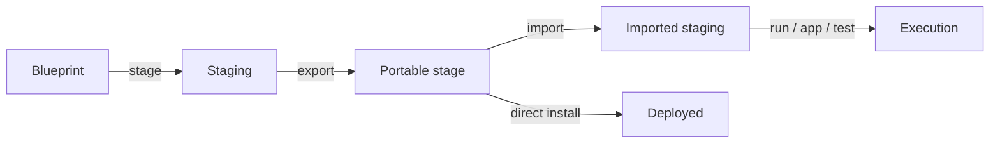

# Future Directions

Ideas that are intentionally outside the current direct/staged install
redesign. This document keeps longer-term product directions visible without
turning them into near-term acceptance criteria.

## Operating Systems

Reploy has two separate OS dimensions:

- binary targets: where the `reploy` CLI can run
- deployment targets: where Reploy can install and operate a managed service

Future work should define support levels for each combination. For example,
macOS and Windows may be useful CLI/staging hosts before they are supported as
permanent deployment targets. Linux/systemd can remain the first deployed
runtime target while other service managers are evaluated.

Open questions:

- Which OSes should get official CLI binaries?
- Which OSes should support staging workflows?
- Which OSes should support permanent install/update/uninstall?
- How should unsupported deployment operations fail on otherwise supported CLI
  platforms?

## Blueprint Index

The blueprint index may evolve toward an `apt-get update` style workflow: a
cached local catalog used for shorthand resolution, discovery, search, and
possibly trust metadata.

Possible commands:

```text
reploy index update
reploy index search arbiter
reploy index show arbiter-server
```

Open questions:

- Should the index remain a simple JSON catalog or become a richer signed
  metadata source?
- Should index entries include app ids, descriptions, supported platforms,
  latest versions, and blueprint package refs?
- Should search work offline from the cached index?
- What trust or verification model is needed before installing from indexed
  shorthand names?

## Deployment Environments

The current redesign focuses on local host deployment, initially Linux/systemd.
Other deployment environments may become useful later.

The most realistic expansion path is probably not a generic cloud or
orchestrator layer. Reploy's current model fits best where it can own a
portable runtime boundary, stage dependencies, generate local state, and expose
an app-scoped control surface. That points first at container or VM runtimes
near the Docker abstraction level.

### Container and VM Runtime Backends

Likely future backends are systems that can run a Reploy-managed service from
the same blueprint/runtime model without changing the product into a cloud
provisioner:

- Docker Engine and Docker Desktop Linux-container mode
- Colima/Lima-style Linux VMs on macOS and possibly Windows
- Podman or containerd-compatible runtimes if the lifecycle semantics line up
- explicit VM backends such as KVM, VirtualBox, or VMware when Reploy can
  provision or target a known guest runtime

These keep Reploy focused on installing and operating an app-owned runtime
environment rather than generating infrastructure. The main abstraction remains
"prepare this app and operate this local runtime," not "manage a fleet."

Open questions:

- Which container runtimes are close enough to Docker Compose to share one
  backend contract?
- Should VM support mean "install into an existing guest" or "create/manage the
  guest runtime"?
- How should host/guest file sharing, ports, persistence, and secrets be
  represented in staging state?
- Can the generated app control script stay identical across Docker Engine,
  Docker Desktop, Colima/Lima, and VM-backed runtimes?

### Podman Userland Backend

Evaluate Podman as a uniform user-scope backend for Reploy. Podman is
interesting because rootless Linux plus user systemd/Quadlet could provide a
real non-root Linux install path, while Podman Machine offers a local
VM-backed runtime on macOS and Windows. That could let the smoke contract stay
closer across platforms: stage, build, run, install, generated control script,
and uninstall would all exercise installed-app behavior without requiring
Linux root/systemd system services for the common user-scope case.

This should be evaluated as a backend option, not assumed as a replacement for
the current Docker/systemd and Docker Desktop paths. On macOS and Windows,
Podman containers still run on the host machine inside a Linux VM, so the
security and lifecycle promises are VM-backed userland promises rather than
native OS service promises. On Linux, rootless Podman depends on host
capabilities such as user namespaces, subuid/subgid mappings, cgroup v2,
rootless networking, user systemd, and possibly linger for reboot-without-login
persistence.

Open questions:

- Can one Podman backend cover Linux, macOS, and Windows with the same Reploy
  install/control/uninstall contract?
- Should Reploy use Quadlet/user systemd directly, `podman generate systemd`,
  or a Compose-compatible provider through `podman compose`?
- How should Reploy represent Podman Machine readiness, VM lifecycle, file
  sharing, port publishing, and host path behavior on macOS and Windows?
- What preflight checks are required for rootless Linux: user namespaces,
  subuid/subgid, cgroup v2, network backend, user systemd, and linger?
- Does the Podman path improve cross-platform smoke parity enough to justify a
  first-class backend beside Docker?
- How should support docs explain "runs on the host inside a Linux VM" for
  macOS and Windows without implying native OS service semantics?

## Additional Bundle Providers

The current provider direction starts with Python/PyPI. Source repositories and
system packages should be treated as additional bundle providers, not separate
one-off install modes.

Portable runtime environments make mixed providers more useful. A realistic
service environment may need Python packages, system packages, source-built
components, and image references in the same staged runtime. In that model, each
provider is responsible for resolving, materializing, and later restoring its
own part of the environment contract.

### Source Provider

Reploy now has an initial generic Git source provider for HTTPS and SSH
repositories. It fetches source with a built-in Git client, resolves branch and
tag refs to a commit hash in staging state, loads an explicitly selected
blueprint file when supplied, and builds the provider package from the
checked-out source.

Current refs:

```text
reploy stage github://org/repo/package_name/reploy/app.blueprint.yaml?ref=main
reploy stage git:https://github.com/org/repo.git#package_name/reploy/app.blueprint.yaml?ref=main
reploy install git:https://github.com/org/repo.git#package_name/reploy/app.blueprint.yaml?ref=v1.2.3 --scope <user|system>
```

Open questions:

- Should a future blueprint index map Reploy versions or app versions to
  upstream commit hashes?
- Should additional provider schemes be added for GitLab or Bitbucket after
  there are fixtures and parser tests for their URL layouts?
- If GitLab is supported, how should Reploy handle nested groups without
  confusing the project path with the blueprint file path?
- If Bitbucket is supported, should it accept a path-style provider ref like
  GitHub, or require an explicit `path=` query parameter?
- Which build steps are blueprint-declared versus provider-specific?
- What build dependencies are required, and how are they declared?
- What build environment is used?
- Can builds run isolated from the host OS to improve reproducibility and
  stability?
- How is the target OS and architecture selected for the build?
- Can the staging build target differ from the host running Reploy?
- How is source provenance recorded in deployed state?

### System Package Provider

Bundles may eventually support system packages such as `dpkg` artifacts as a
provider alongside Python/PyPI packages.

This could help apps that need native tools, service-side utilities, or
distribution-packaged dependencies. It also raises privilege, platform, and
dependency-resolution questions that are different from Python wheel bundles.

Open questions:

- Are `.deb` packages copied into the bundle, referenced from apt repositories,
  or both?
- Does Reploy install system packages on the host or inside generated runtime
  images?
- How are package sources, signatures, and trust handled?
- How does this interact with non-Debian deployment targets?
- How is the package target OS and architecture represented?

## Portable Stages

A portable stage may become the shared primitive for turning a prepared staging
workspace into a transferable file. It is not a separate blueprint or profile;
it is the exported form of staging state. The same stage can later be consumed
by direct install, import, or remote/development execution flows.

"Portable" should not imply architecture-independent. A portable stage can move
between compatible systems, but it will usually be tied to the target OS,
architecture, runtime backend, and provider locks used when the environment was
resolved.

Conceptual flow:



This should not be treated as rewriting the app-owned blueprint. A blueprint is
owned by the app author; a portable stage would be an operator-prepared source
derived from that blueprint. It should preserve local
decisions made in staging without pretending to be the upstream app blueprint.

Possible commands:

```text
reploy stage --export arbiter.stage.tgz
reploy stage --import arbiter.stage.tgz
reploy install --stage arbiter.stage.tgz --scope <user|system>
reploy run pytest -q
```

`reploy stage --export` and `reploy stage --import` make export/import part of
the staging lifecycle. `reploy install --stage ... --scope user|system` keeps
portable stages distinct from app refs while still allowing direct install from
a prepared stage.

`reploy app` should remain the app-command surface for blueprint-declared
commands. A future `reploy run` or `reploy exec` would be the lower-level
primitive for running an ad hoc command inside the staged environment.

A portable stage should be useful for both deployment transfer and runtime
transfer:

- direct install on another system
- importing a prepared staging workspace on another host
- stable development environments for agents moving across operating systems
- remote execution systems that need to import a known environment, run a
  command, collect outputs, and discard or preserve the result
- CI-like validation where the staged runtime is the unit of work

A portable stage should be efficient logical environment transfer, not a blind
archive of every file in staging. It should preserve the parts that cannot be
reliably restored elsewhere, such as:

- staging state and the resolved blueprint ref
- selected bundle roots and app options
- user configuration and local overrides
- lock or materialization metadata, such as package versions, source commits,
  image digests, and checksums
- provider-specific resolved identities, such as PyPI distributions, dpkg
  packages, source commits, and image digests
- portable generated configuration
- install/update policy metadata
- generated control script metadata
- explicitly selected local artifacts

A portable stage may include locally generated bundle objects when they are the
thing to install, such as locally built packages or generated deployment assets.
It should still avoid copying data that can be restored from public or declared
sources, such as PyPI dependencies, Docker image layers, build caches, logs,
temporary files, and generated runtime output. Import can then rehydrate the
workspace by restoring local decisions, installing included bundle objects, and
refetching external dependencies from locked refs.

Mixed providers are especially important for this direction. Export should
record the resolved identity of each provider item rather than flattening the
environment into bytes. Import can then ask the Python provider to restore
Python requirements, the system package provider to restore `dpkg` or apt
packages, the source provider to restore checked-out commits, and an image
provider to restore image digests.

Export should exclude secrets and host-specific state by default. Any future
support for including sensitive or host-specific values needs explicit policy
and clear reporting.

Open questions:

- What is the portable stage format and versioning policy?
- How should target OS, architecture, runtime backend, and provider compatibility
  be recorded and checked?
- Which files are always included, excluded, or opt-in?
- How should secrets and host-specific paths be represented or redacted?
- Should direct install consume the same portable stage as import, or should it
  consume a narrower projection generated from the stage?
- Should import verify reconstructed dependencies against recorded hashes or
  digests?
- Should `run` require the environment to be started, or should it run inside a
  one-shot container/runtime prepared from staging?

## Snapshots

Real snapshots are separate from portable stages. A portable stage is a logical
transfer format that reconstructs or installs an environment. A snapshot should
capture filesystem or backend state so that Reploy can restore exact bytes from
a point in time.

Possible commands:

```text
reploy snapshot create arbiter.snapshot.tgz
reploy snapshot restore arbiter.snapshot.tgz
```

Snapshots could be useful for:

- save/restore backups of Reploy-owned state
- retrying risky operations from the same state, with a cheap reset after each
  failure
- handing off an in-progress environment to another host or agent
- hibernating a task and resuming it later
- preserving incident reproduction, demo, or training environments where exact
  local state matters more than small artifact size

Snapshotting may need app or backend hooks to bring the system into a quiet
state before capture. Examples include syncing pending writes, flushing queues,
pausing workers, holding new requests in a queue, or marking the service
temporarily read-only. Restore should also be explicit about which Reploy-owned
paths, volumes, containers, or backend resources will be replaced.

Restoring from a snapshot should bring services back to the same lifecycle state
recorded by the snapshot. A service that was running should be restored running,
a stopped service should remain stopped, and multi-service environments need a
defined ordering for stop, restore, and start operations.

Open questions:

- Which backends can provide real snapshots: filesystem archive, Docker volume
  export, Docker image save/load, btrfs/zfs/LVM, VM or microVM disk snapshots?
- How should snapshot hooks be declared, ordered, timed out, and verified?
- How should Reploy prevent secrets, logs, and runtime data from being captured
  accidentally?
- Should snapshots be allowed for deployed services, staging environments, or
  only explicitly stopped runtimes?
- How should service lifecycle state, dependency ordering, and health checks be
  recorded and restored?
- How should restore handle partial failures after replacing some state?
