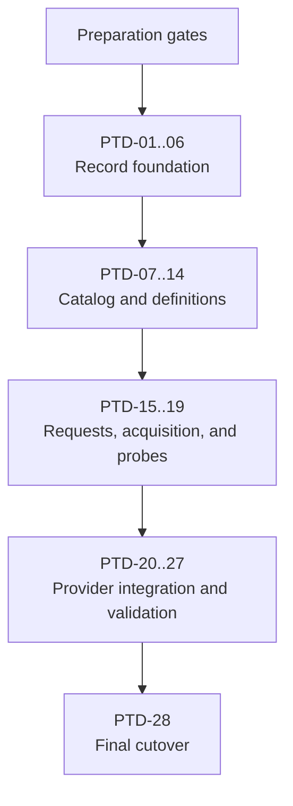

# Portable Tool Definition Implementation Plan

## Authority and Execution Contract

The accepted
[Portable Tool Definition Design](PORTABLE_TOOL_DEFINITION_DESIGN.md) is the
normative authority for behavior, trust boundaries, identity, and support
claims. This document defines preparation, delivery order, review boundaries,
acceptance evidence, and retirement of the existing work in progress. It may
choose implementation structure but must not invent or weaken the design.

This plan is structured as input to the existing AWD function:

```text
global:swe:deliver-design-stack(docs/PORTABLE_TOOL_DEFINITION_IMPLEMENTATION_PLAN.md, all)
```

The only delivery task IDs are `PTD-01` through `PTD-28`. The preparation
gates are prerequisites, not implementation tasks, commits, or pull requests.
`deliver-design-stack` may read this plan before preparation is complete, but
must pause on an unmet preparation gate.

No AWD function change is part of this plan. Preparation retires the oversized
WIP pull requests rather than rewriting them in place, so every `PTD-*` task is
an ordinary slice built on a clean stack.

Because construction and review are separate phases, the saved functions apply
per phase rather than all at once. Construction uses the submission and
synchronization functions to publish each slice as a draft, and does not use
`deliver-design-stack`, whose slice contract ends in a completed remote PR
cycle. Review uses `swe:local-stack-review` bottom-up and then `swe:pr-cycle`
per task. `deliver-design-stack` governs a task end to end only once remote
review capacity is available for that task.

## Scope

Complete the accepted embedded portable-tool bridge for:

- Eclipse Temurin JDK 21, used only by isolated local-source builders;
- Playwright 1.61.0 with the Python binding and explicit Chromium selection;
- asciinema 3.2.1 using the existing pinned GNU/Linux AMD64 and ARM64 release
  assets on Debian 12, Debian 13, Ubuntu 25.10, and Ubuntu 26.04 for both
  architectures;
- Debian 12 and the accepted Ubuntu targets on Linux AMD64, plus Debian 13 for
  Java;
- strict records, bounded catalog loading, deterministic resolution, verified
  acquisition, offline materialization, provider and lock integration, and
  manifest-derived validation evidence.

Reploy is unreleased, and the flat WIP format never landed on the default
branch: it exists only inside the retired work in progress. No flat definition
is therefore a public contract at any point in this campaign, so the design's
requirement that the two formats never coexist publicly is satisfied by never
introducing the flat one, and no compatibility reader is needed.

Repository publication, TUF metadata, publisher authorization, implementation
of additional tool versions including asciinema v2 and other Playwright
bindings or browsers remain outside this campaign. Asciinema 3.2.1 for the
eight pinned Debian, Ubuntu, and architecture tuples is in scope, and v2 is
retained as a design comparison to ensure that
materially different major versions could coexist without implementing v2 now.

## Current Stack Prerequisites

The campaign begins above two already reviewed stack slices:

PR 81 remains unchanged while this design true-up is in progress. That is a
temporary sequencing constraint, not a permanent prohibition. Once the designs
are solid, the owner may separately authorize folding the accumulated design
fixes into PR 81, deliberately invalidating the dependent stack, and reviewing
the rebuilt stack bottom-up.

| PR | Approved responsibility |
| --- | --- |
| 81 | Accepted portable-tool composition design |
| 82 | Local-source exclusions and implicit-root Python sdists |

Preparation must revalidate their current heads and approval evidence, but
must not rewrite or re-review them. Recorded hashes are observations rather
than authority to ignore later drift.

## Retired WIP and Required Truth Fixes

PR 83 combined Python-provider helpers, record schemas, strict decoding,
record-local validation, graph validation, fixture coverage, and tests. PR 85
combined catalog loading, graph validation, selection resolution, embedded Java
and Playwright definitions, and tests. Both were too large to review as single
slices, so both are closed. Their content survives as parked local extraction
sources, not as pull requests:

| Retired PR | Parked extraction source | Feeds |
| --- | --- | --- |
| 83 | `b39985d247e5` (from `9e9cb456db0d`, originally `e5ee84bb5ccb`) | `PTD-01` through `PTD-06` |
| 85 | `37ca781bd6cb` (from `b680caaa834e`) | `PTD-07` through `PTD-09`, `PTD-12` through `PTD-13` |

The parked sources are evidence, not authority. Where they disagree with the
normative design, the design wins and the difference is recorded as a truth fix.

Closing the retired pull requests also closed their review history. Every
finding that was still unresolved at closure is carried forward as an active
campaign discovery and named in the acceptance criteria of the slice that will
own it, so a retired reviewer's objection cannot be lost by rebuilding the same
code. Retired PR 83 left three such findings and retired PR 85 left none.

The retired PR 85 source also uses an obsolete singular target model in parts of
its resolver and validation code. Reconstruction must implement the accepted
plural model:

- binding sets, named selection dimensions, exact intra-tool references to
  existing typed records, and multiple integration
  fixtures;
- binding- and selection-scoped package sets and exports, plus references to
  shared validation profiles;
- validation fixtures, profiles, source locators, and unselected availability
  excluded from selected-closure identity.
- Java's public tool-version coordinate and release namespace are `21`; exact
  Temurin component version `21.0.12+8` belongs to the JDK payload rather than
  the tool-version coordinate.

These are truth fixes required by the normative design. They must be recorded
separately from behavior-preserving movement of existing code.

## Preparation Gates

Preparation establishes a clean review topology to build on. It does not
approve implementation behavior.

### Baseline and Retirement Gate

This gate is one recorded transaction, performed before any slice is built:

1. Require a clean worktree and no unfinished Sapling operation.
2. Record immutable digests for the design and this plan.
3. Record the local draft chain, native-stack membership, PR bases, branches,
   heads, titles, bodies, readiness, labels, and checks.
4. Verify PRs 81 and 82 have current-head approval evidence and record their
   immutable heads as protected prerequisites.
5. Detach the oversized WIP commits into parked extraction sources off PR 82's
   head, and verify their combined effect is unchanged by the detachment.
6. Dissolve the native stack, then close the retired WIP PRs with comments
   naming their parked sources and successor tasks.
7. Inventory every other local WIP node or branch without modifying it.
8. Stop on unexpected local or remote drift; do not smooth it over or silently
   choose a new baseline.

Gate evidence: one baseline record identifying every protected, parked, closed,
and excluded local node and PR, plus proof the parked sources preserve the
retired content exactly.

### Slice Ownership Rule

Every hunk of the parked extraction sources belongs to exactly one task in
`PTD-01` through `PTD-13`, or is explicitly excluded. Ownership is recorded per
slice as that slice is built, not as one up-front ledger. Each slice records:

- changes retained without semantic modification;
- file or function movement required to create coherent ownership;
- every normative truth fix and the design clause requiring it;
- tests paired with each production responsibility;
- unrelated or deferred work that remains excluded.

Shared files may be split into responsibility-named files. File movement does
not justify behavior changes. No source hunk may be unowned, multiply owned, or
silently dropped.

Gate evidence: after `PTD-13`, cumulative accounting proves the parked sources
are fully consumed by the delivered slices plus the recorded truth fixes and
recorded exclusions. An unexplained residue blocks campaign completion.

### Stack Construction Gate

The rebuilt stack starts from PR 81, PR 82, and this plan's own pull request.
Each `PTD-*` task is then appended by ordinary submission:

1. Build one coherent commit that compiles and passes its focused tests.
2. Keep the worktree clean after each commit and preserve excluded WIP.
3. Publish it through the ordinary submission function, which appends a
   contiguous native-stack suffix in exact task order.
4. Give every PR durable scope authority linking its task below and the
   normative design, including intent, acceptance criteria, and exclusions.
5. Verify exact bases, branches, heads, readiness, titles, bodies, and stack
   membership after each append.

Because nothing is inserted below an existing PR and no PR is relinked, the
ordinary submission and synchronization contracts apply from the first task
onward. Publication alone claims no review or approval.

### Construction Handoff Gate

Before constructing a given task:

- the task's dependencies are constructed, locally reviewed, passing their
  checks, and present in the stack in exact order;
- the worktree is clean and the checkout is at the stack tip;
- the task has durable scope authority and a unique commit/PR mapping, or is
  ready to be built and mapped by delivery itself;
- PRs 81 and 82 remain approved at their current owner-authorized heads;
- no `PTD-*` task is represented as approved without current-head evidence;
- active discoveries, exclusions, parked-source identities, and deferrals are
  in the campaign state;
- the saved delivery function and all called SWE functions resolve and validate.

Gate evidence: `deliver-design-stack` builds one unambiguous dependency-ordered
queue from this document.

## Delivery Flow



## Review Phasing

Remote review capacity is a shared, exhaustible resource, so construction does
not wait for it. Construction and review are separate phases with separate
evidence.

A constructed prefix may be reviewed before the rest of `PTD-01` through
`PTD-14` exists, and reviewing early is preferred: a finding that rewrites
history invalidates every slice above it, so the cost of a low finding grows
with stack height.

Construction phase, per task, without remote review:

1. Verify all dependencies are constructed, locally reviewed, and passing their
   checks. Remote approval is not a construction prerequisite.
2. Establish intent, owned scope, acceptance criteria, and non-goals from this
   plan and the normative design.
3. Split again before coding if the responsibility cannot be reviewed
   coherently; task IDs and authority must be updated before execution.
4. Pair behavior with focused positive, negative, limit, and identity tests.
5. Run focused tests, repository validation, and a local deep review.
6. Commit one owning commit and publish one mapped draft PR carrying durable
   scope authority. Draft state records that no review is claimed.
7. Record additive discoveries durably before starting the next task.

Review phase, once remote review capacity is available:

1. Review the constructed stack bottom-up from the recorded review base.
2. Complete one remote PR cycle per task in stack order, marking each PR ready
   only when its review begins.
3. Treat any finding that rewrites history as invalidating review evidence for
   every affected slice above it, and restack and re-review that suffix.
4. Do not mark the campaign complete until every constructed task has
   current-head approval evidence.

Accepted risk: deferring remote review lets a finding in a low slice cascade
into every slice above it. Local deep review and full local checks at every
commit are the mitigation, not an equivalent substitute. Tasks from `PTD-15`
onward are not constructed until the `PTD-01` through `PTD-14` stack has been
reviewed and approved.

A discovery may refine mechanics inside accepted scope. A discovery changing
public schema, identity, trust, support claims, or task responsibility pauses
the campaign until durable authority is updated.

## Delivery Queue

| Task | Exact title | Depends on | Source |
| --- | --- | --- | --- |
| PTD-01 | Expose Portable Python Requirement Validation | PR 82 | PR 83 source |
| PTD-02 | Define Portable Tool Record Data Model | PTD-01 | PR 83 source |
| PTD-03 | Add Bounded Strict Portable Record Decoding | PTD-02 | PR 83 source |
| PTD-04 | Validate Immutable Portable Tool Records | PTD-03 | PR 83 source; small PR 85 correction |
| PTD-05 | Validate Target Composition and Fixture Coverage | PTD-04 | PR 83 source |
| PTD-06 | Validate Release Graphs and External Evidence | PTD-05 | PR 83 source |
| PTD-07 | Load Bounded Hierarchical Portable Tool Catalogs | PTD-06 | PR 85 source |
| PTD-08 | Validate Catalog Graphs and Acquisition Mappings | PTD-07 | PR 85 source |
| PTD-09 | Select Canonical Portable Tool Release Candidates | PTD-08 | PR 85 source and truth fixes |
| PTD-10 | Resolve Selected Closures by Joint Constraint Solving | PTD-09 | New work |
| PTD-11 | Generate Canonical Portable Tool Catalog Records | PTD-10 | New work |
| PTD-12 | Embed the Java Portable Tool Definition | PTD-11 | PR 85 source |
| PTD-13 | Embed the Playwright Portable Tool Definition | PTD-12 | PR 85 source |
| PTD-14 | Embed the Asciinema Portable Tool Definition | PTD-13 | New work |
| PTD-15 | Parse Canonical Portable Tool Requests | PTD-14 | New work |
| PTD-16 | Acquire Pinned Artifacts with Bounded Mirror Fallback | PTD-15 | New work |
| PTD-17 | Enforce Artifact Acquisition Network Policy | PTD-16 | New work |
| PTD-18 | Materialize Verified Archives Safely and Offline | PTD-17 | New work |
| PTD-19 | Run Portable Tool Probes Without Network Access | PTD-18 | New work |
| PTD-20 | Compile Selected Closures into Provider Plans and Locks | PTD-19 | New work |
| PTD-21 | Cut Java Build Tools Over to the Portable Catalog | PTD-20 | New work |
| PTD-22 | Materialize the Playwright Python Binding | PTD-21 | New work |
| PTD-23 | Materialize Playwright Chromium Payloads | PTD-22 | New work |
| PTD-24 | Derive Portable Tool Integration Cases and Evidence | PTD-23 | New work |
| PTD-25 | Validate Every Advertised Java Tuple Through Reploy | PTD-24 | New work |
| PTD-26 | Validate Every Advertised Playwright Tuple Through Reploy | PTD-25 | New work |
| PTD-27 | Validate Every Advertised Asciinema Tuple Through Reploy | PTD-26 | New work |
| PTD-28 | Remove the Flat WIP and Finalize Portable Tool Documentation | PTD-27 | New work |

## Task Specifications

### PTD-01: Expose Portable Python Requirement Validation

Scope: expose canonical Python root-requirement and interpreter-version
validation, normalized distribution-name extraction, and focused provider
tests.

Acceptance: exact and ranged roots normalize deterministically; URLs, markers,
extras, malformed roots, and ambiguous versions fail; `go.mod` remains stable
under `go mod tidy`; and `go test ./internal/providers/python` passes.

Non-goals: record types, catalog behavior, Python resolver changes, or module
dependency promotion, which belongs to the slice that first imports the
dependency directly.

### PTD-02: Define Portable Tool Record Data Model

Scope: define v1 schema names, records, references, target identities,
contribution mappings, fixtures, profiles, evidence, canonical binding-set
requests without defaults, named selection-dimension schemas, explicit
supported-combination matrices, and contribution mappings, profile-reference
arrays without inline probes, and immutable-value
clone or comparison helpers.

Acceptance: the model expresses the complete plural contribution shape; every
record family has construction coverage; clone helpers copy every mutable field
so a handed-out record cannot alias catalog state; and the intermediate
`internal/toolcatalog` package builds without catalog activation.

Truth fix: the parked clone helpers copy only some mutable fields, so a
returned record aliases the loaded catalog through target bindings, target
target exports, integration fixtures, selection package sets, selection exports,
selection validation-profile references, contract selection dimensions and
combinations, and fixture selection maps. The design
treats definition records as immutable, so every mutable field is copied and
the independence is proven by test.

Non-goals: decoding, semantic validation, graph traversal, or resolution.

### PTD-03: Add Bounded Strict Portable Record Decoding

Scope: add schema dispatch, bounded exact JSON decoding, duplicate and unknown
member rejection, UTF-8 and surrogate checks, and canonical IDs, references,
decimals, paths, URLs, version segments, and collections.

Acceptance: every schema round-trips; ambiguous encodings and every structural
limit have negative coverage; and decoding performs no graph or network work.

Non-goals: record business rules or cross-record validation.

### PTD-04: Validate Immutable Portable Tool Records

Scope: validate record-local tool, release, alias, request, runtime, export,
validation-profile probe, payload, source, package-set, binding-set, wheel-tag,
platform, selection-dimension, and namespace rules. Remove the parked
singular/default binding, dimensionless selection, inline-probe, and generic
parameter fields. Move PR 85's release-alias correction here.

Acceptance: each kind validates without graph traversal; version policy uses
the declared scheme; artifacts require exact size and digest; diagnostics have
focused negative tests; `go.mod` promotes the shared version dependency to
direct because this slice is the first to import `go-version/pkg/semver`, and
remains stable under `go mod tidy`.

Non-goals: target coverage, reachability, or source-mapping completeness.

### PTD-05: Validate Target Composition and Fixture Coverage

Scope: add explicit target support cases, plural binding contributions, and
named selection-dimension contributions; scoped artifacts, packages, and
inline exports; shared
validation-profile references; multiple fixtures; and bounded support-tuple
enumeration.

Acceptance: missing, duplicate, incompatible, or conflicting mappings fail;
each target support case names exactly one contract-allowed context, exact
resolved binding set or absence, and complete normalized selection map; cases
are unique and canonical, and no context/target/options outer product is
inferred. Every supported tuple has matching fixture coverage; unselected contributions
never leak into a tuple; each selection contribution preserves its dimension
and value and sorts by that pair; explicit supported combinations have unique
ordered dimensions and unique dimension-keyed maps whose present values
normalize to nonempty sets; required dimensions cannot be omitted, optional
dimensions may be omitted, and a request must exactly match one advertised
combination; Reploy does not
infer an outer product; explicit binding lists and `all` resolve to canonical
sets; omitted bindings match active application providers or the sole
advertised binding; ambiguous omissions fail; and exact intra-tool references
to existing artifact, payload, package-set, and validation-profile records are
acyclic and deduplicate only when their exact references agree. Inline exports
deduplicate on identical canonical name/path values, and conflicting paths for
one name fail.

Carried findings from retired PR 83, each requiring negative coverage:

- a binding artifact set must cover every interpreter its contract advertises.
  One wheel matching `requires_python` is not sufficient: advertising Python
  3.11 and 3.12 while shipping only a `cp311` wheel must fail;
- co-selectable payloads must not collide. Two payloads reachable in one
  support tuple that share a logical path, or whose install destinations
  overlap, must fail even when their package requirements agree.

Non-goals: whole-catalog reachability or container execution.

### PTD-06: Validate Release Graphs and External Evidence

Scope: validate release indexes, exact-version and alias collisions, immutable
manifest graphs, namespaces, provenance, profiles, and external evidence.

Acceptance: cycles, missing references, digest mismatches, namespace escapes,
and conflicting identities fail; evidence cannot create unsupported claims;
validation data remains outside selected identity.

Carried finding from retired PR 83, requiring negative coverage: every artifact
sharing a mapped digest must agree on size. Checking only the mapped artifact
record lets two reachable records declare one SHA-256 with different sizes and
still pass.

Non-goals: filesystem catalog discovery or acquisition.

### PTD-07: Load Bounded Hierarchical Portable Tool Catalogs

Scope: add injected-filesystem loading, ownership and namespace discovery,
reference-edge depth limits, and duplicate/digest checks. The normative
design defines no aggregate byte or record-count ceiling, so this slice adds
none, and `bounded` here does not mean a ceiling on catalog size. It means
three properties that hold however large the catalog is: each record's parse is
bounded by the per-unit limits before that record is decoded; traversal and
recursion are bounded by the reference-edge depth limit; and no allocation, buffer,
or traversal is ever sized by a count a record declares, only by content the
loader has already observed. Loading a catalog of `n` records therefore costs
work and retention linear in `n`, which is the operator's own embedded input,
rather than work a record can inflate.

Acceptance: per-record limits apply before each record is decoded; no
allocation or traversal is sized by a declared count rather than observed
content; loader work and retention stay linear in the records actually present,
proven by a synthetic wide-catalog case rather than asserted; misplaced and
duplicate records fail; synthetic loader tests pass; no tool-specific case
enters the loader.

Non-goals: graph semantics or request resolution.

### PTD-08: Validate Catalog Graphs and Acquisition Mappings

Scope: validate reference schemas and digests, acyclic reachability, target
uniqueness, artifact-source completeness, orphan rejection, and package,
export, logical-path, and installation conflicts.

Acceptance: every reachable artifact has one consistent source mapping;
unreachable records fail; identical contributions deduplicate; incompatible
ones conflict; installation destinations conflict within each selected
contribution union rather than catalog-wide, so contributions that can never
share a support tuple do not collide; validation acquires no bytes.

Non-goals: selecting a release or target.

### PTD-09: Select Canonical Portable Tool Release Candidates

Scope: accept a canonical requirement group through an internal API, load its
tool record's immutable version scheme and, when an opaque
requirement omits its version, normalize it to exact equality with that
record's `default_version` before any candidate is enumerated. Parse compact
`~<revision>` only for schemes that exclude `~` from exact version tokens;
schemes that permit it require structured `definition_revision`. Resolve the
remaining token under the selected scheme and its collision-free coordinate
and alias map. Then enumerate authorized release candidates for each canonical
group, restricted to those satisfying every version constraint and, when
supplied, its exact definition-revision pin, which
is valid only alongside an exact upstream version; an unconstrained
ordered-scheme requirement excludes prereleases, which are eligible only where
the requirement names one. Reduce the enumerated releases per group before
any solving: remove candidates the running client cannot satisfy by version or
primitive set, require exactly one target leaf matching the observed base,
resolve the group's cumulative binding demand, require the resolved
context, binding set, and selection map to equal one exact case advertised by
that target, and traverse the selected references to build each candidate's
contribution union. A client, target, binding, selection, or intrinsic
contribution conflict removes that candidate before
joint solving, so an older release that can satisfy the request survives when
the newest cannot. Return every eligible release rather than one choice,
ordered by descending scheme-native version and then descending definition
revision, so `PTD-10` can still reach an older revision when the newest
conflicts in a shared domain; an opaque request has one exact version and
orders its definition revisions newest first unless pinned.

Multiple target leaves matching one observed base are invalid definition data
rather than a fallback choice, and `PTD-06` already enforces that for the whole
catalog: leaves match by exact identity, so two matching leaves means two
leaves declaring the same identity, which the release graph walker rejects at
load. Selection keeps its own check as a defence rather than relying on that
ordering, and fails the request rather than removing the candidate.

Acceptance: direct internal fixtures supply canonical groups until `PTD-15`
wires public parsing and field-by-field same-scope merging; the plural model
replaces all stale singular-field use;
unsupported requests fail before acquisition; every record placed in a
candidate is cloned, including the validation profile, so a returned candidate
cannot alias loaded catalog state; a client-incompatible newest
candidate falls back to an older compatible release instead of failing; a
versionless opaque request resolves to the tool record's `default_version`
rather than reaching enumeration without an exact coordinate; an exact
definition-revision pin such as `tool:java==21~2` restricts enumeration rather
than being overridden by newest-first ordering; a definition-revision pin
without an exact upstream version is refused rather than applied to whichever
version sorts first within a range; an unpinned opaque request with several
eligible definition revisions orders them newest first while retaining every
one of them, so a revision joint solving must fall back to is still there to
reach; an unconstrained ordered-scheme request selects no prerelease while a
request naming one selects it; an exact coordinate carrying scheme-native
punctuation, such as a PEP 440 epoch or an opaque coordinate containing `~`,
resolves through the tool-wide lookup rather than being parsed as a comparison
expression; an ordered scheme that is not SemVer evaluates its own comparison
expressions rather than borrowing an evaluator its coordinates cannot parse;
and every surviving candidate carries the contribution union its own
references produce, so a candidate removed for an intrinsic conflict is
removed before any joint solving sees it.

This slice was split from the original single task before coding, as that task
permitted. Candidate selection is per requirement and is largely carried by the
parked source; joint solving is across requirements and has no parked basis at
all, the parked resolver containing no scope, partition, assignment, or
backtracking logic. Reviewing both as one unit would have exceeded the largest
slice this campaign has reviewed, which took eight rounds.

Non-goals: public request parsing or construction of canonical groups, which
belongs to `PTD-15`; joint constraint solving across requirement groups, which
belongs to `PTD-10`; downloading or materializing artifacts.

### PTD-10: Resolve Selected Closures by Joint Constraint Solving

Scope: resolve the candidate sets surviving `PTD-09` for canonical requirement
groups as one bounded deterministic
constraint problem against the active provider graph for each scope,
partitioned so that isolated package-manager, filesystem, environment, export,
and capability domains do not constrain one another while domains genuinely
shared across scopes do, failing closed with a diagnostic when the
visited-state cap is exceeded. Groups are ordered by canonical scope identity,
qualified tool name, and then canonical merged-demand bytes, and
bounded deterministic backtracking selects the lexicographically first complete
assignment whose contributions are conflict-free, so a first-ordered
combination that conflicts in a shared domain backtracks to a valid combination
instead of failing the request. Finalize version, revision, context, target,
binding set, selection map, all scoped contributions, matching
validation fixture, provenance, and order-independent selected identity. Report
the incompatible requirements when no complete assignment exists. The complete
blueprint, Reploy, platform, catalog, and candidate-introduced constraint set is
an immutable operation snapshot carried unchanged into acquisition.

Acceptance: validation and source-only data do not affect selected identity
while every selected behavior does; every record placed in a selected closure
is cloned, including the validation profile, so a returned closure cannot alias
loaded catalog state; requirements in an isolated source-builder scope and an
application runtime scope do not constrain each other except through genuinely shared
domains; a first-ordered combination that conflicts in a shared domain
backtracks to a valid combination rather than failing the request; request
input order cannot change the result; exceeding the assignment cap fails closed
rather than returning a partial or order-dependent result; and acquisition
executes the finalized solution without mutating or automatically re-solving
its operation snapshot.

Non-goals: candidate enumeration and per-request reduction, which belong to
`PTD-09`; downloading or materializing artifacts.

### PTD-11: Generate Canonical Portable Tool Catalog Records

Scope: add a typed, deterministic definition composer that resolves exact
references from shared validation profiles and other reusable intra-tool
components into canonical catalog records. Authoring data declares common
records once and keeps target, architecture, and binding differences in small
variant records. The composer performs no implicit inheritance or overlay.

Acceptance: identical input emits byte-identical canonical records; every
reference is explicit and digest checked; a probe shared by many variants is
declared once in its validation profile; invalid, cyclic, ambiguous, or
conflicting composition fails before embedding; target-independent payload,
contract, and profile records referenced by many target leaves are emitted
once rather than copied into each leaf; generated output passes the ordinary
catalog validators.

Non-goals: a general configuration language, arbitrary templates, conditionals,
cross-tool dependencies, or runtime composition.

### PTD-12: Embed the Java Portable Tool Definition

Scope: add Java tool, release, target, Temurin JDK payload/source, fixture, and
profile records for public `tool:java==21` on the accepted AMD64 matrix. Use
release namespace `21`; retain `21.0.12+8` as payload component metadata.

Acceptance: the public version and record namespace are `21`; exact Temurin
version, sizes, digests, exports, and targets match vetted data; unsupported
requests fail before acquisition; Java exports only `java` and `javac` in
build context.

Non-goals: replacing the current hard-coded Java consumer path.

### PTD-13: Embed the Playwright Portable Tool Definition

Scope: add the Playwright release, Python binding and wheel, Chromium,
Headless Shell and FFmpeg payloads, APT package sets, targets, fixtures, and
profile.

Acceptance: the Python/Chromium request resolves on every advertised AMD64
target; bundled metadata and artifact inventory are exact; unsupported
combinations fail before acquisition; selected identity includes all coupled
payloads and no unselected availability.

Non-goals: installing the binding or browser payloads.

### PTD-14: Embed the Asciinema Portable Tool Definition

Scope: add asciinema 3.2.1; two architecture-specific GNU/Linux payloads and
their GitHub-hosted artifact sources; eight exact target leaves and fixtures for
Debian 12, Debian 13, Ubuntu 25.10, and Ubuntu 26.04 on AMD64 and ARM64; and one
shared validation profile and probe through the canonical catalog generator.
Keep the release contract, profile, and payload records independent of the
target variants, with each target leaf explicitly referencing the applicable
architecture payload.

Acceptance: every advertised artifact has bounded ordered GitHub source
records, exact size and SHA-256 identity, target coverage, and matching fixture
metadata using the repository's existing pinned 3.2.1 data; catalog generation
emits exactly eight independently addressable leaves and fixtures while
retaining only two payload records and one shared profile; static validation
succeeds without acquisition, materialization, provider integration, or probe
execution. A non-published v2
comparison models its materially different packaging and layout alongside the
3.2.1 release and demonstrates that both major versions have distinct
coordinates and closures without implementing or advertising v2.

Non-goals: asciinema v2 implementation or support advertisement; acquisition,
materialization, provider integration, or probe execution before their owning
slices.

### PTD-15: Parse Canonical Portable Tool Requests

Scope: implement the compact scalar form for simple tool requirements and the
structured YAML mapping for requests with options, the full version constraint
grammar including ranges as well as exact versions, optional exact
definition-revision pins and typed binding-set/named-selection fields,
canonical resolution scope per requirement, the public field-by-field
same-scope requirement merge and deduplication rules, local-source recipe
migration, and the accepted application
tool-request surface.

Acceptance: a compact scalar such as `tool:java==21` and an equivalent mapping
normalize identically; the compact grammar cannot carry options; application
mappings are accepted under `environment.applications.<application>.packages.tools`
and source-build mappings under `.reploy.yaml` `requires`. Omitted bindings,
explicit YAML binding lists, and `binding: "*"` follow the accepted inference
rules. `select` is a mapping whose scalar or list values normalize to canonical
sets, for example `select: {browser: [webkit, chromium]}`. Equivalent ordering
normalizes rather than being rejected; structurally malformed YAML, duplicates,
empty lists, wildcard-plus-explicit combinations, and compact bracket syntax
fail during parsing; compact revision suffixes fail for schemes whose exact
versions may contain `~`, while unsupported dimensions or values fail during
catalog resolution before provider work. Identical same-scope requirements
deduplicate. Version constraints remain a sorted conjunction and must have a
nonempty intersection; explicit revision pins agree; context agrees; explicit
binding sets union, `"*"` dominates every other binding demand, and otherwise
omission retains an inference demand whose result unions with explicit values;
selection sets union by dimension.
The resulting demand must match one exact target support case or the merge is
incompatible. The complete canonical merge state participates in request
identity, while source locations remain only diagnostic provenance. Parser and
blueprint tests cover Java, Playwright, and asciinema, including conflicting
pins, empty version intersections, cumulative bindings, and a selection union
rejected because no target advertises it.

Non-goals: catalog resolution or compatibility parsing for unreleased syntax.

### PTD-16: Acquire Pinned Artifacts with Bounded Mirror Fallback

Scope: add verified cache lookup, ordered bounded mirrors, non-raiseable core
limits on the number of mirrors, attempts per mirror, and aggregate attempts,
per-attempt and aggregate byte/time/redirect limits, temporary cleanup, atomic
cache publication, and acquisition provenance.

Acceptance: success returns only recorded bytes; mismatches never enter cache;
cache hits use no network; attempt counts per mirror and in aggregate are
bounded by non-raiseable core caps, so a quickly failing mirror cannot retry
indefinitely inside the elapsed-time window; a definition may tighten but never
raise a core cap, while an ordered mirror list within the core cap is valid;
each failed attempt leaves a durable credential-free record of source identity,
outcome category, and relevant observed metadata without retaining failed
bytes; fallback and exhaustion diagnostics are deterministic and
credential-free.

Non-goals: extraction or tool-specific installation.

### PTD-17: Enforce Artifact Acquisition Network Policy

Scope: constrain locator schemes, proxies, redirects, public destinations, DNS
resolution and pinning, redirect-hop revalidation, rebinding, and redaction.

Acceptance: private, loopback, link-local, ambiguous, or rebound destinations
fail; redirects cannot broaden authority or disclose credentials; controlled
network tests cover mixed answers and every redirect boundary.

Non-goals: arbitrary downloader plugins or strict source-host allowlists beyond
the accepted content-verification model.

### PTD-18: Materialize Verified Archives Safely and Offline

Scope: implement reviewed archive primitives, fixed destinations, traversal and
link defenses, special-entry rejection, metadata normalization, resource
limits, atomic replacement, cleanup, and network-disabled materialization.

Acceptance: hostile fixtures cover paths, links, devices, FIFOs, ownership,
modes, ACLs, xattrs, capabilities, counts, and sizes; destination state is
complete or exactly restored; data never selects commands.

Non-goals: provider integration or runtime probes.

### PTD-19: Run Portable Tool Probes Without Network Access

Scope: execute definition-supplied validation-profile probes with exact
executable references and argv through a fixed Reploy-owned executor that owns
the environment, working directory, time/output/resource bounds, forced network
disablement, and canonical observed evidence.

Acceptance: Java, Playwright, and asciinema profiles declare their probes once
and variants reference those profiles; probes use no shell; declarations cannot
enable networking or relax executor bounds; timeout, output, and exit failures
are deterministic.

Non-goals: treating a probe result as support without matching fixture and
selected-closure evidence.

### PTD-20: Compile Selected Closures into Provider Plans and Locks

Scope: translate selected artifacts, packages, bindings, and exports into
provider DAG responsibilities; carry selected validation-profile references
into validation scheduling outside selected-closure identity; compile the selected closure's contract
runtime projection, meaning its install root and environment entries, into
those plans; bind closure, manifest, artifact, base-image, and provider
identities into plans and locks together with the complete release provenance,
meaning the tool, its scheme-native version, and the exact definition revision
that authorized the build, so two revisions sharing a byte-identical closure
remain distinguishable; and persist each artifact's acquisition provenance from
PTD-16 into the lock.

Acceptance: unrelated availability does not invalidate a plan; selected
behavior does; acquisition precedes offline materialization; locked replay does
not consult moving catalog or network state; contribution conflicts fail; and
the selected runtime install root and environment projection reach the provider
plan, so contract-owned final-image placement and environment values such as
Playwright's browser placement and download suppression are not silently
dropped; the lock records the authorizing source record together with the
acquisition outcome, which is either the successful declared source locator for
a network acquisition or an explicit statement that a verified-cache hit
contacted no locator. Redirect hops are sanitized transport diagnostics rather
than provenance locators, and any retained original locator is labeled
historical object provenance rather than the locator used by the current
operation.

Non-goals: tool-specific branches in generic provider code.

### PTD-21: Cut Java Build Tools Over to the Portable Catalog

Scope: replace name-only `tool:java`, `default-jre-headless`, and
`/usr/bin/java` switches with the selected Temurin closure in the isolated
local-source builder.

Acceptance: selected builds receive exact `java` and `javac`; final application
images do not; unsupported targets fail before download; hard-coded Java paths
and their obsolete tests are removed.

Non-goals: runtime Java or other Java versions.

### PTD-22: Materialize the Playwright Python Binding

Scope: translate the binding contract into Python roots and exact wheel
constraints; verify wheel filename, tags, size, digest, interpreter support,
bundled Node, and `playwright-core`; materialize offline.

Acceptance: index resolution cannot substitute different bytes or metadata;
unsupported interpreters fail before acquisition; installation invokes no
Playwright installer and downloads no browser.

Non-goals: browser extraction or other bindings.

### PTD-23: Materialize Playwright Chromium Payloads

Scope: acquire and materialize coupled Chromium, Headless Shell, and FFmpeg;
contribute target APT roots; configure Reploy-owned browser placement and
disable Playwright download and garbage collection.

Acceptance: all exact payloads are present; materialization is offline and
never invokes `playwright install` or `install-deps`; the non-root application
user launches Chromium; conflicts fail before publication.

Non-goals: WebKit, Firefox, Node binding, or Microsoft Playwright images.

### PTD-24: Derive Portable Tool Integration Cases and Evidence

Scope: derive runnable cases from release manifests and the exact support cases
advertised by each target leaf; execute fixtures
through ordinary Reploy resolution and materialization; persist external
evidence bound to the manifest, selected closure, context, target, immutable
base image, fixture, and validator.

Acceptance: missing or excessive context, target, binding, or selection
coverage fails before execution; no case is inferred by cross-producing
release-wide contexts with target or option availability; handwritten case
lists and evidence cannot advertise support; negative fixtures prove unsupported requests fail before
acquisition; the generic harness contains no Java- or Playwright-specific
command logic.

Non-goals: completing any tool's support matrix in this slice.

### PTD-25: Validate Every Advertised Java Tuple Through Reploy

Scope: run the manifest-derived Java cases on every advertised Java
build-context tuple and record current external evidence using the
definition-supplied Java validation profile.

Acceptance: each exact target builds through Reploy, materializes the selected
Temurin payload offline, and reports the requested Java version; missing,
stale, or mismatched evidence fails CI; no AMD64 result establishes ARM64.

Non-goals: Playwright validation, runtime Java, or additional Java versions.

### PTD-26: Validate Every Advertised Playwright Tuple Through Reploy

Scope: run the manifest-derived Playwright cases on every advertised support
tuple and record current external evidence using the definition-supplied
Python/browser validation profile.

Acceptance: each exact target builds through Reploy, imports Playwright,
launches selected Chromium, loads a local page, and exits with probe networking
disabled; missing, stale, or mismatched evidence fails CI; no handwritten or
AMD64-only claim establishes other support.

Non-goals: other bindings, browsers, targets, or architectures.

### PTD-27: Validate Every Advertised Asciinema Tuple Through Reploy

Scope: run the manifest-derived asciinema cases on all eight advertised Debian,
Ubuntu, and architecture tuples and record current external evidence using its
definition-supplied profile probe.

Acceptance: each exact target builds through Reploy, materializes the verified
GitHub-hosted artifact offline, reports asciinema 3.2.1, and
records matching current evidence; missing, stale, or mismatched evidence fails
CI; evidence from one distribution, OS generation, or architecture cannot
establish another tuple; this is the first slice that claims end-to-end
asciinema build and probe acceptance; no result advertises asciinema v2.

Non-goals: asciinema v2, Apple/Darwin or Linux musl payloads, or additional
target OS generations and architectures.

### PTD-28: Remove the Flat WIP and Finalize Portable Tool Documentation

Scope: verify no flat definition, aggregate digest behavior, or compatibility
path exists anywhere in the delivered tree; remove any remaining scaffolding
and obsolete tests; update ADR 0001, environment examples, maintaining docs,
support presentation, and release notes; run final scope and security review.

Acceptance: only the accepted hierarchy remains; examples match exact behavior;
support derives from current evidence; full Go, Docker integration, release,
documentation, and hygiene checks pass; every design goal, non-goal, migration
step, and deferral has an evidence-backed disposition.

Non-goals: repository transport, TUF, additional tools beyond Java, Playwright,
and asciinema, additional versions, bindings, selections, distributions, or
architectures.

## Campaign Completion Gate

The campaign is complete only when:

- `PTD-01` through `PTD-28` map one-to-one to approved current-head PRs in
  dependency order;
- PRs 81 and 82 remain approved at their current owner-authorized heads;
- the retired WIP pull requests remain closed and their parked sources are
  fully accounted for by delivered slices, recorded truth fixes, and recorded
  exclusions;
- every selected and acquired byte is pinned, verified, and locked;
- every advertised support tuple has matching current external evidence;
- the flat WIP and hard-coded Java path are absent;
- focused, repository, Docker integration, release, and documentation checks
  pass at the final tip;
- all discoveries have evidence-backed dispositions and no downstream approval
  is stale;
- the implementation matches the normative design without unrecorded chat
  context.

## Explicit Deferrals

The following must not enter a slice as incidental review feedback:

- repository transport, federation, TUF, signing, and lifecycle;
- Java runtime context or versions beyond the accepted JDK 21 release;
- Playwright bindings other than Python or selections other than Chromium;
- ARM64 or any target without complete artifact, package, and execution proof;
- package managers and distributions beyond the accepted initial APT targets;
- third-party definition code, installer scripts, inheritance, or templating;
- automatic definition updates independent of a Reploy binary release.

If a deferred item becomes necessary to keep an accepted slice or the design
valid, the delivery campaign pauses for an authority update rather than
absorbing it silently.
