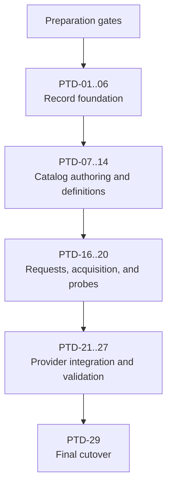

# Portable Tool Definition Implementation Plan

## Authority and Execution Contract

The accepted
[Portable Tool Definition Design](PORTABLE_TOOL_DEFINITION_DESIGN.md) is the
normative authority for behavior, trust boundaries, identity, and support
claims. This document defines preparation, delivery order, review boundaries,
acceptance evidence, and retirement of the existing work in progress. It may
choose implementation structure but must not invent or weaken the design.

This plan is structured as input to the existing AWD function:

```text
global:swe:deliver-design-stack(docs/PORTABLE_TOOL_DEFINITION_IMPLEMENTATION_PLAN.md, all)
```

The active milestone IDs are `PTD-01` through `PTD-14`, `PTD-16` through
`PTD-27`, and `PTD-29`; `PTD-15` and `PTD-28` are retired. `PTD-21`, `PTD-22`,
and `PTD-23` are milestone containers, and `PTD-23.1` and `PTD-23.2` are nested
delivery containers. Their first-class delivery IDs are `PTD-21.1` through
`PTD-21.5`, `PTD-22.1` through `PTD-22.3`, `PTD-23.1.1` through `PTD-23.1.8`,
`PTD-23.2.1` through `PTD-23.2.5`, and `PTD-23.3`; every other active milestone
is itself one delivery item. The preparation gates are prerequisites, not
implementation tasks, commits, or pull requests. `deliver-design-stack` may
read this plan before preparation is complete, but must pause on an unmet
preparation gate.

Plan revision note (2026-08-26): localized portable-tool authoring was inserted
as PTD-12 after PTD-11 completed. No former PTD-12-or-later delivery slice had
been constructed. PTD-01 through PTD-11 therefore retain their identities;
former PTD-12 through PTD-28 are renamed PTD-13 through PTD-29 respectively.

Plan revision note (2026-08-31): PTD-21 and PTD-22 were split before
construction into eight review-sized child delivery items. The parent milestone
identities and PTD-23-through-PTD-29 numbering remain unchanged.

Plan revision note (2026-09-08): PTD-23 was split before construction into
three review-sized child delivery items. The parent milestone and
PTD-24-through-PTD-29 identities remain unchanged. The child slices implement
portable Python-binding projection, verification, and materialization as
generic mechanisms. Playwright remains the first catalog definition and the
tool-specific acceptance case; production code must not branch on Playwright,
Node.js, or `playwright-core` identities.

Plan revision note (2026-09-10): the PTD-23 child contracts were tightened
before construction to make their canonical handoffs, execution order,
pre-acquisition compatibility gate, exact-wheel constraint, bounded wheel
inspection, locked replay, and CLI publication responsibilities explicit. The
clarification does not add another ecosystem binding or change the accepted
portable-tool design. Generic in PTD-23 means generic over selected portable
Python-wheel binding records; it does not mean one provider implementation for
unrelated ecosystem package formats.
Deep design review on the same date additionally aligned artifact cardinality
with schema v1, completed the interpreter-observation seam, made the existing
all-selected-artifacts lock invariant explicit, bounded wheel expansion,
required reuse of the existing Python wheel parser, ordered export publication
after binding materialization, and bound alias collisions and link payloads to
their computed Python-runtime targets. A follow-up review bound wheel
compatibility to existing portable-record and Python-provider behavior. PR
review then completed that boundary: the shared portable-record platform parser
also projects the already validated Linux policy and minimum glibc release, and
the provider-owned pre-acquisition gate compares those facts with the selected
interpreter's pip-derived compatible-tag evidence before any artifact is
acquired. This remains one generic wheel eligibility mechanism rather than
tool-specific logic, a second parser, or a second compatibility engine.

Plan revision note (2026-09-12): PTD-23.1 was split before publication of its
implementation into eight review-sized child delivery items. PTD-23.1 is now a
nested container and owns no implementation commit or pull request. Its
existing technical contract is preserved and owned exactly once across
PTD-23.1.1 through PTD-23.1.7. PTD-23.1.8 also corrects an omission in the
prior task text by making explicit the final-image compatibility-preservation
check required by the accepted design's validation-profile and final-image
integration contracts. PTD-23.2 and PTD-23.3 retain their identities and
scopes, with PTD-23.2 depending on the completed PTD-23.1.8 handoff. This is a
delivery-boundary and implementation-plan correction; it does not amend the
accepted portable-tool design, support envelope, schema-v1 artifact
cardinality, or Python provider ownership.

Plan revision note (2026-09-15): the catalog definition and future validation
work for asciinema were removed before Reploy's first release, retiring PTD-15
and PTD-28 without replacement. The independently pinned recorder used by
controlled sessions remains outside the portable-tool catalog. PTD-23.2 was
also split before construction into five review-sized child delivery items.
PTD-23.2 is now a nested container and owns no implementation commit or pull
request; its existing acquisition and verification contract is preserved and
owned exactly once across PTD-23.2.1 through PTD-23.2.5. PTD-23.3 now depends
on the completed PTD-23.2.5 handoff.

Plan correction note (2026-09-01): PTD-21.4 review exposed duplicate ownership
of canonical portable-tool record structures and validation between catalog
loading and locked replay. Delivery now inserts one behavior-preserving
shared-record-contract corrective prerequisite after PTD-21.3 and before the
PTD-21.4 lock-persistence PR. The corrective prerequisite owns one foundation
commit and PR but is not a `PTD-*` delivery item or milestone and does not
change PTD-21.4's unique commit and PR mapping. It passes the ordinary
submission, synchronization, local-review, remote-review, and current-head
approval gates before PTD-21.4 review. It moves the already accepted record
shapes, strict nested decoding, and record-local validation below both
consumers while preserving canonical bytes and digests. PTD-21.4 then owns only
lock-specific construction, authorization, provenance, graph binding, and
reachability.

Plan correction note (2026-09-04): PTD-21.5 review exposed a premature
production-invocation requirement. PTD-21 plans and locks portable-tool work,
but no selected portable-tool closure is materialized into a concrete image
until later delivery slices, and the manifest-derived production integration
harness is not introduced until PTD-25. PTD-21.5 therefore owns deterministic
schedule projection and the image-neutral execution boundary, including the
PTD-20 contract-environment handoff. PTD-25 owns the first production caller:
for each derived integration case, the harness supplies the exact image that
ordinary Reploy materialization produced and the exact selected schedule. The
boundary never classifies an image as build or runtime, infers scope from image
placement, or routes an entire portable-tool lock to one image. This corrects
delivery order without changing the portable-tool design or its validation
and evidence model. The correction is delivered as one plan-only corrective
commit and PR after the approved PTD-21.4 head and before PTD-21.5. It is not a
`PTD-*` delivery item or milestone, but it must pass the ordinary submission,
synchronization, local-review, remote-review, and current-head approval gates.
Amending its head invalidates its approval and every descendant approval until
the corrected head is reviewed and the descendants are restacked and reviewed.

No AWD function change is part of this plan. Preparation verifies the already
retired oversized WIP pull requests and their parked extraction sources, repairs
the prerequisite PR chain, and establishes a clean base before any `PTD-*` task
is constructed or restacked.

Because construction and review are separate phases, the saved functions apply
per phase rather than all at once. Construction uses the submission and
synchronization functions to publish each slice as a draft, and does not use
`deliver-design-stack`, whose slice contract ends in a completed remote PR
cycle. Review uses `swe:local-stack-review` bottom-up and then `swe:pr-cycle`
per delivery item. `deliver-design-stack` governs a delivery item end to end
only once remote review capacity is available for that item.

## Release and Intermediate-State Policy

The complete PTD campaign is one unreleased product change. It is released
only after every `PTD-*` delivery item is complete, the assembled stack has
passed its final review and validation gates, and no intentionally incomplete
integration boundary remains. Individual delivery items and pull requests are
review checkpoints, not deployable compatibility boundaries.

Every intermediate head must compile and pass the checks appropriate to its
implemented scope, but it does not need to preserve the behavior of an earlier
partial PTD state. Do not add adapters, dual paths, fallbacks, or
consumer-specific orchestration solely to keep an intermediate head
functional. A slice either adds its part of the final ownership boundary or
fails closed at an explicit unmet boundary until the owning downstream slice
lands. Intermediate heads must not simulate later materialization through a
legacy provider, package, executable path, or validation path.

## Scope

Complete the accepted embedded portable-tool bridge for:

- Eclipse Temurin JDK 21, used only by isolated local-source builders;
- Playwright 1.61.0 with the Python binding and explicit Chromium selection;
- Debian 12 and the accepted Ubuntu targets on Linux AMD64, plus Debian 13 for
  Java;
- strict records, bounded catalog loading, deterministic resolution, verified
  acquisition, offline materialization, provider and lock integration, and
  manifest-derived validation evidence.

Reploy is unreleased, and the flat WIP format never landed on the default
branch: it exists only inside the retired work in progress. No flat definition
is therefore a public contract at any point in this campaign, so the design's
requirement that the two formats never coexist publicly is satisfied by never
introducing the flat one, and no compatibility reader is needed.

Repository publication, TUF metadata, publisher authorization, and additional
Playwright bindings or browsers remain outside this campaign. Asciinema is not
provided through the portable-tool catalog; the independently pinned recorder
used by controlled sessions remains outside this campaign.

## Current Stack Prerequisites

The campaign authority begins at PR 81, whose repaired current head contains
the accepted portable-tool design, this implementation plan, and the broader
design-basis true-up. PR 82 is its dependent implementation prerequisite:

| PR | Required prerequisite responsibility and state |
| --- | --- |
| 81 | Repaired design basis, including the portable-tool design and this plan; complete current-head review and approval before rebuilding dependents |
| 82 | Local-source exclusions and implicit-root Python sdists; rebase onto the exact approved PR 81 head, revalidate, and re-review |

Preparation completes PR 81's current-head approval first, then rebases and
re-approves PR 82. No `PTD-*` construction or review may use PR 82's obsolete
pre-fold base. Recorded hashes are observations rather than authority to ignore
later drift.

## Retired WIP and Required Truth Fixes

PR 83 combined Python-provider helpers, record schemas, strict decoding,
record-local validation, graph validation, fixture coverage, and tests. PR 85
combined catalog loading, graph validation, selection resolution, embedded Java
and Playwright definitions, and tests. Both were too large to review as single
slices, so both are closed. Their content survives as parked local extraction
sources, not as pull requests:

| Retired PR | Parked extraction source | Feeds |
| --- | --- | --- |
| 83 | `b39985d247e5` (from `9e9cb456db0d`, originally `e5ee84bb5ccb`) | `PTD-01` through `PTD-06` |
| 85 | `37ca781bd6cb` (from `b680caaa834e`) | `PTD-07` through `PTD-09`, `PTD-13` through `PTD-14` |

The parked sources are evidence, not authority. Where they disagree with the
normative design, the design wins and the difference is recorded as a truth fix.

Closing the retired pull requests also closed their review history. Every
finding that was still unresolved at closure is carried forward as an active
campaign discovery and named in the acceptance criteria of the slice that will
own it, so a retired reviewer's objection cannot be lost by rebuilding the same
code. Retired PR 83 left three such findings and retired PR 85 left none.

The retired PR 85 source also uses an obsolete singular target model in parts of
its resolver and validation code. Reconstruction must implement the accepted
plural model:

- binding sets, named selection dimensions, exact intra-tool references to
  existing typed records, and multiple integration
  fixtures;
- binding- and selection-scoped package sets and exports, plus references to
  shared validation profiles;
- validation fixtures, profiles, source locators, and unselected availability
  excluded from selected-closure identity.
- Java's public tool-version coordinate and release namespace are `21`; exact
  Temurin component version `21.0.12+8` belongs to the JDK payload rather than
  the tool-version coordinate.

These are truth fixes required by the normative design. They must be recorded
separately from behavior-preserving movement of existing code.

## Preparation Gates

Preparation establishes a clean review topology to build on. It does not
approve implementation behavior.

### Baseline and Retirement Gate

This gate is one recorded transaction, performed before any slice is built:

1. Require a clean worktree and no unfinished Sapling operation.
2. Record immutable digests for the design and this plan.
3. Record the local draft chain, native-stack membership, PR bases, branches,
   heads, titles, bodies, readiness, labels, and checks.
4. Verify PR 81 has current-head approval evidence and record that immutable
   head as the protected design prerequisite.
5. Verify the retired WIP PRs remain closed and their recorded parked extraction
   sources preserve the retired content exactly.
6. Rebase PR 82 onto the protected PR 81 head, retain its accepted exclusion
   and implicit-root implementation, remove superseded transitional status
   language, and rerun its focused and repository checks plus local review.
7. Re-review PR 82 at that rebased head, require current-head approval evidence,
   and record its immutable head as the protected implementation prerequisite.
8. Inventory every other local WIP node or branch without modifying it.
9. Stop on unexpected local or remote drift; do not smooth it over or silently
   choose a new baseline.

Gate evidence: one baseline record identifying the approved PR 81 head, the
rebased and approved PR 82 head and exact base, and every parked, closed, and
excluded local node and PR, plus proof the parked sources preserve the retired
content exactly.

### Slice Ownership Rule

Every hunk of the parked extraction sources belongs to exactly one task in
`PTD-01` through `PTD-14`, or is explicitly excluded. Ownership is recorded per
slice as that slice is built, not as one up-front ledger. Each slice records:

- changes retained without semantic modification;
- file or function movement required to create coherent ownership;
- every normative truth fix and the design clause requiring it;
- tests paired with each production responsibility;
- unrelated or deferred work that remains excluded.

Shared files may be split into responsibility-named files. File movement does
not justify behavior changes. No source hunk may be unowned, multiply owned, or
silently dropped.

Gate evidence: after `PTD-14`, cumulative accounting proves the parked sources
are fully consumed by the delivered slices plus the recorded truth fixes and
recorded exclusions. An unexplained residue blocks campaign completion.

### Stack Construction Gate

The rebuilt implementation stack starts from the approved repaired PR 81 head
and PR 82 rebased directly onto it. The original plan is part of PR 81. In
addition to the shared-record-contract correction between PTD-21.3 and
PTD-21.4, one plan-only corrective predecessor is inserted after PTD-21.4 and
before PTD-21.5. Each corrective predecessor owns one commit and PR, is not a
`PTD-*` delivery item, and must retain current-head approval in the exact
ancestry. Each `PTD-*` task is then constructed or restacked above PR 82 in
exact dependency order:

`PTD-21`, `PTD-22`, and `PTD-23` are milestone containers rather than delivery
slices, and `PTD-23.1` and `PTD-23.2` are nested containers rather than delivery
slices.
Their explicitly enumerated leaf slices are first-class delivery items: each
owns one commit and one PR, while a container owns neither.
The sole authorized review-subdivision exception is `PTD-23.1.4`, which remains
one delivery item and introduces no additional `PTD-*` identifiers. Its
contiguous three-PR sequence is PR 149 for shared binding-contract hardening,
PR 148 for production binding projection, and PR 150 for acceptance
hardening. `PTD-23.1.4` completes, and `PTD-23.1.5` may activate, only when all
three PRs retain current-head approval in that order.
`PTD-21` completes only when `PTD-21.1` through `PTD-21.5` have current-head
approval; `PTD-22` completes only when `PTD-22.1` through `PTD-22.3` do;
`PTD-23.1` completes only when `PTD-23.1.1` through `PTD-23.1.8` do; and
`PTD-23.2` completes only when `PTD-23.2.1` through `PTD-23.2.5` do. `PTD-23`
completes only when the nested `PTD-23.1` and `PTD-23.2` containers and delivery
item `PTD-23.3` do. `PTD-22.1` depends directly on `PTD-21.5`, but
cannot activate until the complete `PTD-21` milestone has converged. References
below to a task as a construction or review unit mean one delivery item,
including these leaf slices.

1. Build one coherent commit that compiles and passes its focused tests.
2. Keep the worktree clean after each commit and preserve excluded WIP.
3. Publish a new task through the ordinary submission function, or synchronize
   an existing mapped task after restacking it onto the rebuilt prefix, keeping
   one contiguous native-stack suffix in exact task order.
4. Give every PR durable scope authority linking its task below and the
   normative design, including intent, acceptance criteria, and exclusions.
5. Verify exact bases, branches, heads, readiness, titles, bodies, and stack
   membership after each append.

The prerequisite rewrite and any existing task-suffix restack happen before a
task resumes construction or review. From that verified prefix onward, ordinary
submission and synchronization contracts apply; no task may retain approval
evidence bound to its obsolete base or head. Publication alone claims no review
or approval.

### Construction Handoff Gate

Before constructing a given delivery item:

- the task's dependencies are constructed, locally reviewed, passing their
  checks, and present in the stack in exact order;
- the worktree is clean and the checkout is at the stack tip;
- the task has durable scope authority and a unique commit/PR mapping, or is
  ready to be built and mapped by delivery itself;
- PR 81 remains approved at the protected repaired head, PR 82's base equals
  that exact head, and PR 82 remains approved at its protected rebased head;
- no `PTD-*` task is represented as approved without current-head evidence;
- active discoveries, exclusions, parked-source identities, and deferrals are
  in the campaign state;
- the saved delivery function and all called SWE functions resolve and validate.

Gate evidence: `deliver-design-stack` builds one unambiguous dependency-ordered
queue from this document.

## Delivery Flow



## Review Phasing

Remote review capacity is a shared, exhaustible resource, so construction does
not wait for it. Construction and review are separate phases with separate
evidence.

A constructed prefix may be reviewed before the rest of `PTD-01` through
`PTD-14` exists, and reviewing early is preferred: a finding that rewrites
history invalidates every slice above it, so the cost of a low finding grows
with stack height.

Construction phase, per delivery item, without remote review:

1. Verify all dependencies are constructed, locally reviewed, and passing their
   checks. Remote approval is not a construction prerequisite.
2. Establish intent, owned scope, acceptance criteria, and non-goals from this
   plan and the normative design. A milestone container supplies shared scope
   but does not own an implementation commit or PR.
3. Split again before coding if the responsibility cannot be reviewed
   coherently; task IDs and authority must be updated before execution.
4. Pair behavior with focused positive, negative, limit, and identity tests.
5. Run focused tests, repository validation, and a local deep review.
6. Commit one owning commit and publish one mapped draft PR carrying durable
   scope authority. Draft state records that no review is claimed.
7. Record additive discoveries durably before starting the next task.

Review phase, once remote review capacity is available:

1. Review the constructed stack bottom-up from the protected rebased and
   approved PR 82 head.
2. Complete one remote PR cycle per delivery item in stack order, marking each
   PR ready only when its review begins. Close a milestone only after every
   child slice has current-head approval evidence.
3. Treat any finding that rewrites history as invalidating review evidence for
   every affected slice above it, and restack and re-review that suffix.
4. Do not mark the campaign complete until every constructed task has
   current-head approval evidence.

Accepted risk: deferring remote review lets a finding in a low slice cascade
into every slice above it. Local deep review and full local checks at every
commit are the mitigation, not an equivalent substitute. Tasks from `PTD-16`
onward are not constructed until the `PTD-01` through `PTD-14` stack has been
reviewed and approved.

A discovery may refine mechanics inside accepted scope. A discovery changing
public schema, identity, trust, support claims, or task responsibility pauses
the campaign until durable authority is updated.

## Delivery Queue

| Task | Exact title | Depends on | Source |
| --- | --- | --- | --- |
| PTD-01 | Expose Portable Python Requirement Validation | PR 82 | PR 83 source |
| PTD-02 | Define Portable Tool Record Data Model | PTD-01 | PR 83 source |
| PTD-03 | Add Bounded Strict Portable Record Decoding | PTD-02 | PR 83 source |
| PTD-04 | Validate Immutable Portable Tool Records | PTD-03 | PR 83 source; small PR 85 correction |
| PTD-05 | Validate Target Composition and Fixture Coverage | PTD-04 | PR 83 source |
| PTD-06 | Validate Release Graphs and External Evidence | PTD-05 | PR 83 source |
| PTD-07 | Load Bounded Hierarchical Portable Tool Catalogs | PTD-06 | PR 85 source |
| PTD-08 | Validate Catalog Graphs and Acquisition Mappings | PTD-07 | PR 85 source |
| PTD-09 | Select Canonical Portable Tool Release Candidates | PTD-08 | PR 85 source and truth fixes |
| PTD-10 | Resolve Selected Closures by Joint Constraint Solving | PTD-09 | New work |
| PTD-11 | Generate Canonical Portable Tool Catalog Records | PTD-10 | New work |
| PTD-12 | Load Localized Portable Tool Authoring | PTD-11 | New work |
| PTD-13 | Embed the Java Portable Tool Definition | PTD-12 | PR 85 source |
| PTD-14 | Embed the Playwright Portable Tool Definition | PTD-13 | PR 85 source |
| PTD-16 | Parse Canonical Portable Tool Requests | PTD-14 | New work |
| PTD-17 | Acquire Pinned Artifacts with Bounded Mirror Fallback | PTD-16 | New work |
| PTD-18 | Enforce Artifact Acquisition Network Policy | PTD-17 | New work |
| PTD-19 | Materialize Verified Archives Safely and Offline | PTD-18 | New work |
| PTD-20 | Run Portable Tool Probes Without Network Access | PTD-19 | New work |
| PTD-21 | Compile Selected Closures into Provider Plans and Locks | PTD-20 | Parent milestone; no owning PR |
| PTD-21.1 | Define Provider-Neutral Portable-Tool Plan Contracts | PTD-20 | New work |
| PTD-21.2 | Compile Selected Closures into Deterministic Provider Responsibilities | PTD-21.1 | New work |
| PTD-21.3 | Integrate Portable-Tool Responsibilities into Provider DAG Planning | PTD-21.2 | New work |
| PTD-21.4 | Persist Portable-Tool Plans and Acquisition Provenance in Build Locks | PTD-21.3 | New work |
| PTD-21.5 | Project Selected Validation Profiles into Executor Schedules | plan-only correction after PTD-21.4 | New work; contract-first image-neutral boundary closes the PTD-20 contract-environment handoff; production invocation closes in PTD-25 |
| PTD-22 | Cut Java Build Tools Over to the Portable Catalog | PTD-21 | Parent milestone; no owning PR |
| PTD-22.1 | Resolve Java Builder Demands Through the Portable Catalog | PTD-21.5 | New work; activates only after PTD-21 convergence |
| PTD-22.2 | Materialize Selected Temurin Java in the Isolated Builder | PTD-22.1 | New work |
| PTD-22.3 | Remove Legacy Java Switches and Prove the Cutover | PTD-22.2 | New work |
| PTD-23 | Materialize Portable Python Bindings | PTD-22 | Parent milestone; no owning PR |
| PTD-23.1 | Project Portable Python Binding Contracts into Provider Inputs | PTD-22.3 | Nested container; no owning PR; activates only after PTD-22 convergence |
| PTD-23.1.1 | Canonicalize Python Support Claims | PTD-22.3 | New work; activates only after PTD-22 convergence |
| PTD-23.1.2 | Prove Requires-Python Coverage | PTD-23.1.1 | New work |
| PTD-23.1.3 | Project Wheel Platform Policy | PTD-23.1.2 | New work |
| PTD-23.1.4 | Project Binding Records into Python Provider Inputs | PTD-23.1.3 | New work; one delivery item reviewed through contiguous PRs 149 (contract hardening), 148 (production projection), and 150 (acceptance hardening); all three require current-head approval |
| PTD-23.1.5 | Cut Over Python Interpreter Evidence V2 | PTD-23.1.4 | New work; atomic unreleased-format cutover |
| PTD-23.1.6 | Decide Portable-Wheel Eligibility | PTD-23.1.5 | New work |
| PTD-23.1.7 | Enforce Portable-Wheel Eligibility in Resolver Paths | PTD-23.1.6 | New work |
| PTD-23.1.8 | Preserve Portable-Wheel Compatibility in Final-Image Validation | PTD-23.1.7 | New work; contract-first post-materialization check; completes PTD-23.1 |
| PTD-23.2 | Acquire and Verify Exact Portable Python Binding Wheels | PTD-23.1.8 | Nested container; no owning PR |
| PTD-23.2.1 | Inventory Wheel Archives Safely and Within Fixed Bounds | PTD-23.1.8 | New work |
| PTD-23.2.2 | Inspect Wheel Metadata Through One Descriptor-Stable Primitive | PTD-23.2.1 | New work |
| PTD-23.2.3 | Acquire Manifest-Authorized Portable Binding Wheels | PTD-23.2.2 | New work |
| PTD-23.2.4 | Verify Portable Binding Wheels Against Selected Contracts | PTD-23.2.3 | New work |
| PTD-23.2.5 | Produce Replay-Stable Verified-Wheel Inputs | PTD-23.2.4 | New work; completes PTD-23.2 |
| PTD-23.3 | Materialize Portable Python Bindings Offline | PTD-23.2.5 | New work |
| PTD-24 | Materialize Playwright Chromium Payloads | PTD-23.3 | New work |
| PTD-25 | Derive Portable Tool Integration Cases and Evidence | PTD-24 | New work; closes the PTD-20 production-caller deferral through the PTD-21.5 boundary |
| PTD-26 | Validate Every Advertised Java Tuple Through Reploy | PTD-25 | New work |
| PTD-27 | Validate Every Advertised Playwright Tuple Through Reploy | PTD-26 | New work |
| PTD-29 | Remove the Flat WIP and Finalize Portable Tool Documentation | PTD-27 | New work |

## Task Specifications

### PTD-01: Expose Portable Python Requirement Validation

Scope: expose canonical Python root-requirement and interpreter-version
validation, normalized distribution-name extraction, and focused provider
tests.

Acceptance: exact and ranged roots normalize deterministically; URLs, markers,
extras, malformed roots, and ambiguous versions fail; `go.mod` remains stable
under `go mod tidy`; and `go test ./internal/providers/python` passes.

Non-goals: record types, catalog behavior, Python resolver changes, or module
dependency promotion, which belongs to the slice that first imports the
dependency directly.

### PTD-02: Define Portable Tool Record Data Model

Scope: define v1 schema names, records, references, target identities,
contribution mappings, fixtures, profiles, evidence, canonical binding-set
requests without defaults, named selection-dimension schemas, explicit
supported-combination matrices, and contribution mappings, profile-reference
arrays without inline probes, and immutable-value
clone or comparison helpers.

Acceptance: the model expresses the complete plural contribution shape; every
record family has construction coverage; clone helpers copy every mutable field
so a handed-out record cannot alias catalog state; and the intermediate
`internal/toolcatalog` package builds without catalog activation.

Truth fix: the parked clone helpers copy only some mutable fields, so a
returned record aliases the loaded catalog through target bindings, target
target exports, integration fixtures, selection package sets, selection exports,
selection validation-profile references, contract selection dimensions and
combinations, and fixture selection maps. The design
treats definition records as immutable, so every mutable field is copied and
the independence is proven by test.

Non-goals: decoding, semantic validation, graph traversal, or resolution.

### PTD-03: Add Bounded Strict Portable Record Decoding

Scope: add schema dispatch, bounded exact JSON decoding, duplicate and unknown
member rejection, UTF-8 and surrogate checks, and canonical IDs, references,
decimals, paths, URLs, version segments, and collections.

Acceptance: every schema round-trips; ambiguous encodings and every structural
limit have negative coverage; and decoding performs no graph or network work.

Non-goals: record business rules or cross-record validation.

### PTD-04: Validate Immutable Portable Tool Records

Scope: validate record-local tool, release, alias, request, runtime, export,
validation-profile probe, payload, source, package-set, binding-set, wheel-tag,
platform, selection-dimension, and namespace rules. Remove the parked
singular/default binding, dimensionless selection, inline-probe, and generic
parameter fields. Move PR 85's release-alias correction here.

Acceptance: each kind validates without graph traversal; version policy uses
the declared scheme; artifacts require exact size and digest; diagnostics have
focused negative tests; `go.mod` promotes the shared version dependency to
direct because this slice is the first to import `go-version/pkg/semver`, and
remains stable under `go mod tidy`.

Non-goals: target coverage, reachability, or source-mapping completeness.

### PTD-05: Validate Target Composition and Fixture Coverage

Scope: add explicit target support cases, plural binding contributions, and
named selection-dimension contributions; scoped artifacts, packages, and
inline exports; shared
validation-profile references; multiple fixtures; and bounded support-tuple
enumeration.

Acceptance: missing, duplicate, incompatible, or conflicting mappings fail;
each target support case names exactly one contract-allowed context, exact
resolved binding set or absence, and complete normalized selection map; cases
are unique and canonical, and no context/target/options outer product is
inferred. Every supported tuple has matching fixture coverage; unselected contributions
never leak into a tuple; each selection contribution preserves its dimension
and value and sorts by that pair; explicit supported combinations have unique
ordered dimensions and unique dimension-keyed maps whose present values
normalize to nonempty sets; required dimensions cannot be omitted, optional
dimensions may be omitted; combinations constrain map validity only, while
selection contributions remain strictly additive by `(dimension, value)` and
no whole-map contribution is accepted or inferred; and a request must exactly
match one advertised combination; Reploy does not
infer an outer product; explicit binding lists and `all` resolve to canonical
sets; omitted bindings match active application providers or the sole
advertised binding; ambiguous omissions fail; and exact intra-tool references
to existing artifact, payload, package-set, and validation-profile records are
acyclic and deduplicate only when their exact references agree. Inline exports
deduplicate on identical canonical name/path values, and conflicting paths for
one name fail.

Carried findings from retired PR 83, each requiring negative coverage:

- a binding artifact set must cover every interpreter its contract advertises.
  One wheel matching `requires_python` is not sufficient: advertising Python
  3.11 and 3.12 while shipping only a `cp311` wheel must fail;
- co-selectable payloads must not collide. Two payloads reachable in one
  support tuple that share a logical path, or whose install destinations
  overlap, must fail even when their package requirements agree.

Non-goals: whole-catalog reachability or container execution.

### PTD-06: Validate Release Graphs and External Evidence

Scope: validate release indexes, exact-version and alias collisions, immutable
manifest graphs, namespaces, provenance, profiles, and external evidence.

Acceptance: cycles, missing references, digest mismatches, namespace escapes,
and conflicting identities fail; evidence cannot create unsupported claims;
validation data remains outside selected identity.

Carried finding from retired PR 83, requiring negative coverage: every artifact
sharing a mapped digest must agree on size. Checking only the mapped artifact
record lets two reachable records declare one SHA-256 with different sizes and
still pass.

Non-goals: filesystem catalog discovery or acquisition.

### PTD-07: Load Bounded Hierarchical Portable Tool Catalogs

Scope: add injected-filesystem loading, ownership and namespace discovery,
reference-edge depth limits, and duplicate/digest checks. The normative
design defines no aggregate byte or record-count ceiling, so this slice adds
none, and `bounded` here does not mean a ceiling on catalog size. It means
three properties that hold however large the catalog is: each record's parse is
bounded by the per-unit limits before that record is decoded; traversal and
recursion are bounded by the reference-edge depth limit; and no allocation, buffer,
or traversal is ever sized by a count a record declares, only by content the
loader has already observed. Loading a catalog of `n` records therefore costs
work and retention linear in `n`, which is the operator's own embedded input,
rather than work a record can inflate.

Acceptance: per-record limits apply before each record is decoded; no
allocation or traversal is sized by a declared count rather than observed
content; loader work and retention stay linear in the records actually present,
proven by a synthetic wide-catalog case rather than asserted; misplaced and
duplicate records fail; synthetic loader tests pass; no tool-specific case
enters the loader.

Non-goals: graph semantics or request resolution.

### PTD-08: Validate Catalog Graphs and Acquisition Mappings

Scope: validate reference schemas and digests, acyclic reachability, target
uniqueness, artifact-source completeness, orphan rejection, and package,
export, logical-path, and installation conflicts.

Acceptance: every reachable artifact has one consistent source mapping;
unreachable records fail; identical contributions deduplicate; incompatible
ones conflict; installation destinations conflict within each selected
contribution union rather than catalog-wide, so contributions that can never
share a support tuple do not collide; validation acquires no bytes.

Non-goals: selecting a release or target.

### PTD-09: Select Canonical Portable Tool Release Candidates

Scope: accept a canonical requirement group through an internal API, load its
tool record's immutable version scheme, parse every retained constraint under
that scheme, and reject an empty intersection before any candidate is
enumerated. When an opaque requirement omits its version, normalize it to exact
equality with that record's `default_version`. Parse compact `~<revision>` only
for schemes that exclude `~` from exact version tokens; schemes that permit it
require structured `definition_revision`. Resolve every remaining constraint
token under the selected scheme and its collision-free coordinate and alias
map. Then enumerate authorized release candidates for each canonical group,
restricted to those satisfying every version constraint and, when
supplied, its exact definition-revision pin, which
is valid only alongside an exact upstream version; an unconstrained
ordered-scheme requirement excludes prereleases, which are eligible only where
the requirement names one. Reduce the enumerated releases per group before
any solving: remove candidates the running client cannot satisfy by version or
primitive set, require exactly one target leaf matching the observed base,
resolve the group's cumulative binding demand, require the resolved
context, binding set, and selection map to equal one exact case advertised by
that target, and traverse the selected references to build each candidate's
contribution union. A client, target, binding, selection, or intrinsic
contribution conflict removes that candidate before
joint solving, so an older release that can satisfy the request survives when
the newest cannot. Return every eligible release rather than one choice,
ordered by descending scheme-native version and then descending definition
revision, so `PTD-10` can still reach an older revision when the newest
conflicts in a shared domain; an opaque request has one exact version and
orders its definition revisions newest first unless pinned.

Multiple target leaves matching one observed base are invalid definition data
rather than a fallback choice, and `PTD-06` already enforces that for the whole
catalog: leaves match by exact identity, so two matching leaves means two
leaves declaring the same identity, which the release graph walker rejects at
load. Selection keeps its own check as a defence rather than relying on that
ordering, and fails the request rather than removing the candidate.

Acceptance: direct internal fixtures supply canonical groups until `PTD-16`
wires public parsing and field-by-field same-scope merging; the plural model
replaces all stale singular-field use; scheme-native tests cover satisfiable
and empty conjunctions for `semver`, `pep440`, `integer`, and `opaque` before
candidate enumeration;
unsupported requests fail before acquisition; every record placed in a
candidate is cloned, including the validation profile, so a returned candidate
cannot alias loaded catalog state; a client-incompatible newest
candidate falls back to an older compatible release instead of failing; a
candidate whose target does not advertise the merged context, binding set, and
selection map is removed without rejecting another candidate that does
advertise that exact support case; a request fails only when candidate
reduction and joint solving leave no complete assignment; a
versionless opaque request resolves to the tool record's `default_version`
rather than reaching enumeration without an exact coordinate; an exact
definition-revision pin such as `tool:java==21~2` restricts enumeration rather
than being overridden by newest-first ordering; a definition-revision pin
without an exact upstream version is refused rather than applied to whichever
version sorts first within a range; an unpinned opaque request with several
eligible definition revisions orders them newest first while retaining every
one of them, so a revision joint solving must fall back to is still there to
reach; an unconstrained ordered-scheme request selects no prerelease while a
request naming one selects it; an exact coordinate carrying scheme-native
punctuation, such as a PEP 440 epoch or an opaque coordinate containing `~`,
resolves through the tool-wide lookup rather than being parsed as a comparison
expression; an ordered scheme that is not SemVer evaluates its own comparison
expressions rather than borrowing an evaluator its coordinates cannot parse;
and every surviving candidate carries the contribution union its own
references produce, so a candidate removed for an intrinsic conflict is
removed before any joint solving sees it.

This slice was split from the original single task before coding, as that task
permitted. Candidate selection is per requirement and is largely carried by the
parked source; joint solving is across requirements and has no parked basis at
all, the parked resolver containing no scope, partition, assignment, or
backtracking logic. Reviewing both as one unit would have exceeded the largest
slice this campaign has reviewed, which took eight rounds.

Non-goals: public request parsing or construction of canonical groups, which
belongs to `PTD-16`; joint constraint solving across requirement groups, which
belongs to `PTD-10`; downloading or materializing artifacts.

### PTD-10: Resolve Selected Closures by Joint Constraint Solving

Scope: resolve the candidate sets surviving `PTD-09` for canonical requirement
groups as one bounded deterministic
constraint problem against the active provider graph for each scope,
partitioned so that isolated package-manager, filesystem, environment, export,
and capability domains do not constrain one another while domains genuinely
shared across scopes do, failing closed with a diagnostic when the
visited-state cap is exceeded. Groups are ordered by canonical scope identity,
qualified tool name, and then canonical merged-demand bytes, and
bounded deterministic backtracking selects the lexicographically first complete
assignment whose contributions are conflict-free, so a first-ordered
combination that conflicts in a shared domain backtracks to a valid combination
instead of failing the request. Finalize version, revision, context, target,
binding set, selection map, all scoped contributions, matching
validation fixture, provenance, and order-independent selected identity. Report
the incompatible requirements when no complete assignment exists. The complete
blueprint, Reploy, platform, catalog, and candidate-introduced constraint set is
an immutable operation snapshot carried unchanged into acquisition.

Acceptance: validation and source-only data do not affect selected identity
while every selected behavior does; every record placed in a selected closure
is cloned, including the validation profile, so a returned closure cannot alias
loaded catalog state; requirements in an isolated source-builder scope and an
application runtime scope do not constrain each other except through genuinely shared
domains; a first-ordered combination that conflicts in a shared domain
backtracks to a valid combination rather than failing the request; request
input order cannot change the result; exceeding the assignment cap fails closed
rather than returning a partial or order-dependent result; and acquisition
executes the finalized solution without mutating or automatically re-solving
its operation snapshot.

Non-goals: candidate enumeration and per-request reduction, which belong to
`PTD-09`; downloading or materializing artifacts.

### PTD-11: Generate Canonical Portable Tool Catalog Records

Scope: add a typed, deterministic definition composer that resolves exact
references from shared validation profiles and other reusable intra-tool
components into canonical catalog records. Authoring data declares common
records once and keeps target, architecture, and binding differences in small
variant records. The composer performs no implicit inheritance or overlay.

Acceptance: identical input emits byte-identical canonical records; every
reference is explicit and digest checked; a probe shared by many variants is
declared once in its validation profile; invalid, cyclic, ambiguous, or
conflicting composition fails before embedding; target-independent payload,
contract, and profile records referenced by many target leaves are emitted
once rather than copied into each leaf; generated output passes the ordinary
catalog validators.

Non-goals: a general configuration language, arbitrary templates, conditionals,
cross-tool dependencies, or runtime composition.

### PTD-12: Load Localized Portable Tool Authoring

Scope: add the strict first-party authoring loader before the existing
canonical composer. Strictly decode the single-document, JSON-compatible YAML
`kind`, `imports`, `extends`, and `fields` authoring envelope; load an explicit
set of source-file and catalog-output-path entry descriptors; resolve the one
reachable named local import per extending file with one inherited logical
root; interpret leading `/` paths relative to that root and all other paths
relative to the importing file; resolve one same-schema `extends` parent
through conflict-only field addition; and emit a sorted transitive
source-content manifest for build and review evidence. Pass only cloned, fully
resolved typed records at their explicit output paths to the PTD-11 composer.

Acceptance: equivalent file-relative and root-relative paths resolve to the
same canonical file identity; nested imports and extensions are deterministic
under entry reordering; one normalized parent source may be shared by multiple
entry closures and is loaded and manifested once; imported fragments are not
emitted unless they are explicit complete entries; resolved output is
byte-identical to directly supplying the equivalent complete records to PTD-11;
and no import, root, source path, alias, or extension metadata enters canonical
record or selected-closure identity. The source manifest uses normalized paths
relative to the trusted tool boundary and hashes the exact once-read bytes that
are parsed. Invalid UTF-8, multiple YAML documents, duplicate keys, non-string
map keys, anchors, aliases, explicit tags, merge keys, YAML-specific scalars,
malformed import members, missing roots or files, root redefinition, unused or
extra aliases, symlink inputs, path escape, host-absolute or URL imports,
cross-tool imports, duplicate source or output entries, alias ambiguity, schema
mismatch, cycles, overlapping parent/child fields, incomplete entries, invalid
catalog output paths, and every per-source, resolved-record, or extension-depth
limit fail before canonical composition with the complete source chain in the
diagnostic. No ceiling applies to the number of authoring files, their total
source bytes, or aggregate resolved fields across one definition.

Non-goals: overrides, deletion, scalar replacement, list concatenation, map
overlay, multiple parents, variables, interpolation, templates, conditionals,
remote imports, cross-tool composition, or runtime inheritance.

### PTD-13: Embed the Java Portable Tool Definition

Scope: add Java tool, release, target, Temurin JDK payload/source, fixture, and
profile records for public `tool:java==21` on the accepted AMD64 matrix. Use
release namespace `21`; retain `21.0.12+8` as payload component metadata.

Acceptance: the public version and record namespace are `21`; exact Temurin
version, sizes, digests, exports, and targets match vetted data; unsupported
requests fail before acquisition; Java exports only `java` and `javac` in
build context.

Non-goals: replacing the current hard-coded Java consumer path.

### PTD-14: Embed the Playwright Portable Tool Definition

Scope: add the Playwright release, Python binding and wheel, Chromium,
Headless Shell and FFmpeg payloads, APT package sets, targets, fixtures, and
profile.

Acceptance: the Python/Chromium request resolves on every advertised AMD64
target; bundled metadata and artifact inventory are exact; unsupported
combinations fail before acquisition; selected identity includes all coupled
payloads and no unselected availability.

Non-goals: installing the binding or browser payloads.

### PTD-16: Parse Canonical Portable Tool Requests

Scope: implement the compact scalar form for simple tool requirements and the
structured YAML mapping for requests with options, retain structurally valid
version-constraint tokens including ranges and exact versions for scheme-aware
normalization in `PTD-09`, accept optional exact definition-revision pins and
typed binding-set/named-selection fields, canonical resolution scope per
requirement, the public field-by-field same-scope requirement merge and
deduplication rules, local-source recipe migration, and the accepted
application tool-request surface.

Acceptance: a compact scalar such as `tool:java==21` and an equivalent mapping
normalize identically; the compact grammar cannot carry options; application
mappings are accepted under `environment.applications.<application>.packages.tools`
and source-build mappings under `.reploy.yaml` `requires`. Omitted bindings,
explicit YAML binding lists, and `binding: "*"` follow the accepted inference
rules. `select` is a mapping whose scalar or list values normalize to canonical
sets, for example `select: {browser: [webkit, chromium]}`. Equivalent ordering
normalizes rather than being rejected; structurally malformed YAML, duplicates,
empty lists, wildcard-plus-explicit combinations, and compact bracket syntax
fail during parsing; scheme-dependent version validity and compact `~` suffix
disambiguation, together with unsupported dimensions or values, fail during
catalog resolution before provider work. Identical same-scope requirements
deduplicate. Version constraints remain a sorted, duplicate-free conjunction;
`PTD-09` decides whether that conjunction has a nonempty intersection after
loading the immutable tool version scheme. Explicit revision pins agree;
context agrees; explicit binding sets union, `"*"` dominates every other
binding demand, and otherwise omission retains an inference demand whose result
unions with explicit values; selection sets union by dimension.
The complete canonical merged demand is retained for catalog resolution and
participates in request identity, while source locations remain only diagnostic
provenance. Parser and blueprint tests cover Java, Playwright, and a neutral tool,
including conflicting pins, retention of multiple version constraints,
cumulative bindings, and canonical selection unions without loading catalog
data. Scheme-specific syntax and empty-intersection coverage belong to
`PTD-09`.

Non-goals: catalog resolution or compatibility parsing for unreleased syntax.

### PTD-17: Acquire Pinned Artifacts with Bounded Mirror Fallback

Scope: add verified cache lookup, ordered bounded mirrors, non-raiseable core
limits on the number of mirrors, attempts per mirror, and aggregate attempts,
per-attempt and aggregate byte/time/redirect limits, temporary cleanup, atomic
cache publication, and acquisition provenance.

Acceptance: success returns only recorded bytes; mismatches never enter cache;
cache hits use no network; attempt counts per mirror and in aggregate are
bounded by non-raiseable core caps, so a quickly failing mirror cannot retry
indefinitely inside the elapsed-time window; a definition may tighten but never
raise a core cap, while an ordered mirror list within the core cap is valid;
each failed attempt leaves a durable credential-free record of source identity,
outcome category, and relevant observed metadata without retaining failed
bytes; fallback and exhaustion diagnostics are deterministic and
credential-free.

Non-goals: extraction or tool-specific installation.

### PTD-18: Enforce Artifact Acquisition Network Policy

Scope: constrain locator schemes, proxies, redirects, public destinations, DNS
resolution and pinning, redirect-hop revalidation, rebinding, and redaction.

Acceptance: private, loopback, link-local, ambiguous, or rebound destinations
fail; redirects cannot broaden authority or disclose credentials; controlled
network tests cover mixed answers and every redirect boundary.

Non-goals: arbitrary downloader plugins or strict source-host allowlists beyond
the accepted content-verification model.

### PTD-19: Materialize Verified Archives Safely and Offline

Scope: implement reviewed archive primitives, fixed destinations, traversal and
link defenses, special-entry rejection, metadata normalization, resource
limits, atomic replacement, cleanup, and network-disabled materialization.

Acceptance: hostile fixtures cover paths, links, devices, FIFOs, ownership,
modes, ACLs, xattrs, capabilities, counts, and sizes; destination state is
complete or exactly restored; data never selects commands.

Non-goals: provider integration or runtime probes.

### PTD-20: Run Portable Tool Probes Without Network Access

Scope: execute definition-supplied validation-profile probes with exact
executable references and argv through a fixed Reploy-owned executor that owns
the environment, working directory, time/output/resource bounds, forced network
disablement, and canonical observed evidence.

Acceptance: Java and Playwright profiles declare their probes once
and variants reference those profiles; probes use no shell; declarations cannot
enable networking or relax executor bounds; timeout, output, and exit failures
are deterministic.

Non-goals: treating a probe result as support without matching fixture and
selected-closure evidence.

### PTD-21: Compile Selected Closures into Provider Plans and Locks

Scope: translate selected artifacts, packages, bindings, and exports into
provider DAG responsibilities; carry selected validation-profile references
into validation scheduling outside selected-closure identity; compile the selected closure's contract
runtime projection, meaning its install root and environment entries, into
those plans; bind closure, manifest, artifact, base-image, and provider
identities into plans and locks together with the complete release provenance,
meaning the tool, its scheme-native version, and the exact definition revision
that authorized the build, so two revisions sharing a byte-identical closure
remain distinguishable; and persist each artifact's acquisition provenance from
PTD-17 into the lock.

Acceptance: unrelated availability does not invalidate a plan; selected
behavior does; acquisition precedes offline materialization; locked replay does
not consult moving catalog or network state; contribution conflicts fail; and
the selected runtime install root and environment projection reach the provider
plan, so contract-owned installation placement and environment values such as
Playwright's browser placement and download suppression are not silently
dropped; the lock records the authorizing source record together with the
acquisition outcome, which is either the successful declared source locator for
a network acquisition or an explicit statement that a verified-cache hit
contacted no locator. Redirect hops are sanitized transport diagnostics rather
than provenance locators, and any retained original locator is labeled
historical object provenance rather than the locator used by the current
operation.

Non-goals: tool-specific branches in generic provider code.

The milestone is delivered through these first-class slices:

#### PTD-21.1: Define Provider-Neutral Portable-Tool Plan Contracts

Scope: define canonical provider-neutral plan data for selected closure
identity, release provenance, contract runtime projection, contribution
responsibilities, and selected validation-profile references without activating
provider execution.

Acceptance: canonical validation rejects incomplete, aliased, unsorted,
duplicate, or conflicting plan data; selected-closure identity remains
independent from validation references and unrelated availability; generic plan
contracts contain no Java or Playwright branch.

Non-goals: provider execution, tool-specific materialization, or build-lock
persistence.

#### PTD-21.2: Compile Selected Closures into Deterministic Provider Responsibilities

Scope: compile selected artifacts, native package sets, bindings, payloads,
exports, runtime projection, and release provenance into the provider-neutral
plan contracts.

Acceptance: input ordering and unrelated catalog availability cannot change
compiled output; selected behavior and contribution conflicts do change or
reject it; the compiler remains provider-generic and tool-agnostic.

Non-goals: acquisition, offline materialization, or locked replay.

#### PTD-21.3: Integrate Portable-Tool Responsibilities into Provider DAG Planning

Scope: integrate compiled responsibilities with the existing provider DAG so
acquisition precedes network-disabled materialization and each selected
package, binding, payload, export, environment, and capability domain remains
explicit.

Acceptance: plan validation proves dependency order and rejects missing or
conflicting responsibilities; acquisition precedes offline materialization;
existing APT, Python, and base provider boundaries remain generic.

Non-goals: Java builder cutover, Playwright binding materialization, or browser
materialization.

#### PTD-21.4: Persist Portable-Tool Plans and Acquisition Provenance in Build Locks

Scope: on the approved shared-record-contract corrective prerequisite, bind
selected closure, manifest, artifact, base-image, provider, and complete
release-provenance identities into canonical build locks together with each
artifact acquisition outcome.

Acceptance: the approved corrective prerequisite makes catalog loading and
locked replay consume the same record types and record-local validator without
parallel schema models and preserves canonical record bytes and digests;
PTD-21.4 preserves canonical lock bytes and digests while locked replay uses
the persisted plan and verified artifacts without consulting moving catalog or
network state; definition revisions that share one closure remain
distinguishable; acquisition provenance records either the successful declared
locator or that a verified-cache hit contacted none; redirect hops remain
sanitized diagnostics and historical locators remain explicitly historical.

Non-goals: changing portable-tool record schemas or identity, runtime Java,
repository transport, or new trust and publication policy.

#### PTD-21.5: Project Selected Validation Profiles into Executor Schedules

Scope: project selected locked validation-profile references into deterministic
provider-neutral schedules, and provide an image-neutral validation boundary
that invokes the PTD-20 fixed executor with the selected contract install root
and environment projection when a usage owner supplies the exact schedule and
the exact inspected image containing that selected closure. This is an
independently testable, contract-first slice: until PTD-25 supplies its generic
production caller, the boundary remains disconnected from ordinary
provider-specific and generic image-validation routes.

Acceptance: locked replay projects the exact selected profiles without reading
moving catalog state; scope selection is exact and does not infer image
placement from tool metadata; the boundary invokes the fixed executor once for
each caller-supplied scheduled profile; contract environment values, including
`PLAYWRIGHT_BROWSERS_PATH`, reach validation without weakening fixed policy;
observations are attributed to the exact locked profile and image root
filesystem; validation references and evidence remain outside selected-closure
identity. This slice closes the PTD-20 contract-environment handoff; PTD-25
closes the deferred production-caller integration against real materialized
case images. Tests prove projection and boundary execution through explicit
caller inputs; they do not create a temporary production hook.

Non-goals: choosing which image contains a resolution scope, invoking profiles
before a usage owner has materialized the selected closure, adding an interim
caller to an unrelated image path, support advertisement, Playwright payload
materialization, or definition-controlled executor policy.

### PTD-22: Cut Java Build Tools Over to the Portable Catalog

Scope: replace name-only `tool:java`, `default-jre-headless`, and
`/usr/bin/java` switches with the selected Temurin closure in the isolated
local-source builder.

Acceptance: selected builds receive exact `java` and `javac`; final application
images do not; unsupported targets fail before download; hard-coded Java paths
and their obsolete tests are removed.

Non-goals: runtime Java or other Java versions.

The milestone is delivered through these first-class slices:

#### PTD-22.1: Resolve Java Builder Demands Through the Portable Catalog

Scope: replace name-only local-source Java build-tool detection with canonical
build-scope tool requirements, consumer-neutral embedded-catalog selection,
and the PTD-21 compiled plan. Remove the Python-owned APT installation,
resolver-session restart, and executable-probe bridge instead of adapting that
intermediate path to the selected plan.

Acceptance: `tool:java==21` resolves the exact selected Temurin closure for the
isolated source-builder scope; unsupported targets fail before acquisition;
runtime application scopes and final-image requirements do not receive
build-only Java; Python provider and resolver code contains no Java-specific
package, executable-path, catalog-solving, or portable-plan retry logic.

Non-goals: materializing the selected closure, preserving the legacy Java
builder path on this intermediate head, runtime Java, other Java versions, or
other tool-specific builder branches.

#### PTD-22.2: Materialize Selected Temurin Java in the Isolated Builder

Scope: acquire the selected pinned Temurin payload, materialize it offline
through reviewed primitives into the disposable source-builder environment,
and expose only the selected `java` and `javac` exports there before the Python
source-build consumer is opened.

Acceptance: exact `java` and `javac` are present in selected source builds;
the generic portable-tool coordinator, rather than Python tooling, owns the
selected plan, acquisition, materialization, validation schedule, and prepared
builder environment; materialization uses verified bytes without network
access; the final application image and workload provider graph remain
unchanged; cleanup leaves no accepted partial builder installation.

Non-goals: Java runtime images, distribution-default Java fallback, or
additional architectures.

#### PTD-22.3: Prove the Java Builder Cutover

Scope: verify that the `default-jre-headless` and `/usr/bin/java` assumptions
removed in PTD-22.1 have not reappeared, validate selected exports and
validation-profile projection through focused cutover checks, and prove
build-only containment end to end.

Acceptance: no hard-coded Java build-tool switch remains anywhere in the
source-builder path; focused positive and unsupported-target tests exercise
the catalog-backed path; selected builds
receive `java` and `javac` while final application images do not; repository
validation passes with legacy tests removed or replaced. These focused checks
produce no external support evidence and do not make PTD-22.3 the generic
production caller; that caller remains owned by PTD-25.

Non-goals: runtime Java, other Java versions, or Playwright materialization.

### PTD-23: Materialize Portable Python Bindings

PTD-23 is a milestone container. It owns no implementation commit or pull
request; its complete scope is owned by the nested PTD-23.1 and PTD-23.2
containers and the PTD-23.3 delivery item.

Scope: implement the generic portable Python-binding path from selected binding
contracts and artifacts into Python provider roots, exact wheel constraints,
verified acquisition, content inspection, declared CLI placement, and offline
materialization. Playwright 1.61.0 is the first catalog-defined consumer and
acceptance case, not a production-code dispatch identity.

The milestone has three explicit immutable handoffs. PTD-23.1 produces a
canonical application-scoped Python-binding projection from the selected
portable-tool plan and the resolved application-provider inputs. The projection
retains the scope, owning Python component, selected-closure identity, exact
binding contract and schema-v1 artifact reference, canonical root requirements,
artifact-declared compatibility, exact-wheel constraint, and the selected CLI
export; it contains no locator, acquired path, or acquisition outcome. Schema
v1 selects exactly one binding artifact per binding and target platform. After
the owning Python resolver has observed its interpreter and pip-derived
candidate-tag compatibility,
PTD-23.1's pure eligibility gate validates that exact artifact. PTD-23.2 joins
the complete
projection to manifest-authorized acquisition results and produces
verified-wheel inputs whose descriptors and observed wheel metadata remain
bound to the exact selected artifact references. PTD-23.3 is the only child
that may offer the compatibility-validated verified bytes to the Python
resolver or publish the CLI. Artifact eligibility does not rewrite
selected-closure identity: every artifact selected by the closure is still
acquired, verified, locked, and installed.

Production dispatch in all three children is by the canonical record schema,
reviewed resolver primitive, resolution scope, and provider/domain owner. Tool,
distribution, CLI, and bundled-component names are data and are never dispatch
keys. The Playwright catalog and exact-artifact acceptance fixture may name
Playwright, Node.js, and `playwright-core`; neutral synthetic fixtures must
exercise the same production entry points with different names.

Acceptance: production projection, acquisition, verification, and
materialization code contains no Playwright-, Node.js-, or
`playwright-core`-specific branch; catalog data supplies all tool and bundled
component identities, requirements, paths, versions, and expected artifact
metadata. Index resolution cannot substitute different bytes or metadata;
unsupported interpreters fail before binding-artifact acquisition; installation
invokes no upstream installer and downloads no browser. The Playwright catalog
files and focused acceptance evidence remain tool-specific.

Non-goals: browser extraction, another ecosystem binding, additional
Playwright definitions, or the generic ordinary-build production caller owned
by PTD-25.

The milestone is delivered through these first-class slices:

#### PTD-23.1: Project Portable Python Binding Contracts into Provider Inputs

PTD-23.1 is a nested delivery container. It owns no implementation commit or
pull request; its complete scope is owned exclusively by PTD-23.1.1 through
PTD-23.1.8.

Scope: establish the canonical Python support claims, static
`Requires-Python` proof, shared wheel-platform policy, binding projection,
interpreter evidence, pure runtime eligibility decision, resolver enforcement,
and the contract-first final-image compatibility check that downstream
materialization invokes after installation. Completing these delivery
contracts allows PTD-23.2 construction to begin; it does not place final-image
runtime validation before acquisition or materialization. The child sequence
preserves the existing PTD-23.1 contract across PTD-23.1.1 through
PTD-23.1.7, makes the previously omitted design-required final-image handoff
explicit in PTD-23.1.8, and introduces no compatibility adapter between child
heads.

Acceptance: every responsibility and fixture previously owned by PTD-23.1 is
owned exactly once by PTD-23.1.1 through PTD-23.1.7; PTD-23.1.8 exclusively
owns the newly explicit final-image compatibility-preservation check. Every
child compiles, passes its focused checks, and maps one-to-one to a
current-head-approved pull request. PTD-23.1 closes only after PTD-23.1.1
through PTD-23.1.8 do.

Non-goals: an owning commit or pull request for this container, artifact
download, wheel content inspection, installation, browser payloads, or
ordinary-build production integration.

#### PTD-23.1.1: Canonicalize Python Support Claims

Scope: before joint candidate selection, add one provider-owned canonical
`supported_python` claim model and use it everywhere portable binding records
constrain an interpreter. Over normalized final interpreter releases, a
canonical major/minor claim denotes the closed-open interval from that minor's
`.0` release through, but excluding, the next minor; a canonical
major/minor/patch claim denotes that exact complete release. Normalize a set by
sorting numerically by major, minor, and optional patch with the series before
its patches, removing duplicate claims, and removing exact patch claims already
subsumed by a minor-series claim. Intersect two normalized sets with one linear
merge: equal minor-series claims retain that series, a series and one of its
patches retain the patch, unequal series or unequal exact patches do not
intersect, and the bounded results are normalized again.

Refactor the existing generic Python interpreter claim path in the joint
solver, including active-provider constraints, to use this operation instead
of literal string intersection. This is the sole interpreter-claim
representation; selection, projection, static coverage, and observed-runtime
checks must not grow independent minor/patch matching rules.

Acceptance: normalization is deterministic, idempotent, bounded, and invariant
to input order. Joint-selection fixtures cover two neutral bindings and an
active-provider constraint at mixed minor-series and exact-patch granularity,
retaining the exact patch when it belongs to the series and rejecting unequal
series and unequal exact patches. Contract fixtures distinguish a matching
minor series, an exact matching patch release, and a nonmatching patch release.

Non-goals: parsing `Requires-Python`, projecting binding records, observing an
interpreter, wheel eligibility, or artifact acquisition.

#### PTD-23.1.2: Prove Requires-Python Coverage

Scope: correct the existing target-composition coverage check so its static
guarantee agrees with the PTD-23.1.1 claim model before selection can reach the
runtime gate. For an exact-patch claim, an artifact covers the claim when its
canonical `Requires-Python` admits that release. For a minor-series claim,
coverage requires proof that the schema-v1 target artifact's canonical
`Requires-Python` admits the complete closed-open minor interval; admitting
only `.0`, a finite prefix, or an interval with an excluded release does not
cover the series.

Put the proof in one provider-owned pure helper over the canonical claim
representation. Refactor the Python provider's existing normalized-release
specifier evaluator into one parsed conjunction with inclusive or exclusive
lower and upper bounds, optional exact or prefix equality, and exact or prefix
exclusions; keep `InterpreterVersionSatisfies` as a consumer of that same
representation. The helper uses overflow-checked minor successors and proves
that the claimed point or interval is a subset of the parsed constraint,
including that no exclusion cuts the interval; the same representation also
answers the weaker nonempty-overlap question for an individual artifact.
Contradictory constraints and a minor whose successor cannot be represented
fail closed.

Record validation continues to use the existing PEP 440 parser for general
`Requires-Python` validity, but a form outside the provider's existing
normalized-release subset fails closed when asked to prove complete
minor-series coverage. The helper must not enumerate patch numbers or
introduce a second specifier parser. Reuse it from both
`validateBindingArtifactAgainstContractV1` and
`validateBindingInterpreterCoverageV1`, preserving the existing rule that an
individual artifact must overlap the contract and strengthening the target
artifact to cover every advertised claim. This is a corrective prerequisite,
not a new artifact-selection mechanism or a Playwright exception.

Acceptance: static fixtures prove that `supported_python: ["3.14"]` accepts
complete-series coverage such as `Requires-Python: >=3.14,<3.15` but rejects a
`.0`-only or finite-prefix range such as `>=3.14,<3.14.1` and rejects a range
with a release exclusion; the corresponding exact-patch claim remains a
point-membership check. Boundary fixtures cover the largest accepted numeric
component without overflow or unbounded enumeration.

Non-goals: selecting among multiple artifacts, wheel-platform policy,
interpreter inspection, runtime eligibility, or artifact acquisition.

#### PTD-23.1.3: Project Wheel Platform Policy

Scope: refactor the existing shared portable-record filename-tag expansion and
target-platform compatibility validator behind one pure platform-policy
projection. The same boundary both validates and returns the normalized kind,
architecture, and optional minimum glibc release for each platform tag; PTD-23
does not add a second wheel-tag parser or platform-policy table.

The one policy mapping recognizes `any`, `linux_<arch>`, legacy `manylinux1` as
glibc 2.5 on x86_64, `manylinux2010` as glibc 2.12 on x86_64,
`manylinux2014` as glibc 2.17 on x86_64 or aarch64, and versioned
`manylinux_<major>_<minor>` tags only when the major is 2 and the encoded minor
is at least 5 for x86_64 or 17 for aarch64. A syntactically numeric versioned
tag with another major or a lower architecture floor projects as unsupported
and fails closed. Record validation continues to use this projection for
syntax and selected-target architecture; later Python-provider slices consume
the same result for runtime-dependent decisions.

Acceptance: shared-policy fixtures cover `any`, native Linux, every legacy
manylinux alias, both permitted architectures, versioned floors below, equal
to, and above each architecture minimum, and unsupported policy majors. Record
validation and provider consumers receive identical normalized projections;
production code contains no second platform mapping.

Non-goals: inspecting libc, deciding runtime tag membership, invoking pip, or
artifact acquisition.

#### PTD-23.1.4: Project Binding Records into Python Provider Inputs

Scope: add one pure projection boundary that consumes a validated
provider-neutral portable-tool plan plus the canonical resolved application
component requests, and returns a freshly allocated canonical
component-request set plus the canonical Python-binding projection described
by PTD-23. It runs before provider node planning and portable DAG construction.
An `application:<owner>` scope maps only to
`application/<owner>/python`; any other scope or component owner is rejected.
When the application already has a Python contribution, preserve its explicit
interpreter request and merge the binding requirements into it. When a
selected sole or explicit Python binding is the application's first Python
contribution, create that canonical contribution with the Python provider's
established default `python` interpreter requirement. Do not mutate the
blueprint, selected plan, or caller-owned request values.

Decode binding contracts and artifacts only through their shared strict record
contracts. Join every artifact to its exact contract reference, require the
contract CLI to equal one selected plan export, and normalize every root and
artifact distribution through the Python provider grammar. Key one group by
owning component and normalized contract package. Under schema v1 it has
exactly one contract, exactly one target-platform artifact, and the contract
roots; a second artifact for the same binding and target would collide with
the canonical binding-artifact ID and is not a candidate-selection mechanism.
Identical requirements and exact record references deduplicate. The same
semantic key with different contracts, artifact references, wheel identity,
package identity, provider owner, scope, or selected CLI fails before provider
planning.

Before any interpreter probe, restrict the projected tag input to the initial
support envelope: generic `py<major>` and `py<major><minor>` or
`cp<major><minor>` interpreter tags; ABI `none`, exact CPython ABIs, or `abi3`
whose encoded CPython release is at least 3.2; and the supported `any`, native
Linux, and PTD-23.1.3 manylinux platform forms. Platform `any` is eligible only
with ABI `none`, so every ABI-bearing `*-any` tuple fails before inspection.
Any other syntactically valid Python, ABI, or platform form fails closed before
inspection and acquisition until the shared support envelope is extended.

Emit one exact-wheel constraint per owning component and normalized
distribution. A constraint retains the exact artifact reference and its
declared filename, distribution, ecosystem version, tags, size, digest, and
`Requires-Python`; it is not a version override, index preference,
local-source override, filesystem path, or acquisition result. Collect the
bounded `tested_tags` input for each owning component from the union of the
already expanded, contract-matching artifact tags using PTD-23.1.3's shared
projection.

Acceptance: reversing tools, contracts, artifacts, or component requests emits
byte-identical projected requests and sidecar projection. Projection creates
the missing Python contribution when required and cannot attach one
application's binding to another. Compatible duplicate inputs collapse while
conflicting roots, exact artifacts, owners, scopes, package identities, or CLI
exports fail with stable diagnostics. Tests cover two neutrally named
synthetic tools in one application, the same records in isolated applications,
an existing explicit Python request, a tool-only application, and the selected
Playwright records.

Non-goals: interpreter inspection or evidence, runtime eligibility, artifact
download, wheel content inspection, installation, or a filesystem path in the
projection.

#### PTD-23.1.5: Cut Over Python Interpreter Evidence V2

Scope: extend the existing fixed interpreter inspection, in the same
invocation, to emit the normalized Python implementation, canonical ABI tag,
normalized libc implementation and canonical nonnegative major/minor release
pair, and two canonical sorted unique string arrays: `tested_tags` and its
`compatible_tags` subset. Pass PTD-23.1.4's exact bounded tested-tag set and the
selected target architecture to the fixed probe as validated data, never as
executable source; the returned `tested_tags` must equal it exactly.

Use one provider-owned command-prefix helper for both the probe and the
ordinary resolver: each invokes the selected interpreter in isolated mode
(`python -I`), and the resolver runs `python -I -m pip` rather than maintaining
a second import-isolation contract. Isolated mode retains system site
initialization, so both steps import the same installed pip while excluding
current-directory, user-site, and environment-controlled import-path shadows;
the existing provider-controlled work directory and environment remain in
force. The probe imports that pip installation's
`pip._vendor.packaging.tags` implementation, enumerates `sys_tags()` once, and
emits only the tested tags present in that set. This read-only step performs no
network operation, artifact acquisition, or wheel parsing.

The existing record expansion and reference-count ceilings bound the probe's
candidate input and canonical output. A missing pip tag generator, execution
failure, malformed or duplicate evidence, an output tag outside `tested_tags`,
or any other partial result fails inspection before acquisition. Pip's tag
generator remains the one runtime compatibility engine and observes its
executable and architecture checks, libc detection, free-threaded and other
ABI rules, and optional `_manylinux` policy hooks without copying them into
Reploy. Replace `python-interpreter-facts-v1` and every dependent provider
profile and recipe identity with their next versions in this slice; do not add
a dual reader or compatibility path for the unreleased format.

Acceptance: inspection fixtures cover an absent `_manylinux` module, callable
decisions of `True`, `False`, and `None`, including non-monotonic policy
results, each legacy compatibility boolean, and raising hooks as observed
through the selected pip tag generator. Separate fixtures reject missing or
malformed pip tag evidence, a tested-tag mismatch, duplicates, and an accepted
tag outside the tested set before acquisition. An adversarial import-shadow
fixture places a fake `pip` package in the resolver work directory and proves
that the probe and resolver retain the shared isolated command prefix and
import the selected interpreter's installed pip without diverging before
artifact acquisition. Conflicting or aliased interpreter evidence fails with
stable diagnostics.

Non-goals: implementing a second tag-compatibility engine, deciding portable
wheel eligibility, resolver lifecycle enforcement, or artifact acquisition.

#### PTD-23.1.6: Decide Portable-Wheel Eligibility

Scope: add only the missing provider-owned pure runtime wheel-eligibility
helper over the PTD-23.1.4 projection and validated PTD-23.1.5 interpreter
facts. It performs no subprocess, filesystem, network, import, callback, or
acquisition operation. Reuse the Python provider's canonical interpreter
version and PEP 440 checks, existing inspected-wheel tag representation, and
ordinary pip resolver as the final compatibility authority.

The projection entering this helper has already passed PTD-23.1.4's static
support envelope. For a candidate with a manylinux platform, the runtime
boundary additionally requires the inspected libc implementation to be
`glibc` with observed major exactly 2; unknown libc, a non-glibc
implementation, or any other observed major fails before membership is
considered. This is an observed-runtime guard, not a second policy-floor or
tag-compatibility calculation.

For every candidate inside that envelope, runtime compatibility means exact
membership of its canonical three-part tag in the inspected
`compatible_tags` subset. The helper must not reconstruct generic-version
ordering, CPython or `abi3` rules, ABI flags, libc floors, architecture
compatibility, or `_manylinux` decisions from diagnostic fields. Thus an older
generic tag on a newer interpreter, a debug or free-threaded ABI, native Linux,
and every legacy or versioned manylinux policy follow the selected
interpreter's pip result. The provider does not parse wheel filenames, infer
architectures, invoke policy hooks, or duplicate the shared support mapping.

At least one entry in each contract's `supported_python` must match the
interpreter: a canonical major/minor entry covers that complete minor series,
while a canonical major/minor/patch entry requires exact equality with the
observed complete release. The complete release must also satisfy the
artifact's canonical `Requires-Python`, and at least one filename-derived
artifact tag must be both contract-advertised and compatible with the observed
interpreter, ABI facts, and selected target platform.

Acceptance: neutral fixtures cover generic Python tags, including an older
`py<major><minor>` on a newer interpreter, CPython-specific tags, stable-ABI
tags at and above the CPython 3.2 floor, rejection of pre-3.2 `abi3`, acceptance
of `abi3` on a GIL-enabled debug CPython ABI, rejection of `abi3` on a
free-threaded CPython ABI, and a nonmatching implementation or ABI. Platform
fixtures cover generic and CPython `*-none-any`, rejection of exact-ABI and
`abi3` `*-any`, native Linux, every legacy manylinux alias, and versioned
manylinux floors below, equal to, and above the observed glibc release on each
permitted architecture. Separate fixtures cover floors below the architecture
minimum and unsupported policy or observed glibc majors on both architectures;
unknown and non-glibc runtimes fail every manylinux case. Differential fixtures
prove every supported Python, ABI, and platform decision agrees with the
ordinary pip resolver; unsupported forms fail closed.

Non-goals: invoking an interpreter, resolver lifecycle integration, an
acquisition callback, or final-image revalidation.

#### PTD-23.1.7: Enforce Portable-Wheel Eligibility in Resolver Paths

Scope: invoke PTD-23.1.6's pure gate at the existing Python resolver lifecycle
seam immediately after interpreter resolution and before wheel preparation in
every fresh and cached resolver path. Consume the already observed interpreter
facts; do not probe or resolve the interpreter a second time. Validate every
projected constraint as one deterministic set before invoking any acquisition
callback. Failure acquires nothing. PTD-23.2 repeats all record-to-wheel facts
observable from acquired bytes but does not weaken this earlier eligibility
gate; PTD-23.3 wires the acquisition and wheel-preparation callback into the
validated seam.

Acceptance: fresh and cached paths invoke one identical gate over the complete
constraint set. Every unsupported minor version, complete `Requires-Python`
release, interpreter implementation, ABI tag, libc implementation or release,
and platform tag case, including every below-minimum or unsupported-major
manylinux case, proves that the binding-artifact acquisition callback was
invoked zero times. A hook-rejected tag remains absent even when the observed
glibc release is high enough, and corresponding tests prove zero acquisition.
Otherwise matching `compatible_tags` evidence cannot bypass the bounded libc
guard. Reordering constraints does not change the result or diagnostics.

Non-goals: a second interpreter probe, artifact acquisition or inspection,
wheel installation, CLI publication, or final-image validation.

#### PTD-23.1.8: Preserve Portable-Wheel Compatibility in Final-Image Validation

Scope: extend the existing Python full-image validation profile to preserve
the portable-wheel compatibility decision made before acquisition. Decode the
locked PTD-23.1.5 evidence, rerun the same fixed interpreter inspection once
inside the final image using the locked `tested_tags`, and require the fresh
canonical version, implementation, ABI, libc identity and release, tested-tag
set, and compatible-tag subset to equal the locked binding evidence. Reuse the
PTD-23.1.1 claim and PTD-23.1.2 specifier semantics; do not create an
independent version matcher or compatibility engine. Ordinary Python profiles
whose evidence contains no tested tags retain their existing compatible-version
policy. This slice defines and tests the existing profile's contract before
PTD-23.2 construction; the check runs only after PTD-23.3 has materialized the
binding and the PTD-25 production caller supplies that final image to the
existing validation boundary, never before wheel acquisition or installation.

Acceptance: focused final-image fixtures reject drift in version,
implementation, ABI, libc, tested tags, or compatible tags with stable
diagnostics. Unchanged portable-binding evidence passes, and ordinary Python
profiles without portable tested tags continue to accept the same compatible
version transitions as before. Production files contain no literal identity
check or dispatch on a tool, package, CLI, or bundled-component name;
comparisons between canonical data values remain required validation.

Non-goals: changing eligibility, acquiring or inspecting artifacts,
installation, alias publication, browser payloads, or the PTD-25
ordinary-build production caller.

#### PTD-23.2: Acquire and Verify Exact Portable Python Binding Wheels

PTD-23.2 is a nested delivery container. It owns no implementation commit or
pull request; its complete scope is owned exclusively by PTD-23.2.1 through
PTD-23.2.5.

Scope: extend the common acquisition and Python wheel-inspection paths from the
PTD-23.1 projection to immutable, replay-stable verified-wheel inputs. The
children separately own bounded archive inventory, shared metadata inspection,
manifest-authorized acquisition, selected-contract verification, and replay
orchestration. No child may weaken PTD-17 or PTD-18 acquisition policy, select
bytes from a directory or index candidate, introduce a second wheel parser, or
dispatch on Playwright, Node.js, `playwright-core`, distribution, CLI, or
bundled-component identity.

Acceptance: every responsibility and fixture in this container is owned exactly
once by PTD-23.2.1 through PTD-23.2.5. Each child compiles, passes focused
checks, and maps one-to-one to a current-head-approved pull request. PTD-23.2
closes only after all five children do.

Non-goals: an owning commit or pull request for this container, Python
dependency resolution, wheel installation, browser payload acquisition or
extraction, or tool-specific acquisition and inspection code.

#### PTD-23.2.1: Inventory Wheel Archives Safely and Within Fixed Bounds

Scope: extract the structural ZIP walk from the Python provider's existing
wheel readers into one shared internal wheel-inventory primitive and cut every
ordinary wheel inspection path over to it without changing accepted metadata
semantics. Refactor and reuse the provider store's existing bounded ZIP
central-directory preflight below both archive materialization and wheel
inventory. This slice owns the preflight cutover for every existing ZIP reader:
provider-store ZIP extraction, Python provider wheel readers, PyPI blueprint
wheel readers in `internal/deploy/pypi.go`, and the embedded executable runtime
archive reader in `internal/probearchive`. The runtime archive reuses only the
shared central-directory preflight, retaining its own manifest, layout, and
member validation rather than adopting wheel-specific inventory rules.
Run it over the same descriptor-bound open regular file before
`zip.NewReader` can allocate entry records. Replace direct `zip.OpenReader`
calls with that open-once boundary so preflight and metadata parsing cannot
observe different bytes. Preserve the preflight's ZIP64 and ambiguous-offset
checks, and bind its fixed declared and actual record-count, total
central-directory-byte, and per-record name/extra/comment metadata bounds to
the same core ceilings; do not introduce a second central-directory parser.
Preserve valid executable-prefix ZIP archives and the runtime reader's
`ErrNotEmbedded` behavior for executables without an embedded archive.
For wheel inventory, then apply fixed non-raiseable limits of 10,000 archive entries, 1 GiB
total declared uncompressed bytes, 4,096 UTF-8 bytes per normalized path, and
255 UTF-8 bytes per path component. Sum declared uncompressed sizes with
overflow-safe arithmetic before reading member content. Reject duplicate
normalized paths, absolute or escaping paths, encrypted entries, unsupported
entry kinds, empty normalized paths or interior path components, and ambiguous
file/directory-prefix collisions. For a directory entry, strip exactly one
terminal slash before component validation and retain its directory kind for
collision checks; a terminal slash on a regular-file entry is malformed.
Definitions and callers cannot tune any ceiling. The inventory identifies
regular files and nonempty directory prefixes without extraction or execution.

Acceptance: ordinary wheel inspection uses the shared inventory; hostile
synthetic archives cover every bound, overflow, duplicate, escaping, encrypted,
unsupported-kind, and file/directory-conflict case; valid ZIP and ZIP64 wheels
remain accepted. Forged declared counts, excessive actual records, oversized
central-directory metadata, malformed ZIP64 metadata, and ambiguous raw offsets
fail in the shared preflight before the standard ZIP reader allocates entries;
no member content is read before the complete structural inventory passes.
Audit all production standard ZIP-reader construction sites: each runs the
shared preflight over the same open descriptor before allocating entry records.
Caller-level fixtures cover both PyPI blueprint wheel readers and embedded
runtime archive verification/extraction, proving preflight rejection occurs
before member reads while valid appended runtime archives and executables
without embedded archives retain their existing behavior.

Non-goals: parsing `METADATA`, `WHEEL`, or `entry_points.txt`; portable
binding acquisition or contract verification; changing wheel eligibility.

#### PTD-23.2.2: Inspect Wheel Metadata Through One Descriptor-Stable Primitive

Scope: refactor the existing Python wheel metadata, compatibility-tag, and
console-script readers onto the PTD-23.2.1 inventory as one descriptor-stable,
data-driven primitive shared by ordinary and portable wheels. The caller
supplies the exact descriptor and corresponding file; the primitive proves
filename, kind, decimal size, and digest before consuming metadata. Limit each
selected `METADATA`, `WHEEL`, and `entry_points.txt` member to 1 MiB
uncompressed and aggregate consumed metadata to 4 MiB. Reject ambiguous or
mismatched `.dist-info` roots, duplicate consumed singleton fields, and
malformed consumed fields; stream and ignore unknown metadata fields and
entry-point sections within the same bounds. Require canonical filename
distribution and version to equal core `METADATA` Name and Version, retain
one canonical `Requires-Python`, and require `WHEEL` to carry one supported
`Wheel-Version`, one boolean `Root-Is-Purelib`, and at least one unique
canonical `Tag`. Validate internal tags with the same shared single-tag
validator used by filename expansion; dot-compressed internal components are
malformed. Retain unique sorted filename tags, internal tags, console scripts,
and inventory paths as observed metadata.

Acceptance: ordinary source and prepared-wheel paths use this one primitive;
descriptor mismatch fails before metadata parsing; focused fixtures cover
bounded metadata, malformed or duplicate singleton fields, dist-info
ambiguity, filename/core identity mismatch, wheel-version and purelib rules,
compressed filename tags, canonical internal tags, and console-script parsing.
No parallel metadata or tag parser remains.

Non-goals: acquiring bytes, deciding portable eligibility, matching a selected
binding contract, or interpreting bundled-component versions.

#### PTD-23.2.3: Acquire Manifest-Authorized Portable Binding Wheels

Scope: extend the common embedded manifest/source projection and PTD-17/PTD-18
verified acquisition path to every exact binding-artifact reference in the
PTD-23.1 projection. Resolve each artifact only through its selected release
manifest and source record. Reuse cache, bounded mirror, network, cleanup, and
provenance behavior unchanged. Require the returned provider-store descriptor
to match the binding record's filename, wheel kind, decimal size, and digest
before exposing it to PTD-23.2.4. A locator, caller path, directory filename, or
index candidate cannot select the bytes. Preserve exactly one acquisition per
selected artifact.

Acceptance: missing, duplicate, mismatched, or unauthorized manifest/source
mappings fail before network access or wheel inspection; descriptor size,
digest, kind, and filename mismatches fail before opening the ZIP; cache-hit
tests prove zero network calls; acquisition outcomes retain exact source
provenance.

Non-goals: wheel metadata inspection, selected-contract verification, locked
replay, resolver staging, or acquisition-policy changes.

#### PTD-23.2.4: Verify Portable Binding Wheels Against Selected Contracts

Scope: join each PTD-23.1 binding projection, the same validated interpreter
evidence already consumed by its pre-acquisition gate, PTD-23.2.3 acquired
descriptor, and PTD-23.2.2 observed metadata through one pure verification
boundary. Refactor the existing provider-owned tag-membership helper so both
the unchanged PTD-23.1 error-returning gate and this boundary obtain the exact
sorted subset of filename tags eligible for that evidence; do not implement or
maintain a second compatibility calculation. Require the artifact and contract
distribution, version, filename, expanded filename
tags, core Name, Version, and `Requires-Python` to agree after their defined
canonical normalization. Require exactly one well-formed `[console_scripts]`
entry for the selected `CLI.Name`; validate its target with the shared generic
entry-point syntax rules and retain that target as digest-authenticated observed
wheel metadata. Schema v1 declares no independent expected entry-point target,
so verification does not invent a cross-record equality or dispatch on the
observed target.
Require the internal-tag set to have a nonempty exact intersection with the
filename-derived tags accepted for the selected interpreter by PTD-23.1;
intersection only with a filename tag rejected by that pre-acquisition gate
does not count. Do not require equality or subset in either direction, and
never let internal tags add eligibility or replace the tags supplied to pip.
Require every declared bundled-component path to identify a nonempty regular
file or nonempty directory prefix in the inspected wheel and reject conflicting
declared paths. Component names and versions remain reviewed declaration data;
do not infer versions by executing or interpreting bundled content.

Acceptance: any selected reference, scope, closure, record metadata,
`Requires-Python`, compatibility tag, console-script, or bundled-path mismatch
fails before resolver staging. Fixtures cover equal tag sets, overlapping
unequal compressed sets, fully disjoint internal tags, and overlap only with an
incompatible filename member. A neutral synthetic wheel exercises the same
production boundary as the focused Playwright wheel.

Non-goals: acquisition, extraction, installation, dependency resolution,
component-version inference, or tool-specific verification branches.

#### PTD-23.2.5: Produce Replay-Stable Verified-Wheel Inputs

Scope: orchestrate PTD-23.2.3 acquisition, PTD-23.2.2 descriptor-stable
inspection, and PTD-23.2.4 verification in that order into one immutable
verified-wheel input per exact selected artifact, sorted by
application scope, normalized distribution, and artifact reference. Each input
retains selected scope and closure identity, contract and artifact references,
acquired descriptor, observed wheel metadata, selected console script, and
acquisition outcome. Keep the portable-tool lock normalized: selected plan
records bind expected metadata and the existing acquisition entry binds the
descriptor and source outcome rather than duplicating mutable wheel metadata.
Locked replay reopens every exact descriptor and repeats PTD-23.2.2 inspection
and PTD-23.2.4 verification before resolver staging; it performs no acquisition
when verified store objects are present and fails closed when any is missing or
inconsistent.

Acceptance: ordering and identity are deterministic; duplicate acquisition or
verified inputs fail; locked replay makes zero network calls and repeats
inspection; missing or inconsistent store objects fail closed. A focused
exact-artifact check proves the Playwright wheel matches its catalog
declarations and contains every declared bundled path without executing
Node.js, Playwright, or another bundled program. The neutral synthetic wheel
passes the same orchestration.

Non-goals: offering bytes to pip, wheel installation, alias publication,
browser payloads, or the PTD-25 ordinary-build production caller.
#### PTD-23.3: Materialize Portable Python Bindings Offline

Scope: at the Python resolver seam defined by PTD-23.1, consume the eligibility
decision already enforced over the observed interpreter, invoke PTD-23.2's
owned acquisition and verification path for the exact artifact set, and join
each artifact reference to its exact verified-wheel input and projected
component constraint. PTD-23.3 owns this orchestration and callback wiring; it
does not reimplement the PTD-23.1 gate or PTD-23.2 acquisition and inspection
primitives. Stage each descriptor read-only under a deterministic
collision-checked resolver path. Extend the existing Python resolver input—not
the public blueprint syntax—with a mandatory direct constraint from the
normalized distribution to that staged local wheel.
The selected wheel is also a direct root in the component request. The resolver may
use its ordinary controlled network path for the remaining contract roots and
transitive dependencies, but the selected distribution can be satisfied only
by the staged descriptor with the selected digest. A missing, duplicate, or
different descriptor, or a resolver output whose selected distribution has
different bytes or inspected metadata, fails before bundle publication.

Feed the resulting complete closed wheel set into the existing Python bundle
and network-disabled materialization transaction. Installation consumes only
mounted closed wheels, uses the selected application interpreter, and runs no
tool-supplied installer or hook outside the Python provider's fixed install
recipe. Retain the exact selected binding wheel and its verification identity in
the provider bundle and lock/store reachability; do not reinterpret it as a
local-source wheel or an index-selected artifact.

Extend the provider-neutral portable operation dependencies without changing
their ownership: every binding artifact acquisition still reaches the common
acquisition barrier, the barrier precedes every binding artifact
materialization, every binding artifact materialization precedes that
contract's matching export, and the export precedes its capability.
Reject a contract CLI that cannot be joined uniquely to its export and
capability operations. This ordering is part of canonical DAG and locked-replay
validation, so an executor cannot publish an alias or capability before the
owning Python transaction succeeds.

After the Python transaction has generated and validated the contract-selected
console script inside the owning application's Python runtime root, satisfy the
portable export operation with one fixed Reploy-owned alias publication
primitive. Atomically create the catalog-declared absolute CLI path as a
symbolic link to that exact generated console script. Create any missing parent
directories at mode `0755` only after the exact export path has been accepted by
the selected filesystem and export domains. Anchor every destination operation
in the provider-owned staging root, walk parent components without following
links, reject non-directory or pre-existing unowned destinations, and publish a
same-directory temporary link with a no-replace rename. The filesystem mutation
uses staging-root-relative handles, but the link payload is the canonical
final-image absolute path of the generated Python console script and must never
contain the host staging-root prefix. Validate that image path separately and
prove it is within the owning Python runtime root; after publication, resolve
the link in final-image path space and require that exact target. Neither path
may conflict with another selected filesystem or export claim. An otherwise
identical declared alias destination deduplicates only when its computed
Python-runtime target and exact binding identity are also identical; two
application scopes cannot silently make one shared alias point at different
virtual environments. The definition supplies only the canonical export name
and path; it cannot supply link syntax,
commands, or an alternate target. Failure publishes neither a usable alias nor
a successful portable-tool materialization result, and ordinary provider
rollback removes any staged partial state.

Acceptance: an index containing the same version with different bytes, a newer
version, or a matching name with different metadata cannot replace the selected
wheel; the exact wheel is present once in the application's ordinary Python
closure; and resolver output is invariant to input order. Materialization
installs only the closed wheel set with networking disabled. Missing, duplicate,
or mismatched selected wheels and console scripts, alias destination escape,
filesystem/export collision, interrupted alias publication, and locked-replay
descriptor drift all fail closed with cleanup. The declared CLI resolves to the
generated Python console script in final-image path space, contains no host
staging prefix, and remains application-scoped. A focused DAG test proves the
barrier/materialization/export/capability order, and a
shared-export-domain test rejects two application runtimes competing for one
alias destination. Command and network assertions prove that neither an
upstream installer nor browser acquisition is invoked. Two neutral synthetic
bindings and focused Playwright evidence exercise the same production resolver,
transaction, and alias primitive without literal production checks or dispatch
against Playwright, Node.js, `playwright-core`, package, CLI, or
bundled-component names.

Non-goals: Chromium, Headless Shell, or FFmpeg materialization; target APT
roots; another ecosystem binding; additional catalog definitions; or the
PTD-25 ordinary-build production caller.

### PTD-24: Materialize Playwright Chromium Payloads

Scope: acquire and materialize coupled Chromium, Headless Shell, and FFmpeg;
contribute target APT roots; configure Reploy-owned browser placement and
disable Playwright download and garbage collection.

Acceptance: all exact payloads are present; materialization is offline and
never invokes `playwright install` or `install-deps`; the non-root application
user launches Chromium; conflicts fail before publication.

Non-goals: WebKit, Firefox, Node binding, or Microsoft Playwright images.

### PTD-25: Derive Portable Tool Integration Cases and Evidence

Scope: derive runnable cases from release manifests and the exact support cases
advertised by each target leaf; execute fixtures
through ordinary Reploy resolution and materialization; replace the
pre-integration runtime-request rejection boundary with the generic portable
tool production caller before exercising application-scoped cases; persist
external evidence bound to the manifest, selected closure, context, target,
immutable base image, fixture, and validator. A harness-owned callback receives
the exact inspected materialization result while that result still exists,
selects the case's exact locked scope and validation schedule, and invokes the
PTD-21.5 image-neutral boundary before the result is retained, released, or
cleaned up.
Image ownership, lifecycle, and scope selection remain harness responsibilities.

Acceptance: missing or excessive context, target, binding, or selection
coverage fails before execution; no case is inferred by cross-producing
release-wide contexts with target or option availability; handwritten case
lists and evidence cannot advertise support; every selected profile is invoked
against the exact image produced for its case, with no build/runtime image
classification or whole-lock routing; negative fixtures prove unsupported
requests fail before acquisition; the generic harness contains no Java- or
Playwright-specific command logic. A missing callback invocation or failed
profile produces no successful evidence for that case.

Non-goals: completing any tool's support matrix in this slice.

### PTD-26: Validate Every Advertised Java Tuple Through Reploy

Scope: run the manifest-derived Java cases on every advertised Java
build-context tuple and record current external evidence using the
definition-supplied Java validation profile.

Acceptance: each exact target builds through Reploy, materializes the selected
Temurin payload offline, and reports the requested Java version; missing,
stale, or mismatched evidence fails CI; no AMD64 result establishes ARM64.

Non-goals: Playwright validation, runtime Java, or additional Java versions.

### PTD-27: Validate Every Advertised Playwright Tuple Through Reploy

Scope: run the manifest-derived Playwright cases on every advertised support
tuple and record current external evidence using the definition-supplied
Python/browser validation profile.

Acceptance: each exact target builds through Reploy, imports Playwright,
launches selected Chromium, loads a local page, and exits with probe networking
disabled; missing, stale, or mismatched evidence fails CI; no handwritten or
AMD64-only claim establishes other support.

Non-goals: other bindings, browsers, targets, or architectures.

### PTD-29: Remove the Flat WIP and Finalize Portable Tool Documentation

Scope: verify no flat definition, aggregate digest behavior, or compatibility
path exists anywhere in the delivered tree; remove any remaining scaffolding
and obsolete tests; update ADR 0001, environment examples, maintaining docs,
support presentation, and release notes; run final scope and security review.

Acceptance: only the accepted hierarchy remains; examples match exact behavior;
support derives from current evidence; full Go, Docker integration, release,
documentation, and hygiene checks pass; every design goal, non-goal, migration
step, and deferral has an evidence-backed disposition.

Non-goals: repository transport, TUF, additional tools beyond Java and
Playwright, additional versions, bindings, selections, distributions, or
architectures.

## Campaign Completion Gate

The campaign is complete only when:

- every active delivery item maps one-to-one to an approved current-head PR in
  dependency order: `PTD-01` through `PTD-14`, `PTD-16` through `PTD-20`,
  `PTD-21.1` through `PTD-21.5`, `PTD-22.1` through `PTD-22.3`,
  `PTD-23.1.1` through `PTD-23.1.8`, `PTD-23.2.1` through `PTD-23.2.5`,
  `PTD-23.3`, `PTD-24` through `PTD-27`, and `PTD-29`; the `PTD-21`, `PTD-22`,
  and `PTD-23` milestone containers and nested `PTD-23.1` and `PTD-23.2`
  containers own no PR and close only when all of their child slices are
  approved;
- the shared-record-contract corrective prerequisite has current-head approval
  and remains in the exact ancestry after PTD-21.3 and before PTD-21.4;
- the plan-only corrective predecessor has current-head approval and remains in
  the exact ancestry after PTD-21.4 and before PTD-21.5;
- PR 81 remains approved at the protected repaired head; PR 82's base equals
  that exact head and PR 82 remains approved at its protected rebased head;
- the retired WIP pull requests remain closed and their parked sources are
  fully accounted for by delivered slices, recorded truth fixes, and recorded
  exclusions;
- every selected and acquired byte is pinned, verified, and locked;
- every advertised support tuple has matching current external evidence;
- the flat WIP and hard-coded Java path are absent;
- focused, repository, Docker integration, release, and documentation checks
  pass at the final tip;
- all discoveries have evidence-backed dispositions and no downstream approval
  is stale;
- the implementation matches the normative design without unrecorded chat
  context.

## Explicit Deferrals

The following must not enter a slice as incidental review feedback:

- repository transport, federation, TUF, signing, and lifecycle;
- Java runtime context or versions beyond the accepted JDK 21 release;
- Playwright bindings other than Python or selections other than Chromium;
- Java and Playwright ARM64, or any additional target outside the accepted
  initial matrices without complete artifact, package, and execution proof;
- package managers and distributions beyond the accepted initial APT targets;
- third-party definition code, installer scripts, runtime or general-purpose
  inheritance, or authoring behavior beyond the accepted local import and
  conflict-only single-parent extension;
- automatic definition updates independent of a Reploy binary release.

If a deferred item becomes necessary to keep an accepted slice or the design
valid, the delivery campaign pauses for an authority update rather than
absorbing it silently.
