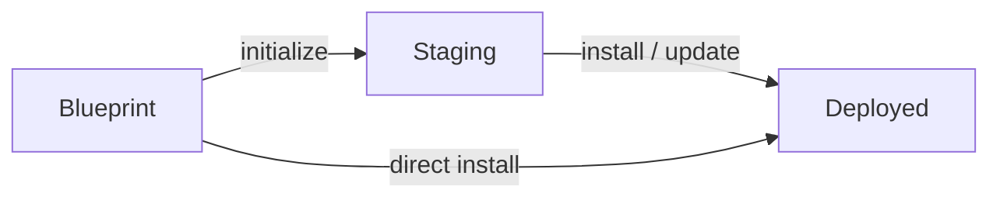

# Staging and Deployment Design

Draft design note for the Reploy CLI redesign.

## Direction

Reploy should support two install paths: direct install from blueprint defaults,
and staged install for configured services. Any bundle can be directly
installed, but some services will not be useful out of the box without the
staging stage. Staging is the full Reploy workspace where users initialize,
configure, bundle, run app commands, operate, test, and update the app before
touching the installed service.

Deployment is different. It is the installed runtime created directly from
blueprint defaults or installed/updated from staging. A deployment should not
expose the full Reploy configuration surface. It should expose a narrow control
surface for service operations such as start, stop, restart, enable, disable,
status, logs, and health checks. The deployed target should not include the
full Reploy binary; install should generate an app-scoped control script such
as `arbiterctl`.

Direct install skips the persistent staging workspace and installs from a
blueprint ref using defaults only. It should be available for every bundle. For
now, direct install does not support install-time user configuration. It can run
blueprint-declared default automation, such as default bundle manipulation or
non-interactive app commands. If the user needs to choose or review app
configuration, staging is the configured path.

The boundary into deployment is install/update:

- staged install creates the deployment from staging
- direct install creates the deployment from blueprint defaults
- later update brings the deployment back in sync with staging
- installed config and app-owned artifacts are preserved by default
- blueprints declare upgrade policy for app-owned artifacts
- operators can override the policy to replace selected artifacts or force a
  clean install

## Lifecycle



## Staging Surface

Staging is the only place where the full Reploy app workflow and configured
install path are available.

Expected staging operations:

- initialize from a blueprint ref
- update generated staging files from the blueprint
- inspect staging state
- select bundle options
- build/check/clean/upgrade bundles
- run blueprint-declared app commands
- start/stop/restart the staging runtime
- read logs/status
- run health checks and doctor checks

Staging uses the normal `reploy ...` command surface. Commands such as
`bundle`, `app`, `up`, `down`, `status`, `logs`, `test`, and `doctor` operate
on staging, not on the installed deployment. `reploy` should resolve the staging
directory by detecting when it is called from inside one, by an explicit
`--dir DIR`, or by the default staging directory when neither applies.

## Direct Install

Direct install is the default-only path. It creates an installed deployment
directly from a blueprint ref without a persistent staging directory.

By default, direct install should create a temporary internal staging-like
workspace, run the same default init/update/bundle/install pipeline used by the
staged path, and remove that temporary workspace when the install succeeds. The
temporary workspace is an implementation detail, not a user-managed staging
environment.

Reploy should also provide a low-prominence `--in-place` flag for installing
directly into the destination when the operator needs to conserve peak disk
space. That mode is an optimization/escape hatch, not the recommended
direct-install path, and should still produce the same installed state and
deployed control surface.

Expected direct install constraints:

- use blueprint defaults
- use positional app refs:

  ```text
  # app name from the Reploy blueprint index
  reploy install arbiter-server

  # local blueprint file
  reploy install file:./app.blueprint.yaml

  # explicit PyPI package; may include a blueprint path inside the package
  reploy install pypi:app-package
  ```
- no compatibility alias such as `reploy install --blueprint APP_REF` is
  required
- no install-time user configuration for now
- allow blueprint-declared default automation, such as default bundle
  manipulation and non-interactive app commands
- no operator-driven bundle editing or app-specific configuration before install
- no persistent staging workspace
- still create normal installed state metadata
- still produce a deployment with only the narrow control surface

Direct install is not a substitute for staging. If an app needs operator-chosen
configuration, bundle selection, app commands, preflight testing, or review
before install, the user should create a staging environment and install/update
from staging.
Some services may install successfully through direct install but still require
staging-time configuration before they are useful.

## Install / Update Boundary

Install/update is not a "promote" command. It is an operation that syncs a
source into an installed deployment. The source can be either a staged
environment or, for default-only direct installs, a blueprint ref.

The same conceptual boundary should cover:

- direct install from blueprint defaults into a new target
- staged install from a validated staging environment into a new target
- non-interactive direct-install automation declared by the blueprint
- update over an existing deployment
- side-by-side installs with separate target/service/port settings
- dry-run planning
- root/systemd requirements on Linux
- installed state metadata
- upgrade policy for preserving or replacing installed artifacts

Side-by-side identity is mostly an existing install behavior, not a new design
hole. Current install requires an explicit absolute target path, defaults the
systemd service name from the blueprint app id when `--service` is omitted,
derives installed Docker identity from service name plus canonical target path,
accepts single-port and named port overrides, and records the resolved service,
target, Docker identity, and ports in installed state. The redesign should
preserve that capability while changing the install source model and deployed
control surface.

The blueprint should also carry the app author's operational defaults for a
normal local install:

- default installed target path
- default deployed port bindings
- default staging port bindings
- default non-root owning user/group for the installed deployment

Operators should still be able to override these defaults at install time or in
the staging environment. The current model already has blueprint-declared
install owner defaults and service/port defaults. It still needs a clear
blueprint default for installed target path and a way to distinguish staging
port defaults from deployed port defaults.

The default installed target path should be expressed in an OS-aware way. In
abstract terms, it is:

```text
place_for_optional_stuff / APP_ID
```

On Unix-like systems, including Linux and macOS, the default mapping should be
`/opt/{{app_id}}`, for example `/opt/arbiter` for the Arbiter app id. Reploy is
primarily about services, so the built-in default should point at a
service/runtime tree rather than a GUI application location. App authors can
override this default when their service has a better platform-specific target.

Concrete examples for `app.id: arbiter`:

- Linux: `/opt/arbiter`
- macOS: `/opt/arbiter`
- Windows: `%ProgramFiles%\Arbiter`

Proposed schema shape:

```yaml
app:
  id: arbiter

install:
  target:
    default_path: /opt/{{ app.id }}
  owner:
    user: arbiter
    group: arbiter
  ports:
    deployed:
      https:
        host_bind: 127.0.0.1
        host_port: 8075
    staging:
      https:
        host_bind: 127.0.0.1
        host_port: 18075
  upgrade:
    artifacts:
      config:
        default: preserve
        paths:
          - conf/
      env:
        default: preserve
        paths:
          - .env
      generated:
        default: replace
        paths:
          - generated/
```

The container port is the port inside the container. It should default to the
same value as the declared host port and only appear when an app author needs
to override it.

By default, installed app config and app-owned artifacts are preserved during an
update. A blueprint should declare artifact classes or paths and their upgrade
policy. Operators should be able to override that policy for a specific update.
The policy should be organized around named artifact classes for operator UX,
with paths underneath each class. Raw paths should not be the primary operator
interface.

Example policy shape inside `install.upgrade`:

```yaml
install:
  upgrade:
    artifacts:
      config:
        default: preserve
        paths:
          - conf/
      env:
        default: preserve
        paths:
          - .env
      generated:
        default: replace
        paths:
          - generated/
```

The `.reploy/` directory is fully Reploy-owned generated state. Reploy may
replace anything under `.reploy/` during install/update without treating it as
an app-owned artifact.

Possible override shape:

```text
--replace ARTIFACT
--replace all
--clean
```

`ARTIFACT` names should come from the blueprint instead of being hardcoded app
concepts such as `conf` or `env`.

`--clean` should mean "as if the operator deleted the deployment directory and
installed fresh from the selected source." From an implementation standpoint,
Reploy may treat it as `--replace all` when that is behaviorally equivalent,
but the user-facing contract is a clean reinstall of app-owned and generated
deployment contents.

Install/update reporting should stay quiet by default. Normal output should
summarize the result and the important policy decisions, such as preserved
installed config and replaced generated runtime. Detailed artifact plans belong
in `--dry-run` output, `--verbose` output, and operations where the operator
explicitly requests replacement with `--replace` or `--clean`.

## Deployment Surface

Deployment is an installed runtime, not a second full Reploy workspace.

The deployed target should expose a small control surface through a generated
app-scoped control script. The full Reploy binary should stay outside the
deployment. The blueprint must declare an app id, and the default script name
should be `<app-id>ctl`, for example `arbiterctl`. App ids should be unique in
practice, but Reploy cannot globally enforce uniqueness across independently
authored blueprints.

The control script is intentionally local to the installed machine. It should
not be treated as a remote management API or a second Reploy CLI. The command
shape should be flat and operator-oriented:

```text
arbiterctl up
arbiterctl down
arbiterctl restart
arbiterctl status
arbiterctl logs
arbiterctl enable
arbiterctl disable
arbiterctl health
```

Expected deployment operations:

- start/up
- stop/down
- restart
- enable
- disable
- status
- logs
- health/test

Deployment should not expose general bundle editing, arbitrary staging updates,
or full blueprint configuration commands. Any change that belongs to the app
definition should go through staging and then install/update.

## Out of Scope

Staging-exported install profiles are out of scope for this core redesign. Keep
that idea in `docs/FUTURE_DIRECTIONS.md` until the direct/staged install model
is stable.

## Open Design Questions

- What should the blueprint schema names be for installed target defaults,
  staging port defaults, deployed port defaults, and upgrade artifact policy?

## Redesign Work Items

- Implement staging directory detection for the default `reploy ...` staging
  command surface.
- Define direct install behavior and document that it uses defaults only.
- Define the generated app control script and deployed control command menu.
- Define install/update semantics and dry-run output.
- Add blueprint upgrade policy schema and validation.
- Replace hardcoded config replacement flags with blueprint-declared artifact
  overrides.
- Update docs, CLI help, and tests around the direct/staged install model.
