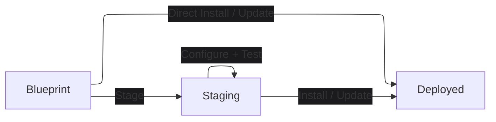

# Reploy

Cross-platform app installs from portable blueprints.

Reploy is an experimental app installer built around portable blueprints. An
app author writes one blueprint that describes install intent: package bundles,
configuration paths, persistent data, ports, health checks, control commands,
install targets, and success output. Reploy maps that blueprint onto the
current host's staging, test, install, update, and uninstall flow.

Package managers such as Homebrew, winget, Scoop, apt, or yum can install tools
onto a host. Reploy solves a different problem: installing and operating an app
instance from a semantic app blueprint across Linux, macOS, and Windows.

## Lifecycle



A blueprint is the portable source of app intent. Staging is a user-owned
deployment directory where the app can be inspected, configured, started,
tested, and prepared before it becomes permanent. A deployed install is the
permanent app instance created from the selected staging state. The staging
directory is self-contained and contains everything needed to run the app in
staging.

For services that do not require customization, Reploy can also install
directly from the blueprint and skip the persistent staging directory.

## Quickstart

Try the included OmegaConf Inspector demo:

OmegaConf Inspector is a small browser app for merging YAML config layers and
inspecting the OmegaConf result. It is useful as a Reploy demo because it has
real Python dependencies, service config, a browser UI, health checks, logs,
control commands, and writable project data, but stays neutral enough to try
without learning a domain-specific app first.

```bash
# Install the Reploy CLI.
curl -fsSL https://reploy.yadan.net/install.sh | sh

# Create a staging workspace for the demo. The default is reploy-staging/.
reploy stage omegaconf-inspector-demo

# Create and validate the demo service config.
reploy app config init
reploy app config check

# Start the staged app.
reploy up

# Run the blueprint-defined checks against staging.
reploy test
```

Then install from the tested staging state:

```bash
reploy install --scope user --to "$PWD/omegaconf-inspector-installed"
```

The blueprint defines default install values such as the target path and
service name. The install guide covers overriding those values.

Simple services can also be installed directly from blueprint defaults:

```bash
reploy install <app-blueprint-ref> --scope user
```

Use staging when you need to select bundle options, run app configuration
commands, inspect generated files, or test before installing.

## Blueprint Refs

Blueprints can be referenced from packages, source repositories, or local files:

```bash
reploy stage omegaconf-inspector-demo
reploy stage example-app
reploy stage git:https://github.com/org/example-app.git?ref=v1.2.3
reploy stage file:./example.blueprint.yaml
```

The first supported app backend is Python. The first supported runtime is
Docker. Linux supports current-user Docker-managed installs and system-scope
systemd installs. macOS and Windows support development, staging, and
Docker-managed user-scope permanent installs with Docker Desktop.

## Read Next

- [Install an app](/docs/install-an-app)
- [Publish app blueprints](/docs/author-deployments)
- [Blueprint structure](/docs/blueprint-structure)
