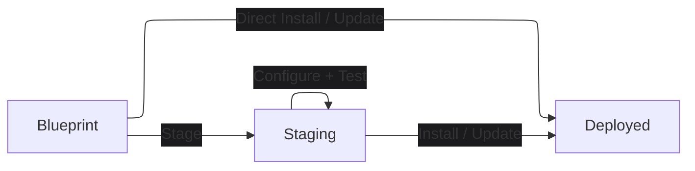

# Reploy

Experimental, repeatable app deployments from portable blueprints.

Reploy is an experimental deployment lifecycle tool for services.
A blueprint is a portable description of how a service should be staged,
tested, installed, and operated. Reploy handles the generic lifecycle around
that blueprint: stage, test, install, update, and uninstall.

## Lifecycle



A blueprint is the portable source of deployment intent. Staging is a
user-owned deployment directory where a service can be inspected, configured,
started, tested, and prepared before it becomes permanent. A deployed install is
the permanent service created from the selected staging state.
The staging directory is self-contained and contains everything needed to run
the service in staging.

For services that do not require customization, Reploy can also install
directly from the blueprint and skip the persistent staging directory.

## Quickstart

Start with the app author's blueprint ref:

```bash
# Install the Reploy CLI.
curl -fsSL https://reploy.yadan.net/install.sh | sh

# Create a staging workspace for the service. The default is reploy-staging/.
reploy stage <app-blueprint-ref>

# Configure the app in the staging directory before starting it.
vim reploy-staging/conf/

# Start the staged service.
reploy up

# Run the blueprint-defined checks against staging.
reploy test
```

Then install from the tested staging state:

```bash
sudo reploy install --scope system --to /opt/example
```

The blueprint defines default install values such as the target path and
service name. The install guide covers overriding those values.

Simple services can also be installed directly from blueprint defaults:

```bash
reploy install <app-blueprint-ref> --scope user
```

Use staging when you need to select bundle options, run app configuration
commands, inspect generated files, or test before installing.

## Blueprint Refs

Blueprints can be referenced from packages, source repositories, or local files:

```bash
reploy stage example-app
reploy stage git:https://github.com/org/example-app.git?ref=v1.2.3
reploy stage file:./example.blueprint.yaml
```

The first supported app backend is Python. The first supported runtime is
Docker. Linux supports current-user Docker-managed installs and system-scope
systemd installs. macOS and Windows support development, staging, and
Docker-managed user-scope permanent installs with Docker Desktop.

## Read Next

- [Install an app](/docs/install-an-app)
- [Publish app blueprints](/docs/author-deployments)
- [Blueprint structure](/docs/blueprint-structure)
